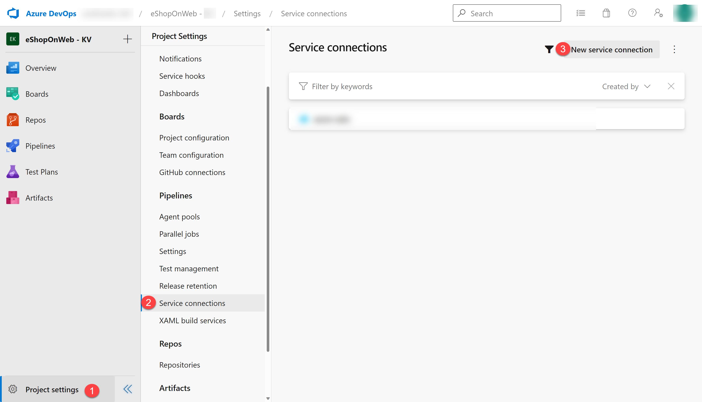

---
lab:
  title: "Validar el entorno de laboratorio"
  module: "Módulo 0: Bienvenida"
---

# Validar el entorno de laboratorio

Como preparación para los laboratorios, es fundamental tener el entorno configurado correctamente. Esta página le guiará por el proceso de configuración y le ayudará a comprobar que se cumplen todos los requisitos previos.

- Los laboratorios requieren **Microsoft Edge** o un [explorador compatible con Azure DevOps.](https://learn.microsoft.com/azure/devops/server/compatibility?view=azure-devops#web-portal-supported-browsers)

- **Configurar una Azure Subscription:** si aún no tiene una Azure subscription, cree una siguiendo las instrucciones de esta página o visite [https://azure.microsoft.com/free](https://azure.microsoft.com/free) para registrarse en una cuenta gratuita.

- **Configurar una organización de Azure DevOps:** si aún no tiene una organización de Azure DevOps que pueda usar para los laboratorios, cree una siguiendo las instrucciones de esta página o en [Create an organization or project collection](https://learn.microsoft.com/azure/devops/organizations/accounts/create-organization).

- [Página de descarga de Git for Windows](https://gitforwindows.org/). Se instalará como parte de los requisitos previos de este laboratorio.

- [Visual Studio Code](https://code.visualstudio.com/). Se instalará como parte de los requisitos previos de este laboratorio.

- [Azure CLI](https://learn.microsoft.com/cli/azure/install-azure-cli). Instale Azure CLI en las máquinas de agente autohospedado.

- [.NET SDK - Latest version](https://dotnet.microsoft.com/download/visual-studio-sdks). Instale .NET SDK en las máquinas de agente autohospedado.

## Instrucciones para crear una organización de Azure DevOps (solo debe hacerlo una vez)

> **Nota**: Comience en el paso 3 si ya tiene una **personal Microsoft Account** configurada y una Azure Subscription activa vinculada a esa cuenta.

1. Use una sesión privada del explorador para obtener una nueva **personal Microsoft Account (MSA)** en `https://account.microsoft.com`.

1. Con la misma sesión del explorador, regístrese para obtener una Azure subscription gratuita en `https://azure.microsoft.com/free`.

1. Abra un explorador y vaya al Azure portal en `https://portal.azure.com`. Luego, busque **Azure DevOps** en la parte superior de la pantalla del Azure portal. En la página resultante, haga clic en **Azure DevOps organizations**.

1. A continuación, haga clic en el vínculo etiquetado como **My Azure DevOps Organizations** o vaya directamente a `https://aex.dev.azure.com`.

1. En la página **We need a few more details**, seleccione **Continue**.

1. En el cuadro desplegable de la izquierda, elija **Default Directory** en lugar de **Microsoft Account**.

1. Si se le solicita (_"We need a few more details"_), proporcione su nombre, dirección de correo electrónico y ubicación, y haga clic en **Continue**.

1. De vuelta en `https://aex.dev.azure.com`, con **Default Directory** seleccionado, haga clic en el botón azul **Create new organization**.

1. Acepte los _Terms of Service_ haciendo clic en **Continue**.

1. Si se le solicita (_"Almost done"_), deje el nombre predeterminado para la organización de Azure DevOps (debe ser un nombre globalmente único) y elija en la lista una ubicación de hospedaje cercana a usted.

1. Una vez que la organización recién creada se abra en **Azure DevOps**, seleccione **Organization settings** en la esquina inferior izquierda.

1. En la pantalla **Organization settings**, seleccione **Billing** (abrir esta pantalla tarda unos segundos).

1. Seleccione **Setup billing** y, en el lado derecho de la pantalla, seleccione su **Azure Subscription**. Después, seleccione **Save** para vincular la suscripción con la organización.

1. Cuando la pantalla muestre en la parte superior el ID de Azure Subscription vinculada, cambie el número de **Paid parallel jobs** para **MS Hosted CI/CD** de 0 a **1**. Luego, seleccione el botón **SAVE** en la parte inferior.

   > **Nota**: Es posible que deba **esperar un par de minutos antes de usar las capacidades de CI/CD** para que la nueva configuración se refleje en el backend. De lo contrario, seguirá viendo el mensaje _"No hosted parallelism has been purchased or granted"_.

1. En **Organization Settings**, vaya a la sección **Pipelines** y haga clic en **Settings**.

1. Cambie el conmutador a **Off** para **Disable creation of classic build pipelines** y **Disable creation of classic release pipelines**.

   > **Nota**: Cuando el conmutador **Disable creation of classic release pipelines** está establecido en **On**, se ocultan las opciones de creación de classic release pipelines, como el menú **Release** en la sección **Pipeline** de los proyectos de DevOps.

1. En **Organization Settings**, vaya a la sección **Security** y haga clic en **Policies**.

1. Cambie el conmutador a **On** para **Allow public projects**.

   > **Nota**: Las extensiones usadas en algunos laboratorios pueden requerir un proyecto público para permitir el uso de la versión gratuita.

## Instrucciones para crear y configurar el proyecto de Azure DevOps (solo debe hacerlo una vez)

> **Nota**: Asegúrese de haber completado los pasos para crear su organización de Azure DevOps antes de continuar con estos pasos.

Para seguir todas las instrucciones del laboratorio, deberá configurar un nuevo proyecto de Azure DevOps, crear un repositorio basado en la aplicación [eShopOnWeb](https://github.com/MicrosoftLearning/eShopOnWeb) y crear una conexión de servicio a su Azure subscription.

### Crear el proyecto de equipo

Primero, creará un proyecto de Azure DevOps **eShopOnWeb** que se usará en varios laboratorios.

1. Abra el explorador y vaya a su organización de Azure DevOps.

1. Seleccione la opción **New Project** y use la siguiente configuración:

   - name: **eShopOnWeb**
   - visibility: **Private**
   - Advanced: Version Control: **Git**
   - Advanced: Work Item Process: **Scrum**

1. Seleccione **Create**.

   

### Importar el repositorio git de eShopOnWeb

Ahora importará eShopOnWeb en su repositorio git.

1. Abra el explorador y vaya a su organización de Azure DevOps.

1. Abra el proyecto **eShopOnWeb** creado anteriormente.

1. Seleccione **Repos > Files**, **Import a Repository** y, a continuación, seleccione **Import**.

1. En la ventana **Import a Git Repository**, pegue la siguiente URL `https://github.com/MicrosoftLearning/eShopOnWeb` y seleccione **Import**:

   

1. El repositorio está organizado de la siguiente manera:

   - La carpeta **.ado** contiene pipelines YAML de Azure DevOps.
   - La carpeta **.devcontainer** contiene la configuración para desarrollar usando contenedores, ya sea localmente en VS Code o en GitHub Codespaces.
   - La carpeta **.azure** contiene plantillas Bicep y ARM de infraestructura como código.
   - La carpeta **.github** contiene definiciones de workflow YAML de GitHub.
   - La carpeta **src** contiene el sitio web .NET 8 usado en los escenarios de laboratorio.

1. Deje abierta la ventana del explorador web.

1. Vaya a **Repos > Branches**.

1. Mantenga el puntero sobre la rama **main** y, a continuación, haga clic en los puntos suspensivos a la derecha de la columna.

1. Haga clic en **Set as default branch**.

### Crear una conexión de servicio para acceder a los recursos de Azure

Deberá crear una conexión de servicio en Azure DevOps, lo que le permitirá implementar recursos en su Azure subscription y acceder a ellos.

1. Inicie un explorador web y vaya al portal de Azure DevOps `https://aex.dev.azure.com`.

1. Inicie sesión en la organización de Azure DevOps.

   > **Nota**: Si es la primera vez que inicia sesión en la organización de Azure DevOps, se le solicitará que cree su perfil y acepte los términos de servicio. Después, seleccione **Continue**.

1. Abra el proyecto **eShopOnWeb** y seleccione **Project settings** en la esquina inferior izquierda del portal.

1. Seleccione **Service connections** en Pipelines y, a continuación, seleccione el botón **Create service connection**.

   

1. En el panel **New service connection**, seleccione **Azure Resource Manager** y **Next** (es posible que deba desplazarse hacia abajo).

1. Seleccione **App registration (automatic)** en el cuadro desplegable **Identity type**.

1. Seleccione **Workload Identity federation** y **Subscription** en **Scope level**.

   > **Nota**: También puede usar **App registration or managed identity (manual)** si prefiere configurar manualmente la conexión de servicio. Siga los pasos de la [documentación de Azure DevOps](https://learn.microsoft.com/azure/devops/pipelines/library/connect-to-azure) para crear manualmente la conexión de servicio.

1. Complete los campos vacíos con la siguiente información:

   - **Subscription**: seleccione su Azure subscription.
   - **Resource group**: seleccione el resource group donde desea implementar los recursos. Si no tiene un resource group, puede crear uno en el Azure portal siguiendo las instrucciones de [Manage Azure resource groups by using the Azure portal](https://learn.microsoft.com/azure/azure-resource-manager/management/manage-resource-groups-portal).
   - **Service connection name**: escriba **`azure subs`**. Se hará referencia a este nombre en los pipelines YAML para acceder a su Azure subscription.

1. Asegúrese de que la opción **Grant access permission to all pipelines** no esté seleccionada y seleccione **Save**.

   > **Importante:** La opción **Grant access permission to all pipelines** no se recomienda para entornos de producción: seleccionar la opción significa conceder acceso a la conexión de servicio a todos los pipelines del proyecto; no seleccionar la opción le permite aprobar el acceso a la conexión de servicio en la primera ejecución de cada pipeline.

   > **Nota**: Si la opción **Grant access permission to all pipelines** está deshabilitada (aparece en gris) y no se puede cambiar, continúe con el laboratorio.

   > **Nota**: Si ve un mensaje de error que indica que no tiene los permisos necesarios para crear una conexión de servicio, inténtelo de nuevo o configure manualmente la conexión de servicio.

Ahora ha completado los pasos previos necesarios para continuar con los laboratorios.
