---
lab:
    title: 'Planeación Agile y administración de portafolios con Azure Boards'
    module: 'Módulo 01: Implementar desarrollo para DevOps empresarial'
---

# Planeación Agile y administración de portafolios con Azure Boards

## Requisitos del laboratorio

- Este laboratorio requiere **Microsoft Edge** o un [explorador compatible con Azure DevOps.](https://docs.microsoft.com/azure/devops/server/compatibility?view=azure-devops#web-portal-supported-browsers)

- **Configurar una organización de Azure DevOps:** si aún no tiene una organización de Azure DevOps que pueda usar para este laboratorio, cree una siguiendo las instrucciones disponibles en [Create an organization or project collection](https://docs.microsoft.com/azure/devops/organizations/accounts/create-organization?view=azure-devops).

## Información general del laboratorio

En este laboratorio, aprenderá sobre las herramientas y los procesos de planeación Agile y administración de portafolios que proporciona Azure Boards, y cómo pueden ayudarle a planear, administrar y realizar el seguimiento del trabajo rápidamente en todo el equipo.

Explorará el product backlog, el sprint backlog y los task boards que permiten realizar el seguimiento del flujo de trabajo durante una iteración. También revisaremos las herramientas mejoradas de esta versión para escalar a equipos y organizaciones de mayor tamaño.

## Objetivos

Después de completar este laboratorio, podrá:

- Administrar equipos, áreas e iteraciones.
- Administrar work items.
- Administrar sprints y capacidad.
- Personalizar tableros Kanban.
- Definir dashboards.
- Personalizar el proceso de equipo.

## Tiempo estimado: 60 minutos

## Instrucciones

### Ejercicio 0: (omitir si ya se realizó) Configurar los requisitos previos del laboratorio

En este ejercicio, configurará los requisitos previos del laboratorio, que consisten en un nuevo proyecto de Azure DevOps con un repositorio basado en [eShopOnWeb](https://github.com/MicrosoftLearning/eShopOnWeb).

#### Tarea 1: (omitir si ya se realizó) Crear y configurar el proyecto de equipo

En esta tarea, creará un proyecto de Azure DevOps **eShopOnWeb** que se usará en varios laboratorios.

1. En el equipo de laboratorio, abra su organización de Azure DevOps en una ventana del explorador. Haga clic en **New Project**. Asigne al proyecto el nombre **eShopOnWeb**. Defina **Private** como opción de Visibility.

1. Haga clic en **Advanced** y especifique **Scrum** como **Work Item Process**. Haga clic en **Create**.

    

### Ejercicio 1: Administrar un proyecto Agile

En este ejercicio, usará Azure Boards para realizar varias tareas comunes de planeación Agile y administración de portafolios, incluida la administración de equipos, áreas, iteraciones, work items, sprints y capacidad, la personalización de tableros Kanban, la definición de dashboards y la personalización de procesos de equipo.

#### Tarea 1: Administrar equipos, áreas e iteraciones

En esta tarea, creará un nuevo equipo y configurará su área y sus iteraciones.

Cada proyecto nuevo se configura con un equipo predeterminado cuyo nombre coincide con el nombre del proyecto. Tiene la opción de crear equipos adicionales. A cada equipo se le puede conceder acceso a un conjunto de herramientas Agile y recursos de equipo. La capacidad de crear varios equipos le brinda la flexibilidad de elegir el equilibrio adecuado entre autonomía y colaboración en toda la empresa.

1. En el equipo de laboratorio, inicie un explorador web y vaya al portal de Azure DevOps en `https://aex.dev.azure.com`.

   > **Nota**: Si se le solicita, inicie sesión con la cuenta Microsoft asociada con su suscripción de Azure DevOps.

1. Abra el proyecto **eShopOnWeb** en su organización de Azure DevOps.

    > **Nota**: Como alternativa, puede acceder directamente a la página del proyecto navegando a la URL <https://dev.azure.com/YOUR-AZURE-DEVOPS-ORGANIZATION/PROJECT-NAME>, donde el marcador de posición YOUR-AZURE-DEVOPS-ORGANIZATION representa el nombre de la cuenta, y el marcador de posición PROJECT-NAME representa el nombre del proyecto.

1. Haga clic en el icono de engranaje etiquetado como **Project settings**, ubicado en la esquina inferior izquierda de la página, para abrir la página **Project settings**.

    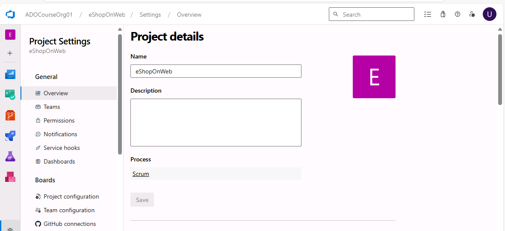

1. En la sección **General**, seleccione la pestaña **Teams**. Ya existe un equipo predeterminado en este proyecto, **eShopOnWeb Team**, pero creará uno nuevo para este laboratorio. Haga clic en **New Team**.

    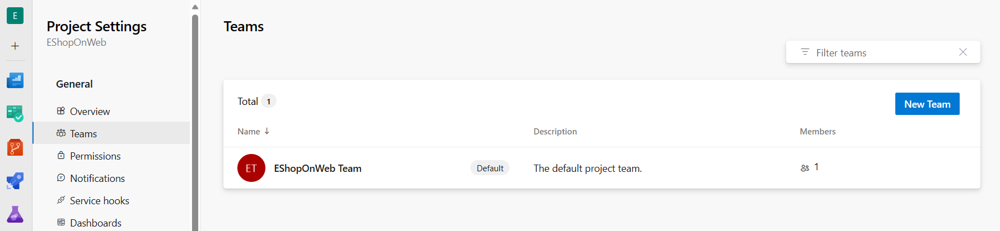

1. En el panel **Create a new team**, en el cuadro de texto **Team name**, escriba **`EShop-Web`**, deje las demás opciones con sus valores predeterminados y haga clic en **Create**.

    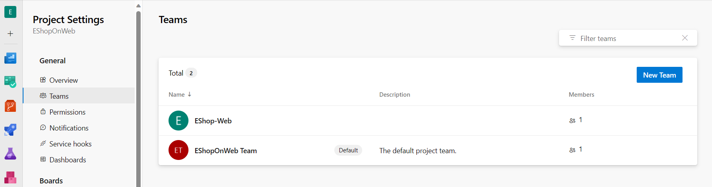

1. En la lista de **Teams**, seleccione el equipo recién creado para ver sus detalles.

    > **Nota**: De forma predeterminada, el nuevo equipo solo le tiene a usted como miembro. Puede usar esta vista para administrar funcionalidades como la pertenencia al equipo, las notificaciones y los dashboards.

1. Haga clic en el vínculo **Iterations and Area Paths** en la parte superior de la página **EShop-Web** para comenzar a definir la programación y el alcance del equipo.

    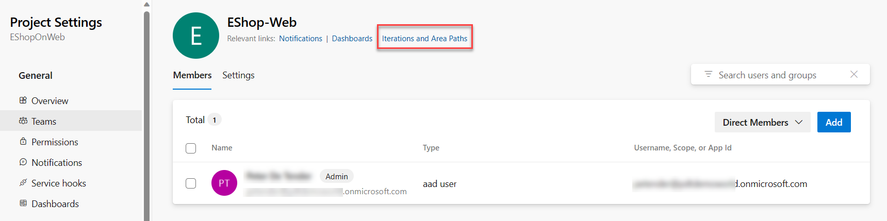

1. En la parte superior del panel **Boards**, seleccione la pestaña **Iterations** y, a continuación, haga clic en **+ Select iteration(s)**.

    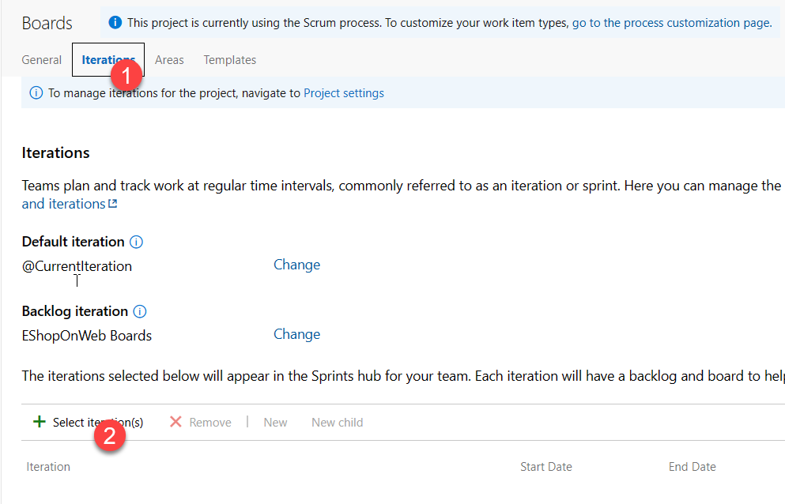

1. Seleccione **eShopOnWeb\Sprint 1** y haga clic en **Save and close**. Observe que este primer sprint aparecerá en la lista de iteraciones, pero las fechas aún no están establecidas.

1. Seleccione **Sprint 1** y haga clic en los **puntos suspensivos (...)**. En el menú contextual, seleccione **Edit**.

     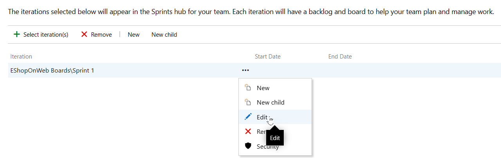

    > **Nota**: Especifique Start Date como el primer día laboral de la semana pasada y cuente 3 semanas laborales completas para cada sprint. Por ejemplo, si el 6 de marzo es el primer día laboral del sprint, este continúa hasta el 24 de marzo. Sprint 2 comienza el 27 de marzo, que está a 3 semanas del 6 de marzo.

1. Repita el paso anterior para agregar **Sprint 2** y **Sprint 3**. Podría decirse que actualmente estamos en la segunda semana del primer sprint.

    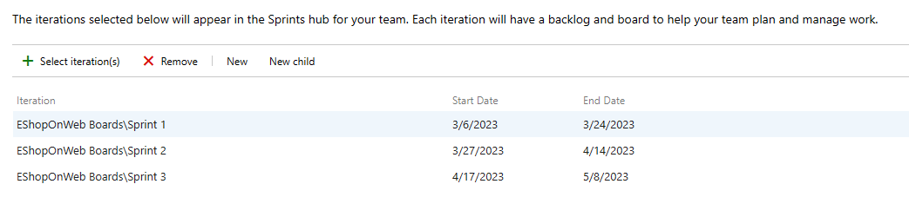

1. Aún en el panel **Project Settings / Boards / Team Configuration**, en la parte superior del panel, seleccione la pestaña **Areas**. Allí encontrará un área generada automáticamente con un nombre que coincide con el nombre del equipo.

    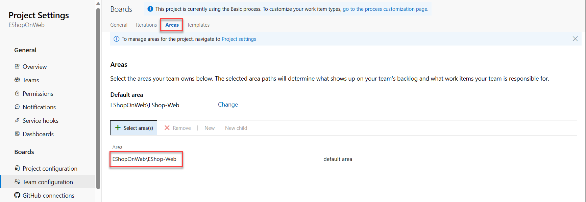

1. Haga clic en el símbolo de puntos suspensivos (...) junto a la entrada **default area** y, en la lista desplegable, seleccione **Include sub areas**.

    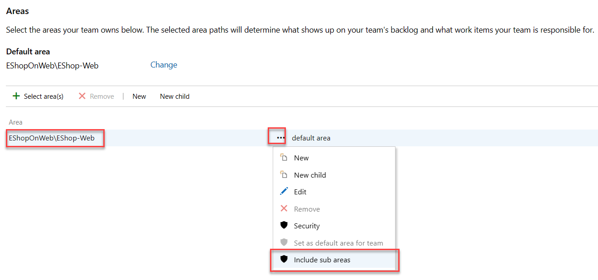

    > **Nota**: La configuración predeterminada para todos los equipos es excluir las rutas de subáreas. La cambiaremos para incluir subáreas, de modo que el equipo tenga visibilidad de todos los work items de todos los equipos. Opcionalmente, el equipo de administración también podría elegir no incluir subáreas, lo que quita automáticamente los work items de su vista tan pronto como se asignan a uno de los equipos.

#### Tarea 2: Administrar work items

En esta tarea, recorrerá tareas comunes de administración de work items.

Los work items desempeñan un papel destacado en Azure DevOps. Ya sea que describan trabajo por realizar, impedimentos para una versión, definiciones de prueba u otros elementos clave, los work items son la pieza central del trabajo en los proyectos modernos.

En esta tarea, se enfocará en usar varios work items para configurar el plan de extensión del sitio eShopOnWeb con una sección de capacitación de productos. Aunque puede parecer intimidante desarrollar una parte tan importante de la oferta de una empresa, Azure DevOps y el proceso Scrum lo hacen muy administrable.

> **Nota**: Esta tarea está diseñada para ilustrar varias formas de crear diferentes tipos de work items, así como para demostrar la amplitud de características disponibles en la plataforma. Como resultado, estos pasos no deben considerarse una guía prescriptiva para la administración de proyectos. Las características están pensadas para ser lo suficientemente flexibles como para adaptarse a las necesidades de su proceso, así que explore y experimente a medida que avanza.

1. Haga clic en el nombre del proyecto en la esquina superior izquierda del portal de Azure DevOps para volver a la página principal del proyecto.

1. En el panel de navegación vertical del portal de Azure DevOps, seleccione el icono **Boards** y, a continuación, seleccione **Work Items**.

    > **Nota**: Hay muchas maneras de crear work items en Azure DevOps, y exploraremos algunas de ellas. A veces es tan sencillo como crear uno desde un dashboard.

1. En la ventana **Work Items**, haga clic en **+ New Work Item > Epic**.

    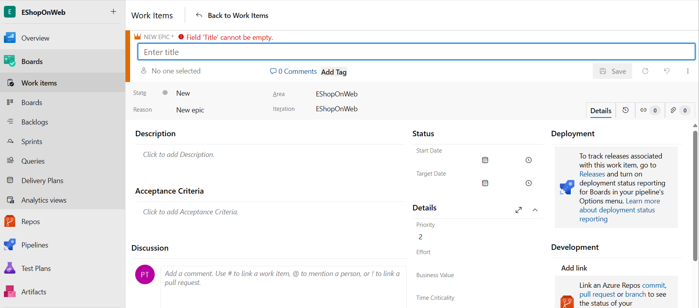

1. En el cuadro de texto **Enter title**, escriba **`Product training`**.

1. En la esquina superior izquierda, seleccione la entrada **No one selected** y, en la lista desplegable, seleccione su cuenta de usuario para asignarse el nuevo work item. Si su nombre no aparece al inicio, comience a escribirlo y haga clic en **Search**.

1. Junto a la entrada **Area**, seleccione la entrada **eShopOnWeb** y, en la lista desplegable, seleccione **EShop-WEB**. Esto establecerá **Area** en **eShopOnWeb\EShop-WEB**.

1. Junto a la entrada **Iteration**, seleccione la entrada **eShopOnWeb** y, en la lista desplegable, seleccione **Sprint 2**. Esto establecerá **Iteration** en **eShopOnWeb\Sprint 2**.

1. Haga clic en **Save** para finalizar los cambios. **No lo cierre**.

    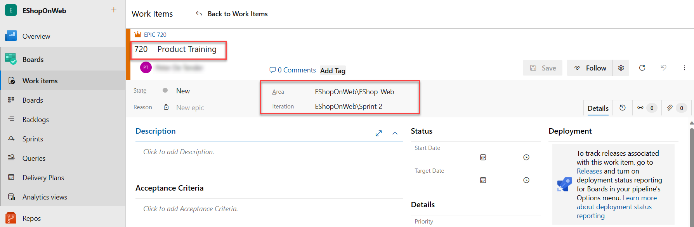

    > **Nota**: Normalmente, convendría completar tanta información como sea posible, pero esto es suficiente para los fines de este laboratorio.

    > **Nota**: El formulario del work item incluye todas las configuraciones relevantes del work item. Esto incluye detalles sobre a quién está asignado, su estado según muchos parámetros, y toda la información e historial asociados sobre cómo se ha gestionado desde su creación. Una de las áreas clave en la que debe enfocarse es **Related Work**. Exploraremos una de las formas de agregar una feature a este epic.

1. En la sección **Related work**, en la parte inferior derecha, seleccione la entrada **Add link** y, en la lista desplegable, seleccione **New item**.

1. En el panel **Add link**, en la lista desplegable **Link Type**, seleccione **Child**. A continuación, en la lista desplegable **Work item type**, seleccione **Feature** y, en el cuadro de texto **Title**, escriba **`Training dashboard`**.

    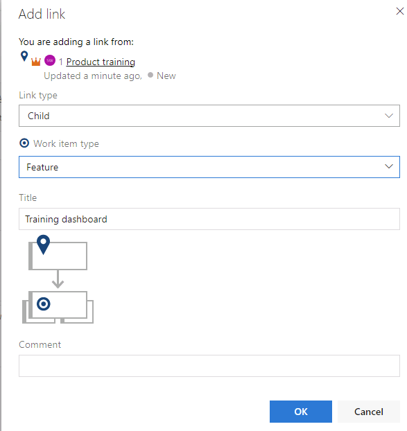

1. Haga clic en **Add link** para guardar el elemento Child.

    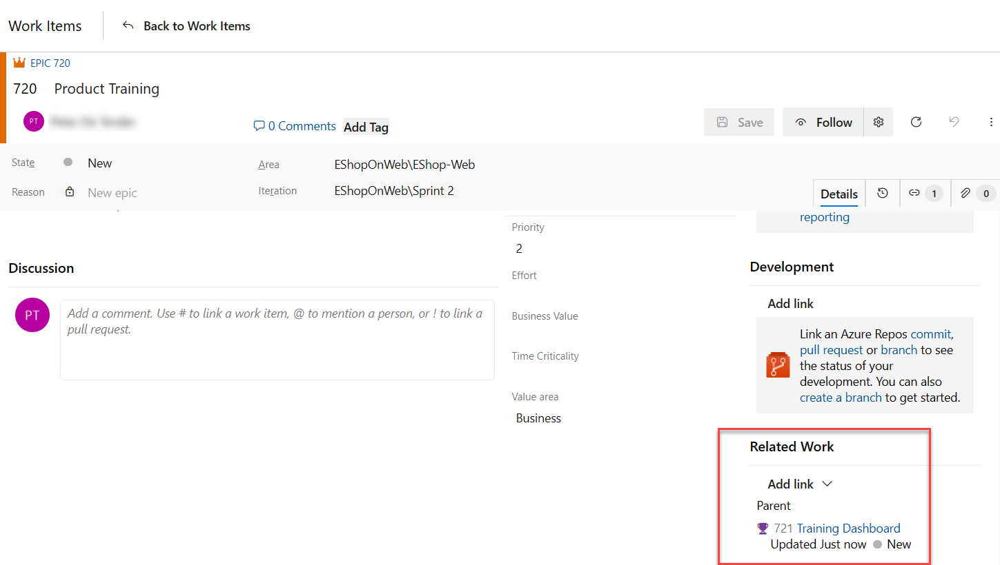

    > **Nota**: En el panel **Training dashboard**, observe que la asignación, **Area** e **Iteration** ya están establecidas con los mismos valores que el epic en el que se basa la feature. Además, la feature se vincula automáticamente al elemento primario desde el que se creó.

1. En el panel (New Feature) **Training dashboard**, haga clic en **Save and Close**.

1. En el panel de navegación vertical del portal de Azure DevOps, en la lista de elementos de **Boards**, seleccione **Boards**.

1. En el panel **Boards**, seleccione la entrada **EShop-WEB boards**. Esto abrirá el tablero de ese equipo específico.

    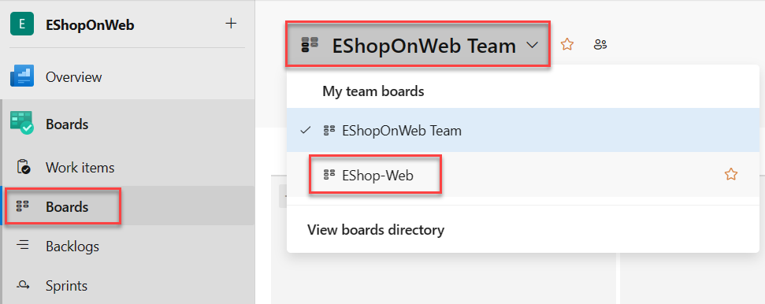

1. En el panel **Boards**, en la esquina superior derecha, seleccione la entrada **Backlog items** y, en la lista desplegable, seleccione **Features**.

    > **Nota**: Esto facilitará agregar tareas y otros work items a las features.

1. Mantenga el puntero del mouse sobre el rectángulo que representa la feature **Training dashboard**. Esto mostrará el símbolo de puntos suspensivos (...) en la esquina superior derecha.

1. Haga clic en el icono de puntos suspensivos (...) y, en la lista desplegable, seleccione **Add Product Backlog Item**.

    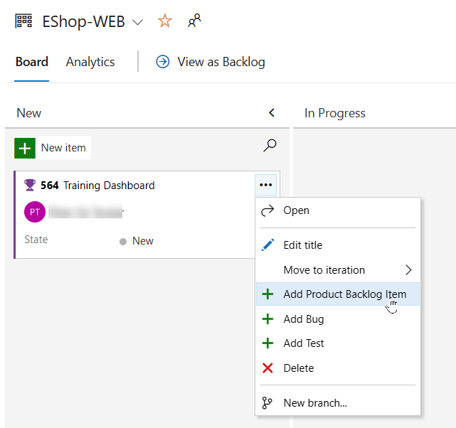

1. En el cuadro de texto del nuevo product backlog item, escriba **`As a customer, I want to view new tutorials`** y presione la tecla **Enter** para guardar la entrada.

    > **Nota**: Esto crea un nuevo work item de tipo product backlog item (PBI), que es secundario de la feature y comparte su área e iteración.

1. Repita el paso anterior para agregar dos PBI más diseñados para permitir que el cliente vea los tutoriales consultados recientemente y solicite nuevos tutoriales, denominados respectivamente **`As a customer, I want to see tutorials I recently viewed`** y **`As a customer, I want to request new tutorials`**.

    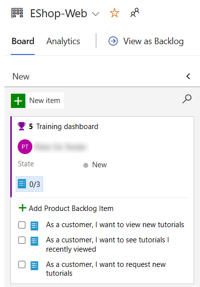

1. En el panel **Boards**, en la esquina superior derecha, seleccione la entrada **Features** y, en la lista desplegable, seleccione **Backlog items**.

     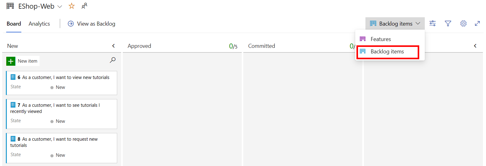

    > **Nota**: Los backlog items tienen un estado que define dónde se encuentran en relación con su finalización. Aunque podría abrir y editar el work item mediante el formulario, es más sencillo arrastrar las tarjetas en el tablero.

1. En la pestaña **Board** del panel **EShop-WEB**, arrastre el primer work item llamado **As a customer, I want to view new tutorials** desde la etapa **New** hasta **Approved**.

    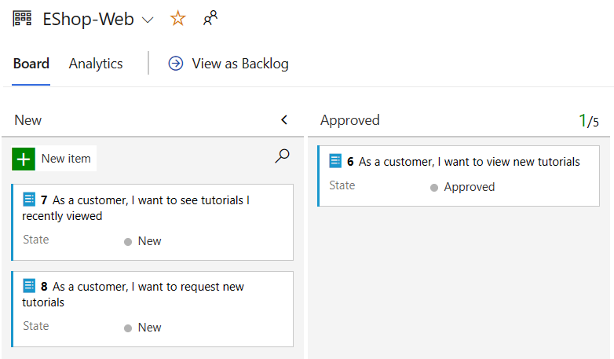

    > **Nota**: También puede expandir las tarjetas de work item para acceder cómodamente a detalles editables.

1. Mantenga el puntero del mouse sobre el rectángulo que representa el work item que movió a la etapa **Approved**. Esto mostrará el símbolo de intercalación hacia abajo.

1. Haga clic en el símbolo de intercalación hacia abajo para expandir la tarjeta del work item, reemplace la entrada **Unassigned** por su nombre y, a continuación, seleccione su cuenta para asignarse el PBI movido.

1. En la pestaña **Board** del panel **EShop-WEB**, arrastre el segundo work item llamado **As a customer, I want to see tutorials I recently viewed** desde **New** hasta la etapa **Committed**.

1. En la pestaña **Board** del panel **EShop-WEB**, arrastre el tercer work item llamado **As a customer,  I want to request new tutorials** desde **New** hasta la etapa **Done**.

    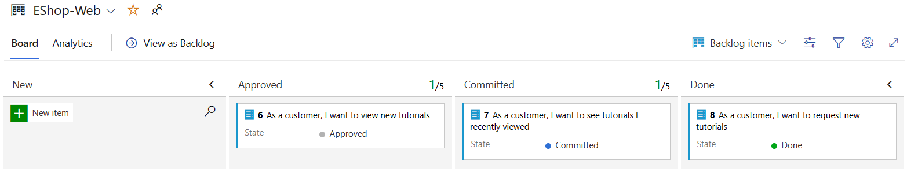

    > **Nota**: El task board es una vista del backlog. También puede usar la vista tabular.

1. En la pestaña **Board** del panel **EShop-WEB**, en la parte superior del panel, haga clic en **View as Backlog** para mostrar el formulario tabular.

    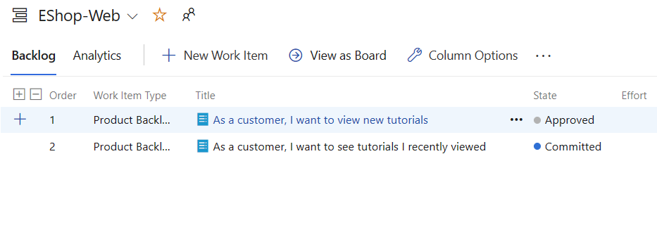

    > **Nota**: Puede usar el signo más ubicado directamente debajo de la etiqueta de la pestaña **Backlog** del panel **EShop-WEB** para ver las tareas anidadas debajo de estos work items.

    > **Nota**: Puede usar el segundo signo más, ubicado directamente a la izquierda del primer backlog item, para agregarle una nueva tarea.

1. En la pestaña **Backlog** del panel **EShop-WEB**, en la esquina superior izquierda del panel, haga clic en el signo más junto al primer work item. Esto mostrará el panel **NEW TASK**.

    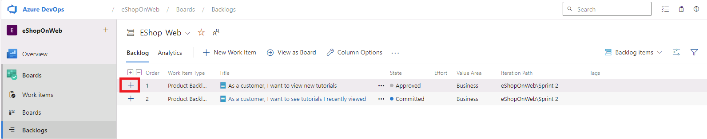

1. En la parte superior del panel **NEW TASK**, en el cuadro de texto **Enter title**, escriba **`Add page for most recent tutorials`**.

1. En el panel **NEW TASK**, en el cuadro de texto **Remaining Work**, escriba **5**.

1. En el panel **NEW TASK**, en la lista desplegable **Activity**, seleccione **Development**.

1. En el panel **NEW TASK**, haga clic en **Save and Close**.

    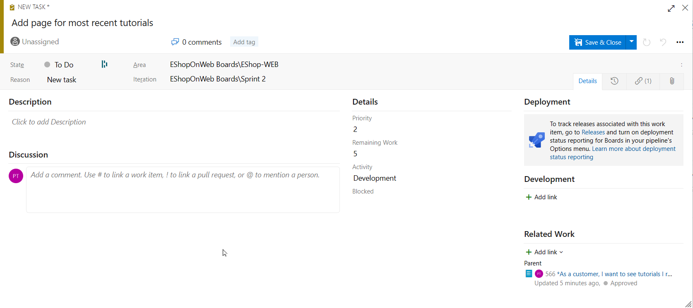

1. Repita los últimos cinco pasos para agregar otra tarea denominada **`Optimize data query for most recent tutorials`**. Establezca **Remaining Work** en **3** y **Activity** en **Design**. Haga clic en **Save and Close** cuando haya terminado.

#### Tarea 3: Administrar sprints y capacidad

En esta tarea, recorrerá tareas comunes de administración de sprints y capacidad.

Los equipos crean el sprint backlog durante la reunión de planeación del sprint, que normalmente se realiza el primer día del sprint. Cada sprint corresponde a un intervalo con límite de tiempo que respalda la capacidad del equipo para trabajar mediante procesos y herramientas Agile. Durante la reunión de planeación, el product owner trabaja con el equipo para identificar las historias o backlog items que se completarán en el sprint.

Las reuniones de planeación suelen constar de dos partes. En la primera, el equipo y el product owner identifican los backlog items que el equipo considera que puede comprometerse a completar en el sprint, según la experiencia con sprints anteriores. Estos elementos se agregan al sprint backlog. En la segunda parte, el equipo determina cómo desarrollará y probará cada elemento. Luego define y estima las tareas necesarias para completar cada elemento. Finalmente, el equipo se compromete a implementar algunos o todos los elementos con base en estas estimaciones.

El sprint backlog debe contener toda la información que el equipo necesita para planear y completar correctamente el trabajo dentro del tiempo asignado, sin tener que apresurarse al final. Antes de planear el sprint, convendría haber creado, priorizado y estimado el backlog, además de haber definido los sprints.

1. En el panel de navegación vertical del portal de Azure DevOps, seleccione el icono **Boards** y, en la lista de elementos de **Boards**, seleccione **Sprints**.

1. En la pestaña **Taskboard** de la vista **Sprints**, en la barra de herramientas del lado derecho, seleccione el símbolo **View options** (directamente a la izquierda del icono de filtro) y, en la lista desplegable **View options**, seleccione la entrada **Work details**. Seleccione **Sprint 2** como filtro.

    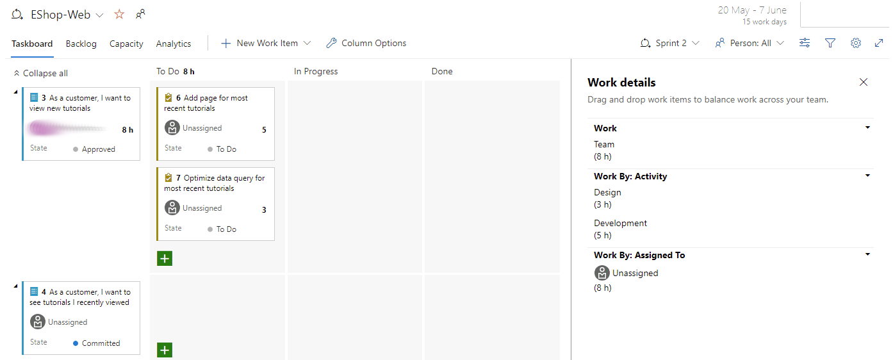

    > **Nota**: El sprint actual tiene un alcance bastante limitado. Hay dos tareas en la etapa **To do**. En este momento, ninguna de las tareas está asignada. Ambas muestran un valor numérico a la derecha de la entrada **Unassigned**, que representa la estimación de trabajo restante.

1. En la columna **ToDo**, observe el Task Item **Add page for most recent tutorials**, haga clic en la entrada **Unassigned** y, en la lista de cuentas de usuario, seleccione su cuenta para asignarse la tarea.

1. Seleccione la pestaña **Capacity** de la vista **Sprints**.

    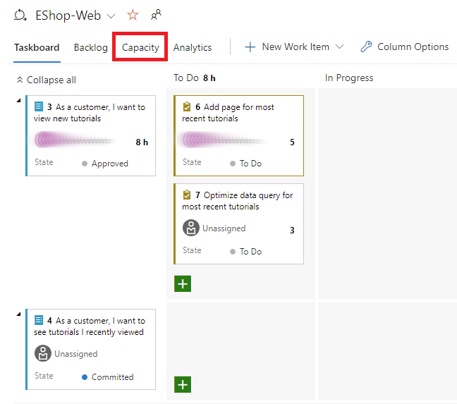

    > **Nota**: Esta vista permite definir qué actividades puede asumir un usuario y con qué nivel de capacidad.

1. En la pestaña **Capacity** de la vista **Sprints**, para su cuenta de usuario, establezca el campo **Activity** en **Development** y, en el cuadro de texto **Capacity per day**, escriba **1**. Luego haga clic en **Save**.

    > **Nota**: Esto representa 1 hora de trabajo de desarrollo por día. Observe que puede agregar actividades adicionales por usuario en caso de que realice algo más que desarrollo.

    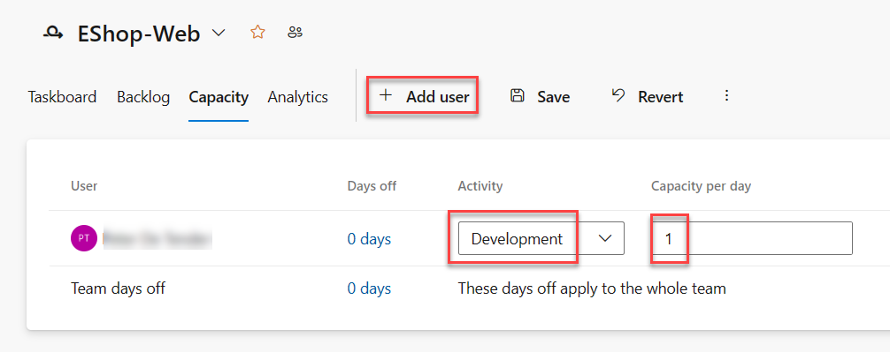

    > **Nota**: Supongamos que también tomará algunos días de vacaciones. Esto también debe agregarse a la vista de capacidad.

1. En la pestaña **Capacity** de la vista **Sprints**, justo junto a la entrada que representa su cuenta de usuario, en la columna **Days off**, haga clic en la entrada **0 days**. Esto mostrará un panel donde puede establecer sus días libres.

1. En el panel mostrado, use la vista de calendario para establecer que sus vacaciones abarquen cinco días laborales durante el sprint actual (dentro de las próximas tres semanas) y, cuando haya terminado, haga clic en **OK**.

    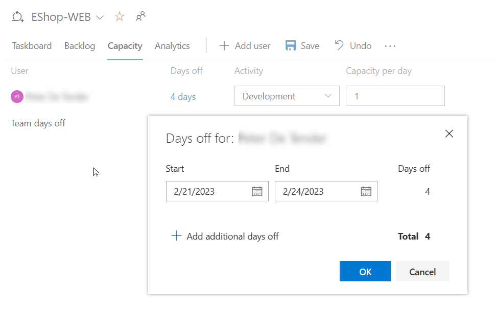

1. De vuelta en la pestaña **Capacity** de la vista **Sprints**, haga clic en **Save**.

1. Seleccione la pestaña **Taskboard** de la vista **Sprints**.

    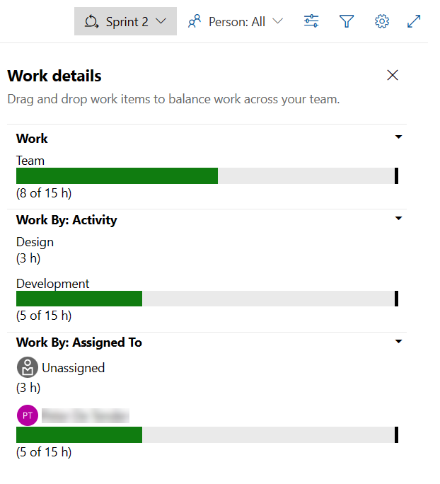

    > **Nota**: Observe que el panel **Work details** se ha actualizado para reflejar su ancho de banda disponible. El número real que se muestra en el panel **Work details** puede variar, pero su capacidad total del sprint será igual al número de días laborales restantes hasta el final del sprint, ya que asignó 1 hora por día. Tome nota de este valor, ya que lo usará en los próximos pasos.

    > **Nota**: Una característica cómoda de los tableros es que puede actualizar fácilmente datos clave en línea. Es una buena práctica actualizar con regularidad la estimación de **Remaining Work** para reflejar la cantidad de tiempo esperada para cada tarea. Supongamos que revisó el trabajo de la tarea **Add page for most recent tutorials** y descubrió que en realidad tardará más de lo previsto originalmente.

1. En la pestaña **Taskboard** de la vista **Sprints**, en el cuadro que representa **Add page for most recent tutorials**, establezca el número estimado de horas en **14**, para que coincida con su capacidad total para este sprint, que identificó en el paso anterior.

    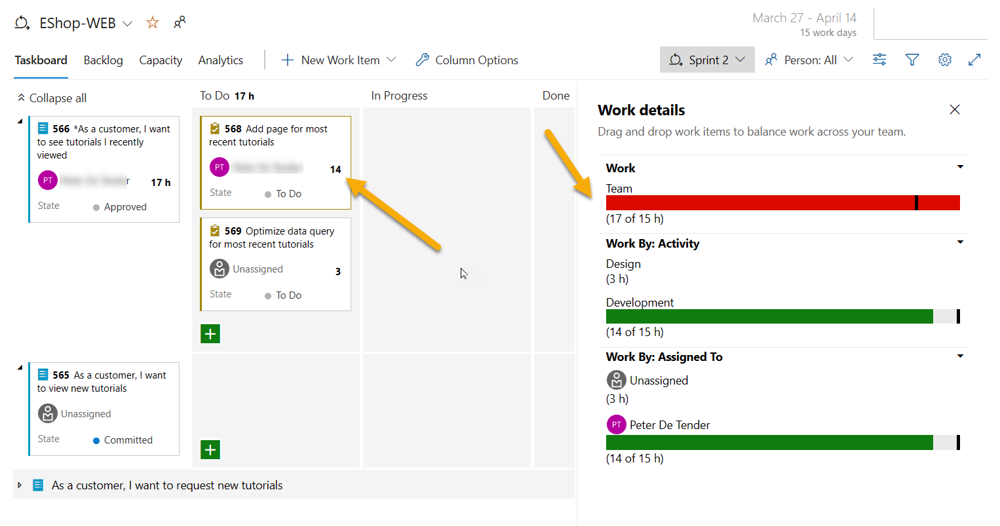

    > **Nota**: Esto expande automáticamente las capacidades de **Development** y su capacidad personal hasta su máximo. Como son lo suficientemente grandes para cubrir las tareas asignadas, permanecen en verde. Sin embargo, se supera la capacidad general del **Team** debido a las 3 horas adicionales que requiere la tarea **Optimize data query for most recent tutorials**.

    > **Nota**: Una forma de resolver este problema de capacidad sería mover la tarea a una iteración futura. Hay varias formas de hacerlo. Por ejemplo, podría abrir la tarea aquí y editarla en el panel que da acceso a sus detalles. Otro enfoque sería usar la vista **Backlog**, que proporciona una opción de menú en línea para moverla. Sin embargo, en este punto, no mueva la tarea todavía.

1. En la pestaña **Taskboard** de la vista **Sprints**, en la barra de herramientas del lado derecho, seleccione el símbolo **View options** (directamente a la izquierda del icono de filtro) y, en la lista desplegable **View options**, seleccione la entrada **Assigned To**.

    > **Nota**: Esto ajusta la vista para que pueda revisar el progreso de las tareas por persona en lugar de por backlog item.

    > **Nota**: También hay muchas opciones de personalización disponibles.

1. Haga clic en el icono de engranaje **Configure team settings** (directamente a la derecha del icono de filtro).

1. En el panel **Settings**, seleccione la pestaña **Styles**, haga clic en **+ Add styling rule**, debajo de la etiqueta **Rule name**, en el cuadro de texto **Name**, escriba **`Development`** y, en la lista desplegable **Color**, seleccione el rectángulo verde.

    > **Nota**: Esto coloreará de verde todas las tarjetas si cumplen los criterios de regla establecidos directamente debajo del nombre de la regla.

1. En la sección debajo del nombre de la regla, en la lista desplegable **Field**, seleccione **Activity**; en la lista desplegable **Operator**, seleccione **=**; y, en la lista desplegable **Value**, seleccione **Development**.

    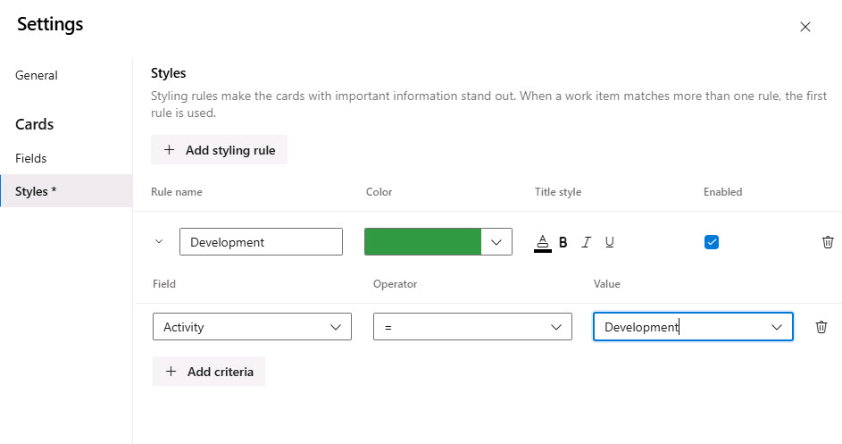

1. Haga clic en **Save** para guardar y cerrar la configuración.

    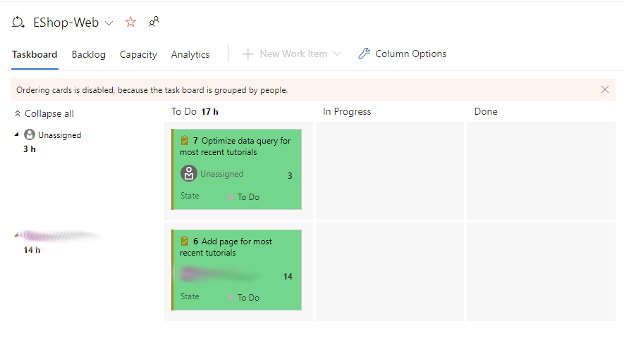

    > **Nota**: Esto establecerá en verde todas las tarjetas asignadas a actividades de **Development**.

1. Vuelva al panel **Settings**, seleccione la pestaña **General** y, en la sección **Backlogs**, vea y configure los niveles de navegación.

    > **Nota**: Los epics no se incluyen de forma predeterminada, pero podría cambiarlo.

1. En el panel **Settings**, seleccione la pestaña **General** y, en la sección **Working days**, especifique los días laborales que sigue el equipo.

    > **Nota**: Esto se aplica a los cálculos de capacidad y burndown.

1. En el panel **Settings**, seleccione la pestaña **General** y, en la sección **Working with bugs**, puede especificar cómo administra bugs en backlogs y tableros.

    > **Nota**: Las entradas de esta pestaña permiten especificar cómo se presentan los bugs en el tablero.

1. En el panel **Settings**, haga clic en **Save** para guardar y cerrar la regla de estilo.

    > **Nota**: La tarea asociada con **Development** ahora es verde y muy fácil de identificar.

#### Tarea 4: Personalizar tableros Kanban

En esta tarea, recorrerá el proceso de personalización de tableros Kanban.

Para maximizar la capacidad de un equipo de entregar software de alta calidad de manera constante, Kanban enfatiza dos prácticas principales. La primera, visualizar el flujo de trabajo, requiere que asigne las etapas del flujo de trabajo del equipo y configure un tablero Kanban que coincida con ellas. La segunda, limitar la cantidad de trabajo en curso, requiere que establezca límites de trabajo en curso (WIP).

Después de esto, estará listo para realizar el seguimiento del progreso en el tablero Kanban y supervisar métricas clave para reducir el lead time o cycle time. El tablero Kanban convierte el backlog en un panel interactivo que proporciona un flujo visual del trabajo. A medida que el trabajo avanza de la idea a la finalización, se actualizan los elementos del tablero.

Cada columna representa una etapa de trabajo, y cada tarjeta representa una user story (tarjetas azules) o un bug (tarjetas rojas) en esa etapa del trabajo. Sin embargo, cada equipo desarrolla su propio proceso con el tiempo, por lo que la capacidad de personalizar el tablero Kanban para que coincida con la forma en que trabaja el equipo es fundamental para una entrega correcta.

1. En el panel de navegación vertical del portal de Azure DevOps, en la lista de elementos de **Boards**, seleccione **Boards**.

1. En el panel **Boards**, haga clic en el icono de engranaje **Configure board settings** (directamente a la derecha del icono de filtro).

    > **Nota**: El equipo está enfatizando el trabajo realizado con datos, por lo que se presta especial atención a cualquier tarea asociada con el acceso o almacenamiento de datos.

1. En el panel **Settings**, seleccione la pestaña **Tag colors**, haga clic en **+ Add tag color**, en el cuadro de texto **Tag**, escriba **`data`** y seleccione el rectángulo amarillo.

    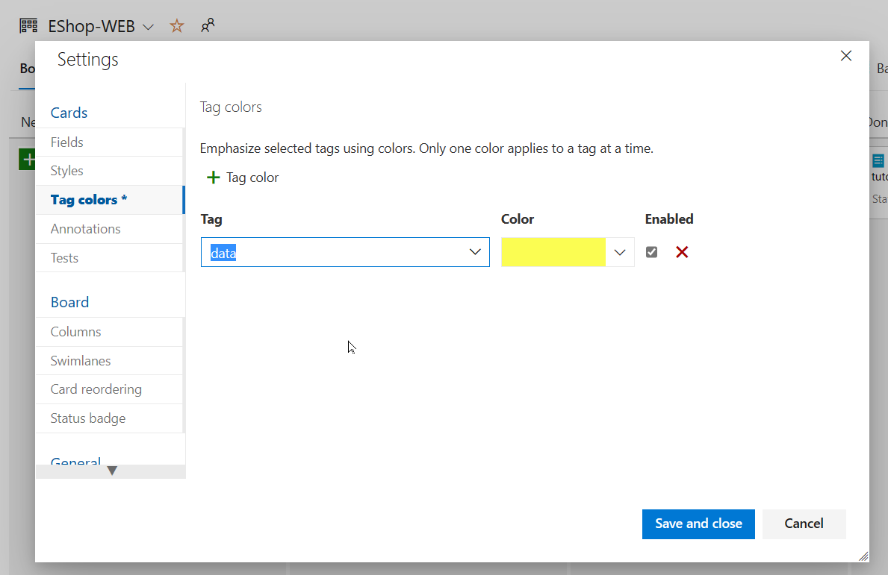

    > **Nota**: Cada vez que un backlog item o bug esté etiquetado con **data**, esa etiqueta se resaltará.

1. Seleccione la pestaña **Annotations**.

    > **Nota**: Puede especificar qué **Annotations** desea incluir en las tarjetas para facilitar su lectura y navegación. Cuando una anotación está habilitada, se puede acceder fácilmente a los work items secundarios de ese tipo haciendo clic en la visualización de cada tarjeta.

1. Seleccione la pestaña **Tests**.

    > **Nota**: La pestaña **Tests** permite configurar cómo aparecen y se comportan las pruebas en las tarjetas.

1. Haga clic en **Save** para guardar y cerrar la configuración.

1. Desde la pestaña **Board** del panel **EShop-WEB**, abra el Work Item que representa el backlog item **As a customer, I want to view new tutorials**.

1. Desde la vista detallada del elemento, en la parte superior del panel, a la derecha de la entrada **0 comments**, haga clic en **Add tag**.

1. En el cuadro de texto resultante, escriba **`data`** y presione la tecla **Enter**.

1. Repita el paso anterior para agregar la etiqueta **`ux`**.

1. Guarde estas ediciones haciendo clic en **Save and Close**.

    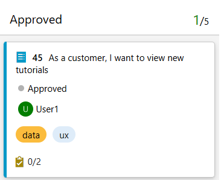

    > **Nota**: Las dos etiquetas ahora son visibles en la tarjeta, con la etiqueta **data** resaltada en amarillo según la configuración.

1. En el panel **Boards**, haga clic en el icono de engranaje **Configure board settings** (directamente a la derecha del icono de filtro).

1. En el panel **Settings**, seleccione la pestaña **Columns**.

    > **Nota**: Esta sección le permite agregar nuevas etapas al workflow.

1. Haga clic en **+ Add column**, debajo de la etiqueta **Column name**, en el cuadro de texto **Name**, escriba **`QA Approved`** y, en el cuadro de texto **WIP limit**, escriba **1**.

    > **Nota**: El límite de Work in progress de 1 indica que solo un work item debe estar en esta etapa a la vez. Normalmente establecería un valor mayor, pero solo hay dos work items para demostrar la característica.

    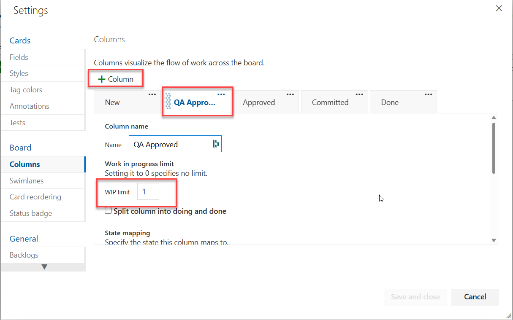

1. Observe los puntos suspensivos junto a la columna **QA Approved** que creó. Seleccione **Move right** dos veces para que la columna QA Approved quede ubicada entre **Committed** y **Done**.

1. Haga clic en **Save** para guardar y cerrar la configuración.

1. En el **Boards portal**, la columna **QA Approved** ahora está visible en la vista del tablero Kanban.

1. Arrastre el work item **As a customer, I want to see tutorials I recently viewed** desde la etapa **Committed** hasta la etapa **QA Approved**.

1. Arrastre el work item **As a customer, I want to view new tutorials** desde la etapa **Approved** hasta la etapa **QA Approved**.

    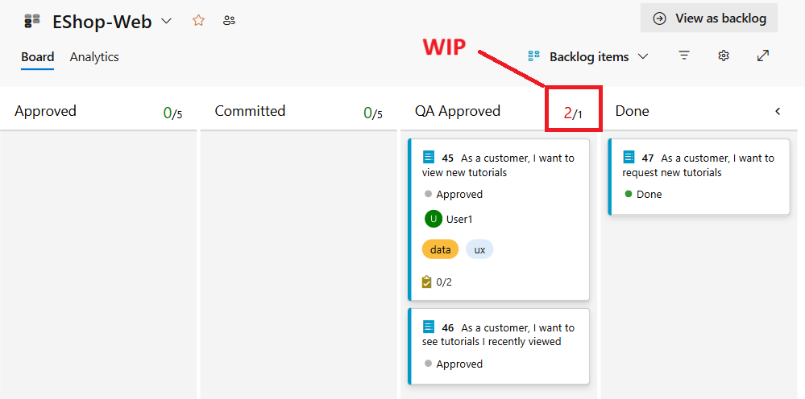

    > **Nota**: La etapa ahora supera su límite **WIP** y aparece en rojo como advertencia.

1. Mueva el backlog item **As a customer, I want to see tutorials I recently viewed** de vuelta a **Committed**.

1. En el panel **Boards**, haga clic en el icono de engranaje **Configure board settings** (directamente a la derecha del icono de filtro).

1. En el panel **Settings**, vuelva a la pestaña **Columns** y seleccione la pestaña **QA Approved**.

    > **Nota**: A menudo existe un retraso entre el momento en que el trabajo se mueve a una columna y el momento en que comienza. Para contrarrestar ese retraso y revelar el estado real del trabajo en curso, puede activar columnas divididas. Al dividirse, cada columna contiene dos subcolumnas: **Doing** y **Done**. Las columnas divididas permiten que el equipo implemente un modelo pull. Sin columnas divididas, los equipos empujan el trabajo hacia adelante para señalar que completaron su etapa de trabajo. Sin embargo, moverlo a la siguiente etapa no significa necesariamente que un miembro del equipo comience de inmediato a trabajar en ese elemento.

1. En la pestaña **QA Approved**, habilite la casilla **Split column into doing and done** para crear dos columnas separadas.

    > **Nota**: A medida que el equipo actualiza el estado del trabajo conforme avanza de una etapa a la siguiente, resulta útil que todos estén de acuerdo sobre lo que significa **done**. Al especificar los criterios de **Definition of done** para cada columna Kanban, ayuda a compartir las tareas esenciales que deben completarse antes de mover un elemento a una etapa posterior.

1. En la pestaña **QA Approved**, en la parte inferior del panel, en el cuadro de texto **Definition of done**, escriba **`Passes **all** tests`**.

1. Haga clic en **Save** para guardar y cerrar la configuración.

    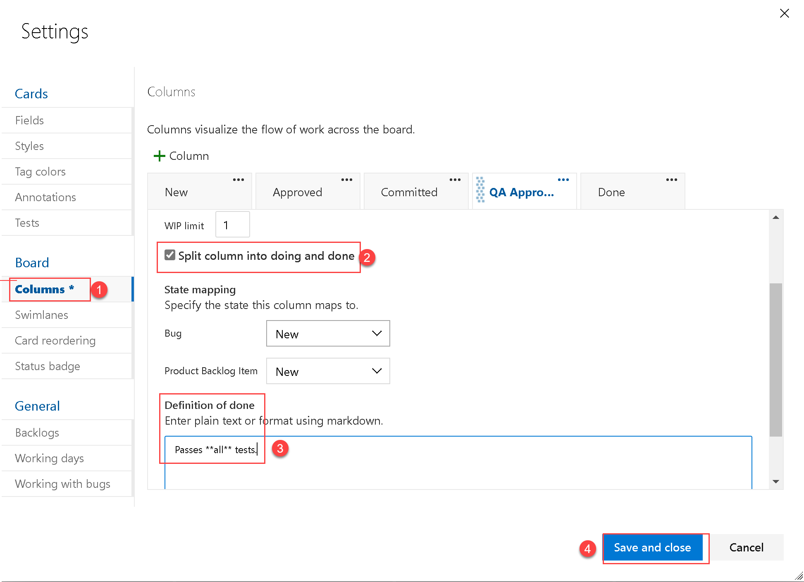

    > **Nota**: La etapa **QA Approved** ahora tiene columnas **Doing** y **Done**. También puede hacer clic en el símbolo de información (con la letra **i** dentro de un círculo) junto al encabezado de la columna para leer la **Definition of done**. Es posible que deba actualizar el explorador para ver los cambios.

    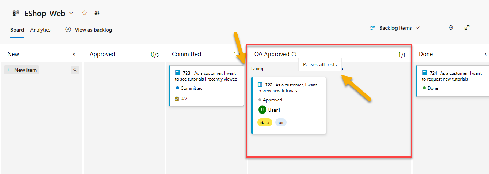

1. En el panel **Boards**, haga clic en el icono de engranaje **Configure boards settings** (directamente a la derecha del icono de filtro).

    > **Nota**: El tablero Kanban admite la capacidad de visualizar el flujo de trabajo a medida que se mueve de nuevo a finalizado. Cuando agrega **swimlanes**, también puede visualizar el estado del trabajo que admite diferentes clases de nivel de servicio. Puede crear un swimlane para representar cualquier otra dimensión que respalde sus necesidades de seguimiento.

1. En el panel **Settings**, seleccione la pestaña **Swimlanes**.

1. En la pestaña **Swimlanes**, haga clic en **+ Add swimlane**, directamente debajo de la etiqueta **Swimlane name**, en el cuadro de texto **Name**, escriba **`Expedite`**.

1. En la lista desplegable **Color**, seleccione el rectángulo **Green**.

1. Haga clic en **Save** para guardar y cerrar la configuración.

    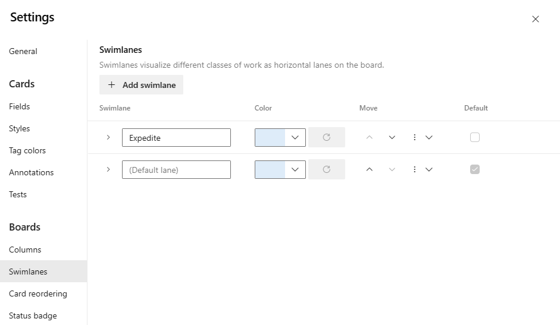

1. De vuelta en la pestaña **Board** del panel **Boards**, arrastre y coloque el work item **Committed** en la etapa **QA Approved \| Doing** del swimlane **Expedite**, de modo que se reconozca como prioritario cuando haya ancho de banda disponible para QA.

    > **Nota**: Es posible que deba actualizar el explorador para que el swimlane sea visible.

En este ejercicio, aprendió a usar el tablero Kanban para visualizar el flujo de trabajo de una manera fácil de entender y para realizar el seguimiento del progreso. También aprendió a configurar el tablero para admitir el proceso del equipo y a establecer el límite de trabajo en curso (WIP), con el fin de garantizar que el equipo no se vea sobrecargado de trabajo.

### Ejercicio 2: Definir dashboards

#### Tarea 1: Crear y personalizar dashboards

En esta tarea, recorrerá el proceso de creación de dashboards y sus componentes principales.

Los dashboards permiten que los equipos visualicen el estado y supervisen el progreso en todo el proyecto. De un vistazo, puede tomar decisiones informadas sin tener que profundizar en otras partes del sitio del proyecto de equipo. La página Overview proporciona acceso a un dashboard de equipo predeterminado, que puede personalizar agregando, quitando o reorganizando los mosaicos. Cada mosaico corresponde a un widget que proporciona acceso a una o varias características o funciones.

1. En el panel de navegación vertical del portal de Azure DevOps, seleccione el icono **Overview** y, en la lista de elementos de **Overview**, seleccione **Dashboards**.

1. Seleccione **Overview** para **eShopOnWeb Team** y revise el dashboard existente.

    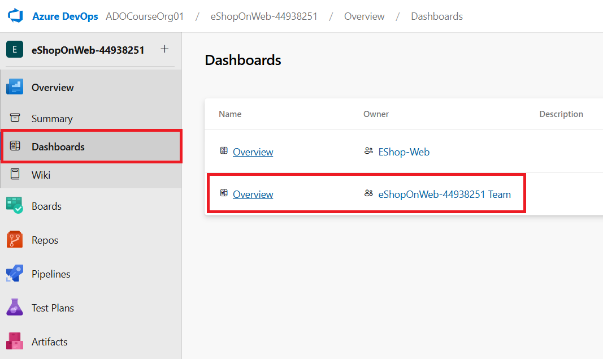

1. En el panel **Dashboards**, en la esquina superior derecha, seleccione **+ New Dashboard**.

1. En el panel **Create a dashboard**, en el cuadro de texto **Name**, escriba **`Product training`**; en la lista desplegable **Team**, seleccione el equipo **EShop-WEB** y haga clic en **Create**.

    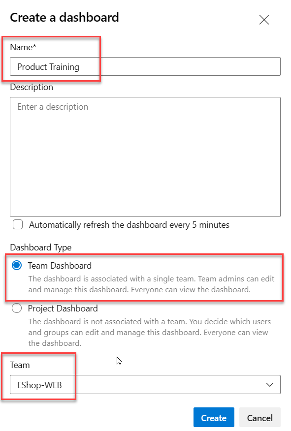

1. En el nuevo panel de dashboard, haga clic en **Add a widget**.

1. En el panel **Add Widget**, en el cuadro de texto **Search widgets**, escriba **`sprint`** para buscar widgets existentes enfocados en sprints. En la lista de resultados, seleccione **Sprint Overview** y haga clic en **Add**.

1. En el rectángulo que representa el widget recién agregado, haga clic en el icono de engranaje **Settings** y revise el panel **Configuration**.

    > **Nota**: El nivel de personalización variará según el widget.

1. En el panel **Configuration**, haga clic en **Close** sin realizar cambios.

1. De vuelta en el panel **Add Widget**, en el cuadro de texto **Search**, escriba **`sprint`** de nuevo para buscar widgets existentes enfocados en sprints. En la lista de resultados, seleccione **Sprint Capacity** y haga clic en **Add**.

    > **Nota**: Si el widget muestra "Set capacity to use the sprint capacity widget", puede seleccionar el vínculo **Set capacity** para establecer la capacidad. Establezca Activity en Development y Capacity en 1. Haga clic en **Save** y vuelva al dashboard.

1. En la vista **Dashboard**, en la parte superior del panel, haga clic en **Done Editing**.

    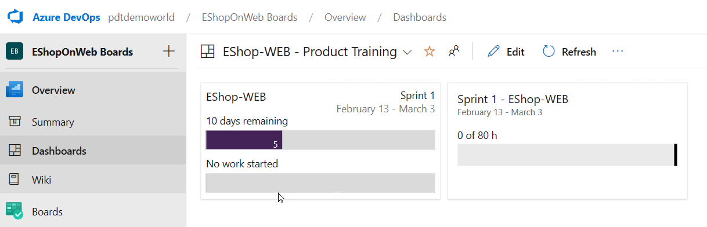

    > **Nota**: Ahora puede revisar dos aspectos importantes de su sprint actual en el dashboard personalizado.

    > **Nota**: Otra forma de personalizar dashboards es generar gráficos basados en consultas de work items, que puede compartir en un dashboard.

1. En el panel de navegación vertical del portal de Azure DevOps, seleccione el icono **Boards** y, en la lista de elementos de **Boards**, seleccione **Queries**.

1. En el panel **Queries**, haga clic en **+ New query**.

1. En la pestaña **Editor** del panel **Queries > My Queries**, en la lista desplegable **Value** de la fila **Work Item Type**, seleccione **Task**.

1. Haga clic en **Add new clause** y, en la columna **Field**, seleccione **Area Path**. Luego, en la lista desplegable **Value** correspondiente, seleccione **eShopOnWeb\\EShop-WEB**.

1. Haga clic en **Save**.

    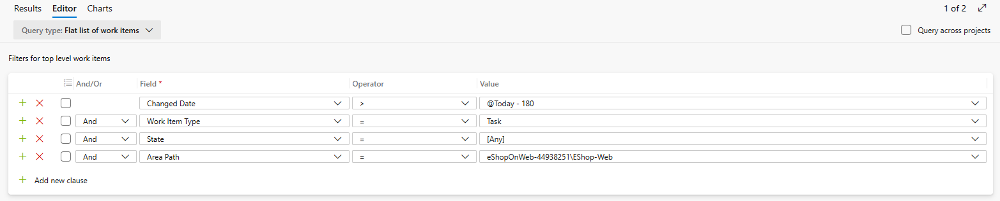

1. En el cuadro de texto **Enter name**, escriba **`Web tasks`**; en la lista desplegable **Folder**, seleccione **Shared Queries** y haga clic en **OK**.

1. En el panel **Queries > Shared Queries**, haga clic en **Web tasks** para abrir la consulta.

1. Seleccione la pestaña **Charts** y haga clic en **New chart**.

1. En el panel **Configure Chart**, en el cuadro de texto **Name**, escriba **`Web tasks - By assignment`**; en la lista desplegable **Group by**, seleccione **Assigned To** y haga clic en **Save chart** para guardar los cambios.

    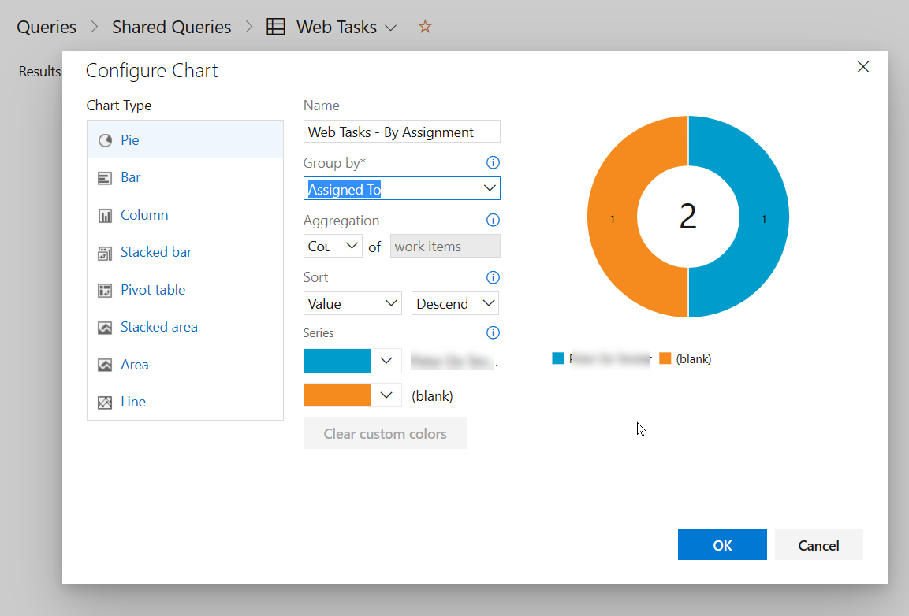

    > **Nota**: Ahora puede agregar este gráfico a un dashboard.

1. Vuelva a la sección **Dashboards** en el menú **Overview**. En la sección **EShop-Web**, seleccione el dashboard **Product Training** que usó anteriormente para abrirlo.

1. Haga clic en **Edit** en el menú superior. En la lista **Add Widget**, busque **`Chart`** y seleccione **Chart for Work Items**. Haga clic en **Add** para agregar este widget al dashboard de EShop-Web.

1. Haga clic en **configure** (engranaje) dentro de **Chart for Work Items** para abrir la configuración del widget.

1. Acepte el título tal como está. En **Query**, seleccione **Shared Queries / Web Tasks**. Mantenga **Pie** como Chart Type. En **Group By**, seleccione **Assigned To**. Mantenga los valores predeterminados de Aggregation (Count) y Sort (Value / Ascending).

1. Confirme la configuración haciendo clic en **Save**.

1. Observe que el gráfico circular de resultados de la consulta se muestra en el dashboard. Guarde los cambios presionando el botón **Done Editing** en la parte superior.

## Revisión

En este laboratorio, usó Azure Boards para realizar varias tareas comunes de planeación Agile y administración de portafolios, incluida la administración de equipos, áreas, iteraciones, work items, sprints y capacidad, la personalización de tableros Kanban y la definición de dashboards.
