---
lab:
    title: 'Control de versiones con Git en Azure Repos'
    module: 'Módulo 01: Implementar desarrollo para DevOps empresarial'
---

# Control de versiones con Git en Azure Repos

## Requisitos del laboratorio

- Este laboratorio requiere **Microsoft Edge** o un [explorador compatible con Azure DevOps.](https://docs.microsoft.com/azure/devops/server/compatibility)

- **Configurar una organización de Azure DevOps:** si aún no tiene una organización de Azure DevOps que pueda usar para este laboratorio, cree una siguiendo las instrucciones disponibles en [Create an organization or project collection](https://docs.microsoft.com/azure/devops/organizations/accounts/create-organization).

- Si aún no tiene instalado Git 2.47.0 o posterior, inicie un explorador web, vaya a la [página de descarga de Git for Windows](https://gitforwindows.org/), descárguelo e instálelo.
- Si aún no tiene instalado Visual Studio Code, desde la ventana del explorador web, vaya a la [página de descarga de Visual Studio Code](https://code.visualstudio.com/), descárguelo e instálelo.
- Si aún no tiene instalada la extensión Visual Studio C#, en la ventana del explorador web, vaya a la [página de instalación de la extensión C#](https://marketplace.visualstudio.com/items?itemName=ms-dotnettools.csharp) e instálela.

## Información general del laboratorio

Azure DevOps admite dos tipos de control de versiones: Git y Team Foundation Version Control (TFVC). A continuación, se muestra una descripción general rápida de los dos sistemas de control de versiones:

- **Team Foundation Version Control (TFVC)**: TFVC es un sistema de control de versiones centralizado. Normalmente, los miembros del equipo tienen solo una versión de cada archivo en sus máquinas de desarrollo. Los datos históricos se mantienen únicamente en el servidor. Las ramas se basan en rutas y se crean en el servidor.

- **Git**: Git es un sistema de control de versiones distribuido. Los repositorios Git pueden residir localmente, en la máquina de un desarrollador. Cada desarrollador tiene una copia del repositorio de origen en su máquina de desarrollo. Los desarrolladores pueden confirmar cada conjunto de cambios en su máquina de desarrollo y realizar operaciones de control de versiones, como revisar historial y comparar, sin una conexión de red.

Git es el proveedor de control de versiones predeterminado para los proyectos nuevos. Debe usar Git para el control de versiones en sus proyectos, a menos que necesite características de control de versiones centralizado en TFVC.

En este laboratorio, aprenderá a establecer un repositorio Git local que se pueda sincronizar fácilmente con un repositorio Git centralizado en Azure DevOps. Además, aprenderá sobre el soporte de branching y merging de Git. Usará Visual Studio Code, pero los mismos procesos se aplican al uso de cualquier cliente compatible con Git.

## Objetivos

Después de completar este laboratorio, podrá:

- Clonar un repositorio existente.
- Guardar trabajo con commits.
- Revisar el historial de cambios.
- Trabajar con ramas mediante Visual Studio Code.

## Tiempo estimado: 45 minutos

## Instrucciones

### Ejercicio 0: Configurar los requisitos previos del laboratorio

En este ejercicio, configurará los requisitos previos del laboratorio, que consisten en un nuevo proyecto de Azure DevOps con un repositorio basado en [eShopOnWeb](https://github.com/MicrosoftLearning/eShopOnWeb).

#### Tarea 1: Configurar Git y Visual Studio Code

En esta tarea, instalará y configurará Git y Visual Studio Code, incluida la configuración del Git credential helper para almacenar de forma segura las credenciales de Git que se usan para comunicarse con Azure DevOps. Si ya implementó estos requisitos previos, puede continuar directamente con la siguiente tarea.

1. En el equipo de laboratorio, abra **Visual Studio Code**.

1. En la interfaz de Visual Studio Code, en el menú principal, seleccione **Terminal \| New Terminal** para abrir el panel **TERMINAL**.

1. Asegúrese de que el Terminal actual esté ejecutando **PowerShell**; para ello, compruebe si la lista desplegable de la esquina superior derecha del panel **TERMINAL** muestra **1: powershell**.

    > **Nota**: Para cambiar el shell actual de Terminal a **PowerShell**, haga clic en la lista desplegable de la esquina superior derecha del panel **TERMINAL** y haga clic en **Select Default Shell**. En la parte superior de la ventana de Visual Studio Code, seleccione su shell de terminal preferido, **Windows PowerShell**, y haga clic en el signo más del lado derecho de la lista desplegable para abrir una nueva terminal con el shell predeterminado seleccionado.

1. En el panel **TERMINAL**, ejecute el siguiente comando para configurar el credential helper.

    ```git
    git config --global credential.helper wincred
    ```

1. En el panel **TERMINAL**, ejecute los siguientes comandos para configurar un nombre de usuario y un correo electrónico para los commits de Git. Reemplace los marcadores de posición entre llaves con su nombre de usuario y correo electrónico preferidos, eliminando los símbolos < y >:

    ```git
    git config --global user.name "<John Doe>"
    git config --global user.email <johndoe@example.com>
    ```

#### Tarea 2: (omitir si ya se realizó) Crear y configurar el proyecto de equipo

En esta tarea, creará un proyecto de Azure DevOps **eShopOnWeb** que se usará en varios laboratorios.

1. En el equipo de laboratorio, abra su organización de Azure DevOps en una ventana del explorador. Haga clic en **New Project**. Asigne al proyecto el nombre **eShopOnWeb** y elija **Scrum** en la lista desplegable **Work Item process**. Haga clic en **Create**.

    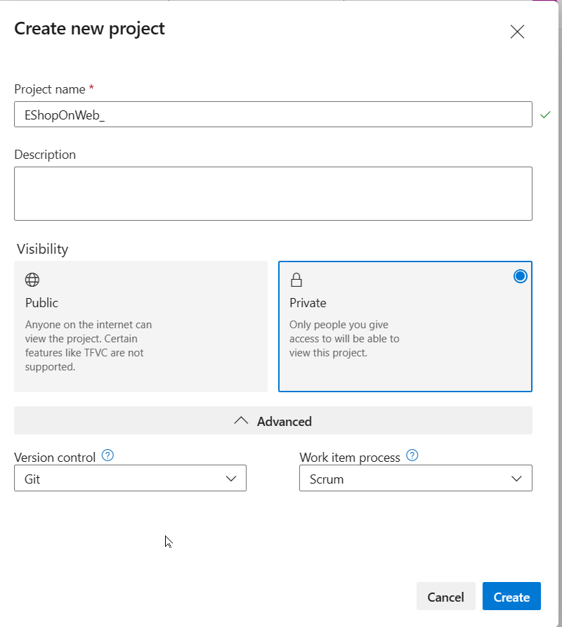

#### Tarea 3: (omitir si ya se realizó) Importar el repositorio Git de eShopOnWeb

En esta tarea, importará el repositorio Git de eShopOnWeb que se usará en varios laboratorios.

1. En el equipo de laboratorio, abra su organización de Azure DevOps y el proyecto **eShopOnWeb** creado anteriormente en una ventana del explorador. Haga clic en **Repos>Files** y en **Import**. En la ventana **Import a Git Repository**, pegue la siguiente URL `https://github.com/MicrosoftLearning/eShopOnWeb.git` y haga clic en **Import**:

    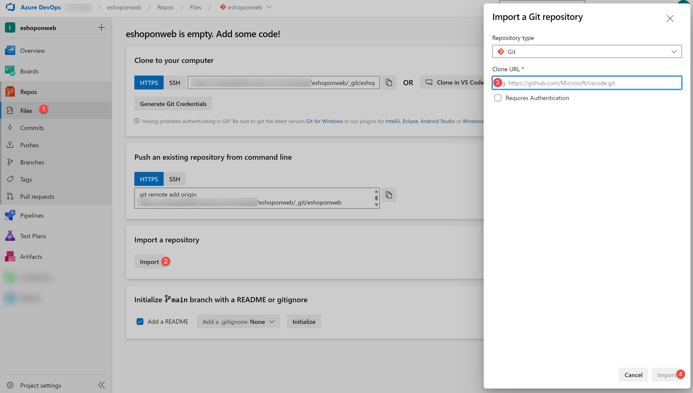

1. El repositorio está organizado de la siguiente manera:

    - La carpeta **.ado** contiene pipelines YAML de Azure DevOps.
    - La carpeta **.devcontainer** contiene la configuración para desarrollar usando contenedores, ya sea localmente en VS Code o en GitHub Codespaces.
    - La carpeta **infra** contiene plantillas Bicep y ARM de infraestructura como código usadas en algunos escenarios de laboratorio.
    - La carpeta **.github** contiene definiciones de workflow YAML de GitHub.
    - La carpeta **src** contiene el sitio web .NET 8 usado en los escenarios de laboratorio.

#### Tarea 4: (omitir si ya se realizó) Establecer la rama main como rama predeterminada

1. Vaya a **Repos>Branches**.

1. Mantenga el puntero sobre la rama **main** y, a continuación, haga clic en los puntos suspensivos a la derecha de la columna.

1. Haga clic en **Set as default branch**.

### Ejercicio 1: Clonar un repositorio existente

En este ejercicio, usará Visual Studio Code para confirmar cambios en la rama **main** del repositorio **eShopOnWeb**.

> **Nota**: La rama **main** es la rama predeterminada en el repositorio **eShopOnWeb** y es la rama que usará durante el resto del laboratorio.

#### Tarea 1: Clonar un repositorio existente

En esta tarea, recorrerá el proceso de clonar un repositorio Git mediante Visual Studio Code.

1. Cambie al explorador web que muestra su organización de Azure DevOps con el proyecto **eShopOnWeb** que generó en el ejercicio anterior.

1. En el panel de navegación vertical del portal de Azure DevOps, seleccione el icono **Repos**.

1. En la esquina superior derecha del panel del repositorio **eShopOnWeb**, haga clic en **Clone**.

    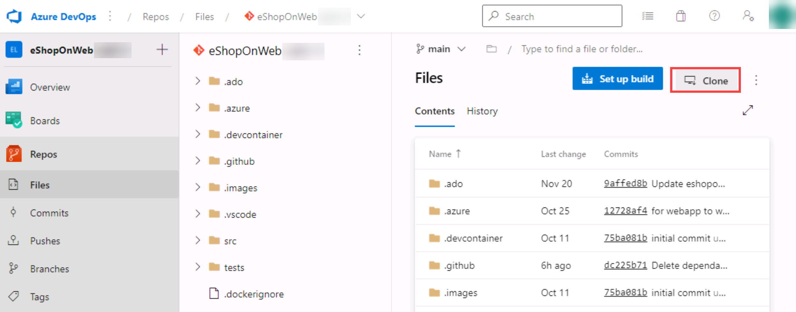

    > **Nota**: Obtener una copia local de un repositorio Git se denomina *cloning*. Todas las herramientas de desarrollo principales admiten esta operación y podrán conectarse a Azure Repos para descargar el código fuente más reciente con el que se trabajará.

1. En el panel **Clone Repository**, con la opción de línea de comandos **HTTPS** seleccionada, haga clic en el botón **Copy to clipboard** junto a la URL de clonación del repositorio.

    > **Nota**: Puede usar esta URL con cualquier herramienta compatible con Git para obtener una copia del código base.

1. Cierre el panel **Clone Repository**.

1. Cambie a **Visual Studio Code** en ejecución en el equipo de laboratorio.

1. Haga clic en el encabezado de menú **View** y, en el menú desplegable, haga clic en **Command Palette**.

    > **Nota**: Command Palette proporciona una forma sencilla y práctica de acceder a una amplia variedad de tareas, incluidas las implementadas como extensiones de terceros. Puede usar el método abreviado de teclado **Ctrl+Shift+P** o **F1** para abrirlo.

1. En el símbolo del sistema de Command Palette, ejecute el comando **Git: Clone**.

    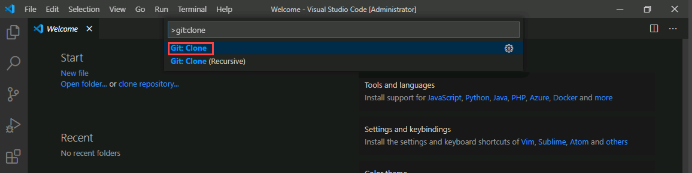

    > **Nota**: Para ver todos los comandos relevantes, puede comenzar escribiendo **Git**.

1. En el cuadro de texto **Provide repository URL or pick a repository source**, pegue la URL de clonación del repositorio que copió anteriormente en esta tarea y presione la tecla **Enter**.

1. En el cuadro de diálogo **Select Folder**, navegue a la unidad C:, cree una nueva carpeta llamada **Git**, selecciónela y luego haga clic en **Select as Repository Destination**.

1. Cuando se le solicite, inicie sesión en su cuenta de Azure DevOps.

1. Una vez que finalice el proceso de clonación y cuando se le solicite, en Visual Studio Code, haga clic en **Open** para abrir el repositorio clonado.

    > **Nota**: Puede ignorar las advertencias que reciba sobre problemas con la carga del proyecto. Es posible que la solución no esté en un estado adecuado para una compilación, pero nos enfocaremos en trabajar con Git, por lo que no es necesario compilar el proyecto.

### Ejercicio 2: Guardar trabajo con commits

En este ejercicio, recorrerá varios escenarios que implican el uso de Visual Studio Code para preparar y confirmar cambios.

Cuando realiza cambios en sus archivos, Git registra los cambios en el repositorio local. Puede seleccionar los cambios que desea confirmar preparándolos mediante staging. Los commits siempre se realizan contra el repositorio Git local, por lo que no tiene que preocuparse de que el commit sea perfecto o esté listo para compartirse con otros. Puede realizar más commits a medida que continúa trabajando y enviar los cambios a otros cuando estén listos para compartirse.

Los commits de Git constan de lo siguiente:

- Los archivos modificados en el commit. Git conserva el contenido de todos los cambios de archivo en el repositorio dentro de los commits. Esto mantiene el proceso rápido y permite realizar merges inteligentes.
- Una referencia a los commits primarios. Git administra el historial del código mediante estas referencias.
- Un mensaje que describe un commit. Este mensaje se entrega a Git al crear el commit. Es una buena idea mantener este mensaje descriptivo, pero conciso.

#### Tarea 1: Confirmar cambios

En esta tarea, usará Visual Studio Code para confirmar cambios.

1. En la ventana de Visual Studio Code, en la parte superior de la barra de herramientas vertical, seleccione la pestaña **EXPLORER**, navegue al archivo **/eShopOnWeb/src/Web/Program.cs** y selecciónelo. Esto mostrará automáticamente su contenido en el panel de detalles.

1. En la primera línea, agregue el siguiente comentario:

    ```csharp
    // My first change
    ```

    > **Nota**: Realmente no importa cuál sea el comentario, ya que el objetivo es simplemente realizar un cambio.

1. Presione **Ctrl+S** para guardar el cambio.

1. En la ventana de Visual Studio Code, seleccione la pestaña **SOURCE CONTROL** para comprobar que Git reconoció el cambio más reciente en el archivo que reside en el clon local del repositorio Git.

1. Con la pestaña **SOURCE CONTROL** seleccionada, en la parte superior del panel, en el cuadro de texto, escriba **`My commit`** como mensaje de commit y presione **Ctrl+Enter** para confirmarlo localmente.

    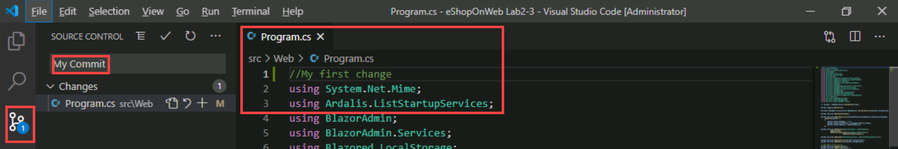

1. Si se le pregunta si desea preparar automáticamente los cambios y confirmarlos directamente, haga clic en **Always**.

    > **Nota**: Analizaremos **staging** más adelante en el laboratorio.

1. En la esquina inferior izquierda de la ventana de Visual Studio Code, a la derecha de la etiqueta **main**, observe el icono **Synchronize Changes**, un círculo con dos flechas verticales que apuntan en direcciones opuestas, y el número **1** junto a la flecha que apunta hacia arriba. Haga clic en el icono y, si se le solicita confirmación para continuar, haga clic en **OK** para enviar y recuperar commits hacia y desde **origin/main**.

#### Tarea 2: Revisar commits

En esta tarea, usará el portal de Azure DevOps para revisar commits.

1. Cambie a la ventana del explorador web que muestra la interfaz de Azure DevOps.

1. En el panel de navegación vertical del portal de Azure DevOps, en la sección **Repos**, seleccione **Commits**.

1. Compruebe que su commit aparece en la parte superior de la lista.

    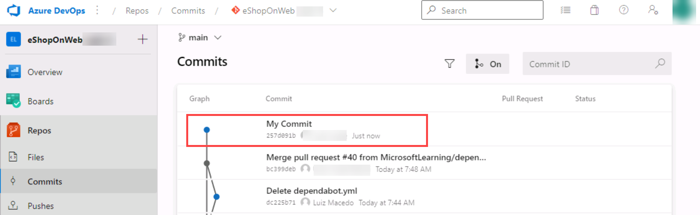

#### Tarea 3: Preparar cambios mediante staging

En esta tarea, explorará el uso de staging de cambios mediante Visual Studio Code. Preparar cambios permite agregar de forma selectiva determinados archivos a un commit mientras se omiten los cambios realizados en otros archivos.

1. Vuelva a la ventana de **Visual Studio Code**.

1. Actualice la clase **Program.cs** abierta cambiando el primer comentario por el siguiente y guarde el archivo.

    ```csharp
        //My second change
    ```

1. En la ventana de Visual Studio Code, vuelva a la pestaña **EXPLORER**, navegue al archivo **/eShopOnWeb/src/Web/Constants.cs** y selecciónelo. Esto mostrará automáticamente su contenido en el panel de detalles.

1. Agregue al archivo **Constants.cs** un comentario en la primera línea y guarde el archivo.

    ```csharp
    // My third change
    ```

1. En la ventana de Visual Studio Code, cambie a la pestaña **SOURCE CONTROL**, mantenga el puntero del mouse sobre la entrada **Program.cs** y haga clic en el signo más del lado derecho de esa entrada.

    > **Nota**: Esto prepara únicamente el cambio del archivo **Program.cs**, dejándolo listo para el commit sin incluir **Constants.cs**.

1. Con la pestaña **SOURCE CONTROL** seleccionada, en la parte superior del panel, en el cuadro de texto, escriba **`Added comments`** como mensaje de commit.

    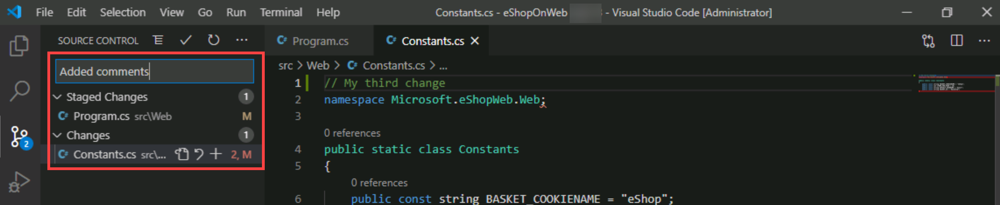

1. En la parte superior de la pestaña **SOURCE CONTROL**, haga clic en el símbolo de puntos suspensivos; en el menú desplegable, seleccione **Commit** y, en el menú en cascada, seleccione **Commit Staged**.

1. En la esquina inferior izquierda de la ventana de Visual Studio Code, haga clic en el botón **Synchronize Changes** para sincronizar los cambios confirmados con el servidor y, si se le solicita confirmación para continuar, haga clic en **OK** para enviar y recuperar commits hacia y desde **origin/main**.

    > **Nota**: Observe que, como solo se confirmó el cambio preparado, el otro cambio sigue pendiente de sincronización.

### Ejercicio 3: Revisar historial

En este ejercicio, usará el portal de Azure DevOps para revisar el historial de commits.

Git usa la información de referencia primaria almacenada en cada commit para administrar un historial completo del desarrollo. Puede revisar fácilmente este historial de commits para identificar cuándo se realizaron cambios en los archivos y determinar diferencias entre versiones del código mediante la terminal o una de las muchas extensiones disponibles de Visual Studio Code. También puede revisar los cambios mediante el portal de Azure DevOps.

El uso de la característica **Branches and Merges** de Git funciona mediante pull requests, por lo que el historial de commits del desarrollo no necesariamente forma una línea recta y cronológica. Cuando use el historial para comparar versiones, piense en términos de cambios de archivo entre dos commits, en lugar de cambios de archivo entre dos puntos en el tiempo. Un cambio reciente en un archivo de la rama main puede provenir de un commit creado hace dos semanas en una feature branch que se fusionó ayer.

#### Tarea 1: Comparar archivos

En esta tarea, recorrerá el historial de commits mediante el portal de Azure DevOps.

1. Con la pestaña **SOURCE CONTROL** de la ventana de Visual Studio Code abierta, seleccione **Constants.cs**, que representa la versión no preparada del archivo.

    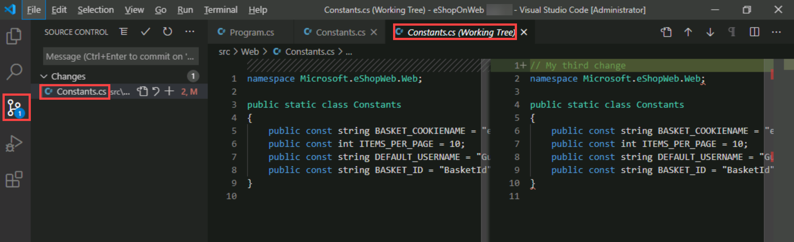

    > **Nota**: Se abre una vista de comparación para permitirle localizar fácilmente los cambios que realizó. En este caso, es solo el comentario.

1. Cambie a la ventana del explorador web que muestra el panel **Commits** del portal de **Azure DevOps** para revisar las ramas de origen y los merges. Estos proporcionan una forma práctica de visualizar cuándo y cómo se realizaron los cambios en el origen.

1. Desplácese hacia abajo hasta la entrada **My commit** (enviada antes) y mantenga el puntero del mouse sobre ella para mostrar el símbolo de puntos suspensivos del lado derecho.

1. Haga clic en los puntos suspensivos, en el menú desplegable, seleccione **Browse Files** y revise los resultados.

    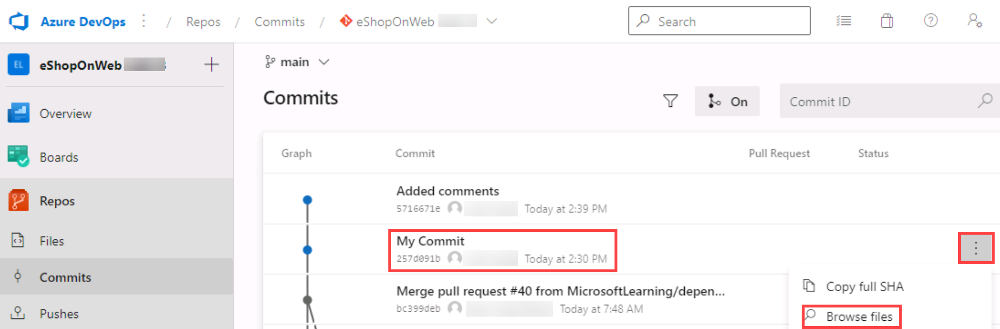

    > **Nota**: Esta vista representa el estado del origen correspondiente al commit, lo que le permite revisar y descargar cada uno de los archivos de origen.

### Ejercicio 4: Trabajar con ramas

En este ejercicio, recorrerá escenarios que implican la administración de ramas mediante Visual Studio Code y el portal de Azure DevOps.

Puede administrar su repositorio Git de Azure DevOps desde la vista **Branches** de **Azure Repos** en el portal de Azure DevOps. También puede personalizar la vista para realizar seguimiento de las ramas que más le interesan y mantenerse al tanto de los cambios realizados por el equipo.

Confirmar cambios en una rama no afectará a otras ramas, y puede compartir ramas con otras personas sin tener que fusionar los cambios en el proyecto principal. También puede crear nuevas ramas para aislar los cambios de una característica o una corrección de bug respecto de la rama principal y de otro trabajo.

Como las ramas son ligeras, cambiar entre ellas es rápido y sencillo. Git no crea varias copias del código fuente al trabajar con ramas; en su lugar, usa la información de historial almacenada en los commits para recrear los archivos de una rama cuando comienza a trabajar en ella.

Su workflow de Git debe crear y usar ramas para administrar características y correcciones de bugs. El resto del workflow de Git, como compartir código y revisarlo con pull requests, funciona a través de ramas. Aislar el trabajo en ramas facilita mucho cambiar en qué está trabajando simplemente cambiando la rama actual.

#### Tarea 1: Crear una nueva rama en el repositorio local

En esta tarea, creará una rama mediante Visual Studio Code.

1. Cambie a **Visual Studio Code** en ejecución en el equipo de laboratorio.

1. Con la pestaña **SOURCE CONTROL** seleccionada, en la esquina inferior izquierda de la ventana de Visual Studio Code, haga clic en **main**.

1. En la ventana emergente, seleccione **+ Create new branch from...**.

    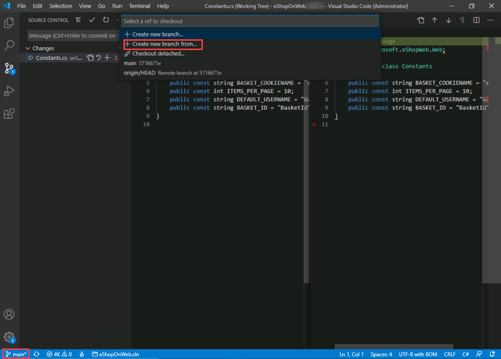

1. En el cuadro de texto **Select a ref to create the branch from**, seleccione **main** como rama de referencia.

1. En el cuadro de texto **Branch name**, escriba **`dev`** para especificar la nueva rama y presione **Enter**.

    > **Nota**: En este punto, se le cambia automáticamente a la rama **dev**.

#### Tarea 2: Eliminar una rama

En esta tarea, usará Visual Studio Code para trabajar con una rama creada en la tarea anterior.

Git realiza un seguimiento de la rama en la que está trabajando y se asegura de que, cuando haga checkout de una rama, los archivos coincidan con el commit más reciente de esa rama. Las ramas le permiten trabajar con varias versiones del código fuente en el mismo repositorio Git local al mismo tiempo. Puede usar Visual Studio Code para publicar, hacer checkout y eliminar ramas.

1. En la ventana de **Visual Studio Code**, con la pestaña **SOURCE CONTROL** seleccionada, en la esquina inferior izquierda de la ventana de Visual Studio Code, haga clic en el icono **Publish changes** (directamente a la derecha de la etiqueta **dev**, que representa la rama recién creada).

1. Cambie a la ventana del explorador web que muestra el panel **Commits** del portal de **Azure DevOps** y seleccione **Branches**.

1. En la pestaña **Mine** del panel **Branches**, compruebe que la lista de ramas incluye **dev**.

1. Mantenga el puntero del mouse sobre la entrada de rama **dev** para mostrar el símbolo de puntos suspensivos del lado derecho.

1. Haga clic en los puntos suspensivos, en el menú emergente, seleccione **Delete branch** y, cuando se le solicite confirmación, haga clic en **Delete**.

    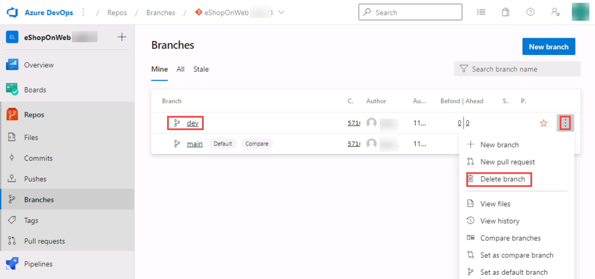

1. Vuelva a la ventana de **Visual Studio Code** y, con la pestaña **SOURCE CONTROL** seleccionada, en la esquina inferior izquierda de la ventana de Visual Studio Code, haga clic en la entrada **dev**. Esto mostrará las ramas existentes en la parte superior de la ventana de Visual Studio Code.

1. Compruebe que ahora se muestran dos ramas **dev**.

1. Vaya al explorador web que muestra la pestaña **Mine** de **Branches**.

1. En la pestaña **Mine** del panel **Branches**, seleccione la pestaña **All**.

1. En la pestaña **All** del panel **Branches**, en el cuadro de texto **Search branch name**, escriba **`dev`**.

1. Revise la sección **Deleted branches**, que contiene la entrada que representa la rama recién eliminada.

1. En la sección **Deleted branches**, mantenga el puntero del mouse sobre la entrada de rama **dev** para mostrar el símbolo de puntos suspensivos del lado derecho.

1. Haga clic en los puntos suspensivos y, en el menú emergente, seleccione **Restore branch**.

    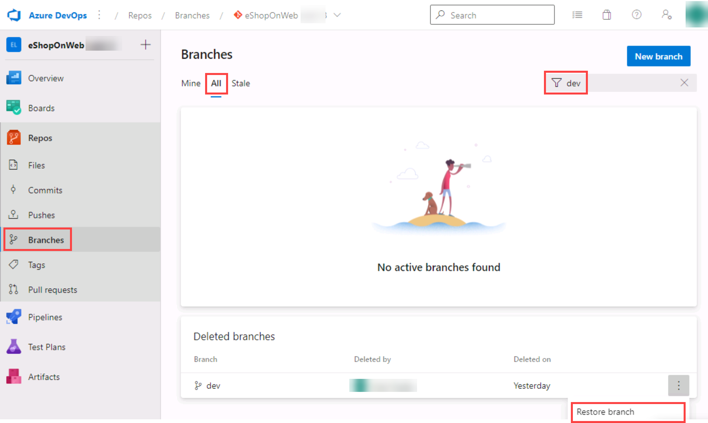

    > **Nota**: Puede usar esta funcionalidad para restaurar una rama eliminada siempre que conozca su nombre exacto.

#### Tarea 3: Branch Policies

En esta tarea, usará el portal de Azure DevOps para agregar políticas a la rama main y permitir cambios únicamente mediante Pull Requests que cumplan con las políticas definidas. Se busca garantizar que los cambios de una rama se revisen antes de fusionarse.

Para simplificar, trabajaremos directamente en el editor del repositorio desde el explorador web, es decir, directamente en origin, en lugar de usar el clon local en VS Code, que es lo recomendado en escenarios reales.

1. Cambie al explorador web que muestra la pestaña **Mine** del panel **Branches** en el portal de Azure DevOps.

1. En la pestaña **Mine** del panel **Branches**, mantenga el puntero del mouse sobre la entrada de rama **main** para mostrar el símbolo de puntos suspensivos del lado derecho.

1. Haga clic en los puntos suspensivos y, en el menú emergente, seleccione **Branch Policies**.

    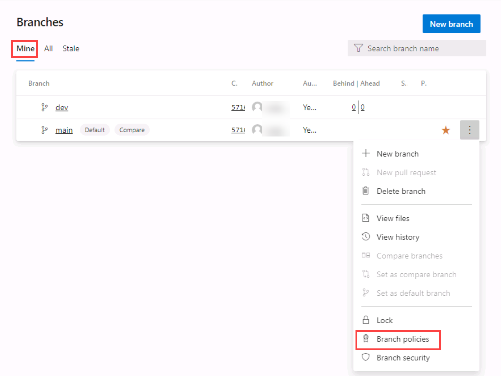

1. En la pestaña **main** de la configuración del repositorio, habilite la opción **Require minimum number of reviewers**. Agregue **1** reviewer y active la casilla **Allow requestors to approve their own changes** (ya que usted es el único usuario del proyecto para el laboratorio).

1. En la pestaña **main** de la configuración del repositorio, habilite la opción **Check for linked work items** y déjela con la opción **Required**.

    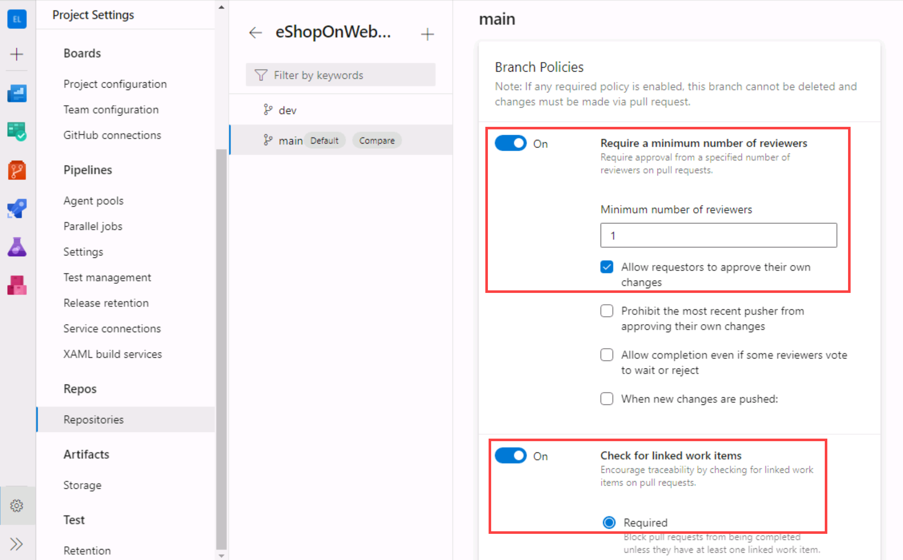

#### Tarea 4: Probar la branch policy

En esta tarea, usará el portal de Azure DevOps para probar la política y crear su primer Pull Request.

1. En el panel de navegación vertical del portal de Azure DevOps, en **Repos>Files**, asegúrese de que la rama **main** esté seleccionada en la lista desplegable que se muestra sobre el contenido.

1. Para asegurarse de que las políticas funcionan, intente realizar un cambio y confirmarlo en la rama **main**. Navegue al archivo **/eShopOnWeb/src/Web/Program.cs** y selecciónelo. Esto mostrará automáticamente su contenido en el panel de detalles.

1. En la primera línea, agregue el siguiente comentario:

    ```csharp
    // Testing main branch policy
    ```

1. Haga clic en **Commit > Commit**. Verá una advertencia: los cambios en la rama main solo se pueden realizar mediante un Pull Request.

    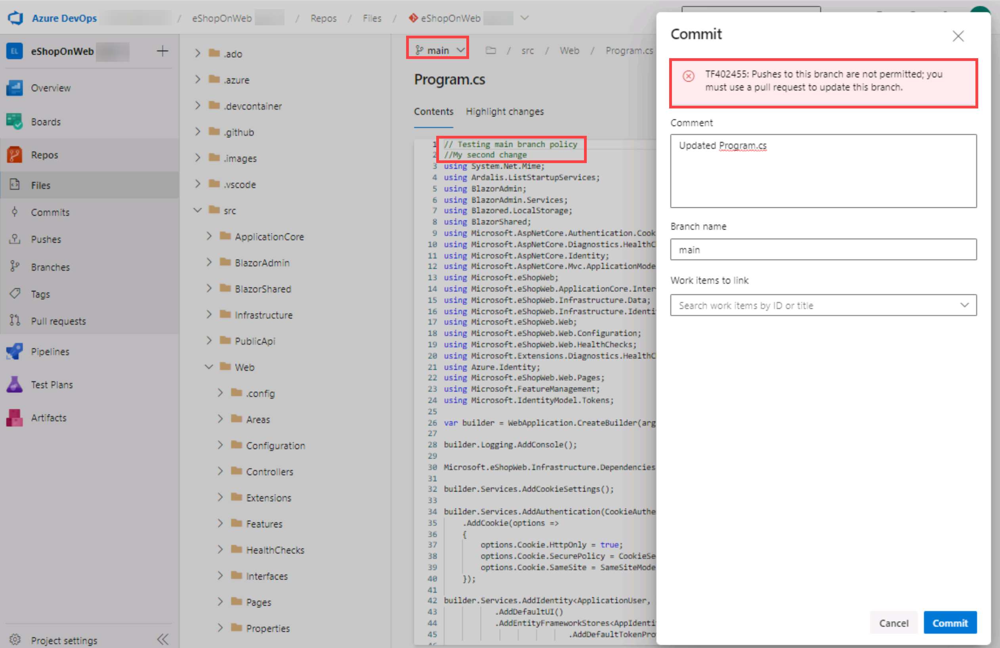

1. Haga clic en **Cancel** para omitir el commit.

#### Tarea 5: Trabajar con Pull Requests

En esta tarea, usará el portal de Azure DevOps para crear un Pull Request usando la rama **dev** con el fin de fusionar un cambio en la rama **main** protegida. Un work item de Azure DevOps se vinculará a los cambios para poder rastrear el trabajo pendiente con la actividad del código.

1. En el panel de navegación vertical del portal de Azure DevOps, en la sección **Boards**, seleccione **Work Items**.

1. Haga clic en **+ New Work Item > Product Backlog Item**. En el campo de título, escriba **Testing my first PR** y haga clic en **Save**.

1. Ahora vuelva al panel de navegación vertical del portal de Azure DevOps, en **Repos>Files**, y asegúrese de que la rama **dev** esté seleccionada.

1. Navegue al archivo **/eShopOnWeb/src/Web/Program.cs** y realice el siguiente cambio en la primera línea:

    ```csharp
    // Testing my first PR
    ```

1. Haga clic en **Commit > Commit** y deje el mensaje de commit predeterminado. Esta vez el commit funciona porque la rama **dev** no tiene políticas.

1. Aparecerá un mensaje que propone crear un Pull Request, ya que la rama **dev** ahora tiene cambios por delante en comparación con **main**. Haga clic en **Create a Pull Request**.

    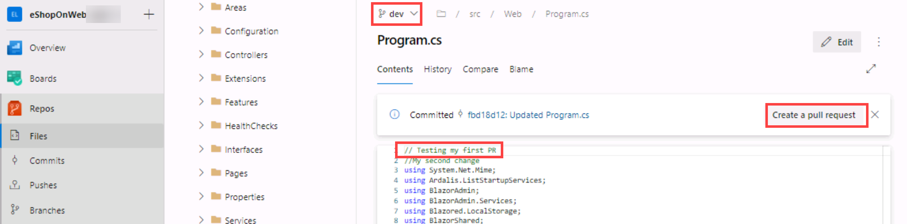

1. En la pestaña **New pull request**, deje los valores predeterminados y haga clic en **Create**.

1. El Pull Request mostrará algunos requisitos con error o pendientes, según las políticas aplicadas a nuestra rama de destino **main**.

    - Los cambios propuestos deben tener un work item vinculado.
    - Al menos 1 usuario debe revisar y aprobar los cambios.

1. En las opciones del lado derecho, haga clic en el botón **+** junto a **Work Items**. Vincule el work item creado anteriormente al Pull Request haciendo clic en él. Verá que cambia el estado de uno de los requisitos.

    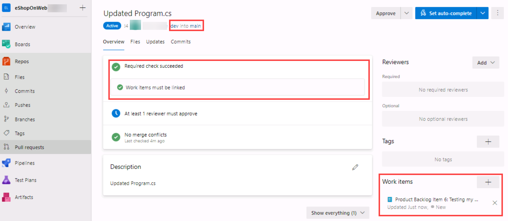

1. A continuación, abra la pestaña **Files** para revisar los cambios propuestos. En un Pull Request más completo, podría revisar los archivos uno por uno, marcarlos como revisados y abrir comentarios en las líneas que no sean claras. Al mantener el mouse sobre el número de línea, aparece una opción para publicar un comentario.

1. Vuelva a la pestaña **Overview** y, en la parte superior derecha, haga clic en **Approve**. Todos los requisitos cambiarán a verde. Ahora puede hacer clic en **Complete**.

1. En la pestaña **Complete Pull Request**, se mostrarán varias opciones antes de completar el merge:

    - **Merge Type**: se ofrecen 4 tipos de merge. Puede revisarlos [aquí](https://learn.microsoft.com/azure/devops/repos/git/complete-pull-requests?view=azure-devops&tabs=browser#complete-a-pull-request) u observar las animaciones proporcionadas. Elija **Merge (no fast forward)**.
    - **Post-complete options**:
        - Active **Complete associated work item...**. Esto moverá el PBI asociado al estado **Done**.

1. Haga clic en **Complete Merge**.

#### Tarea 6: Aplicar tags

El equipo de producto decidió que la versión actual del sitio debe publicarse como v1.1.0-beta.

1. En el panel de navegación vertical del portal de Azure DevOps, en la sección **Repos**, seleccione **Tags**.

1. En el panel **Tags**, haga clic en **New tag**.

1. En el panel **Create a tag**, en el cuadro de texto **Name**, escriba **`v1.1.0-beta`**; en la lista desplegable **Based on**, deje seleccionada la entrada **main**; en el cuadro de texto **Description**, escriba **`Beta release v1.1.0`** y haga clic en **Create**.

    > **Nota**: Ahora etiquetó el repositorio en esta versión; el commit más reciente queda vinculado al tag. Podría etiquetar commits por diversos motivos, y Azure DevOps ofrece la flexibilidad de editarlos y eliminarlos, así como administrar sus permisos.

### Ejercicio 5: Quitar Branch Policies

Al recorrer los distintos laboratorios del curso en el orden en que se presentan, la branch policy configurada durante este laboratorio bloqueará ejercicios de laboratorios futuros. Por lo tanto, debe quitar las branch policies configuradas.

1. Desde la vista del proyecto **eShopOnWeb** de Azure DevOps, navegue a **Repos** y seleccione **Branches**. Seleccione la pestaña **Mine** del panel **Branches**.

1. En la pestaña **Mine** del panel **Branches**, mantenga el puntero del mouse sobre la entrada de rama **main** para mostrar el símbolo de puntos suspensivos (the ...) del lado derecho.

1. Haga clic en los puntos suspensivos y, en el menú emergente, seleccione **Branch Policies**.

    

1. En la pestaña **main** de la configuración del repositorio, deshabilite la opción **Require minimum number of reviewers**.

1. En la pestaña **main** de la configuración del repositorio, deshabilite la opción **Check for linked work items**.

    

1. Ahora ha deshabilitado o quitado las branch policies de la rama main.

## Revisión

En este laboratorio, aprendió a usar Git para el control de versiones en Azure Repos.
