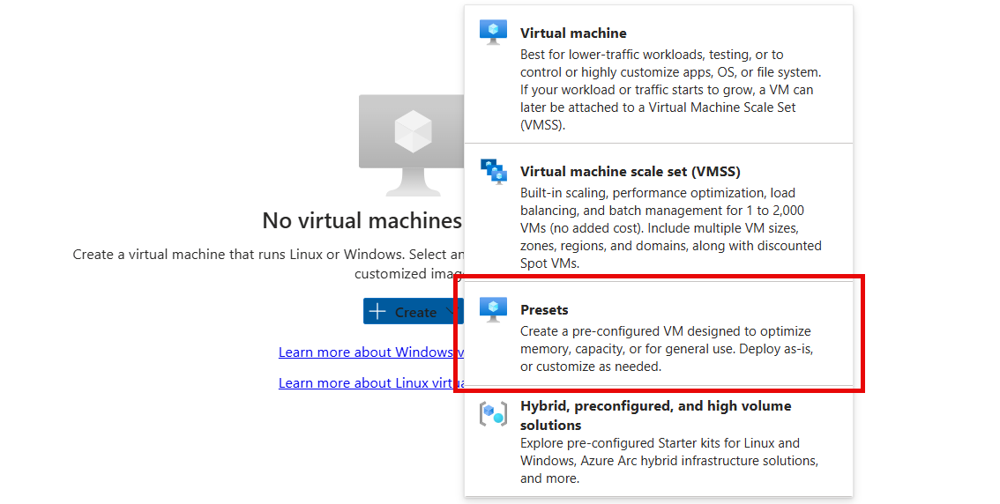
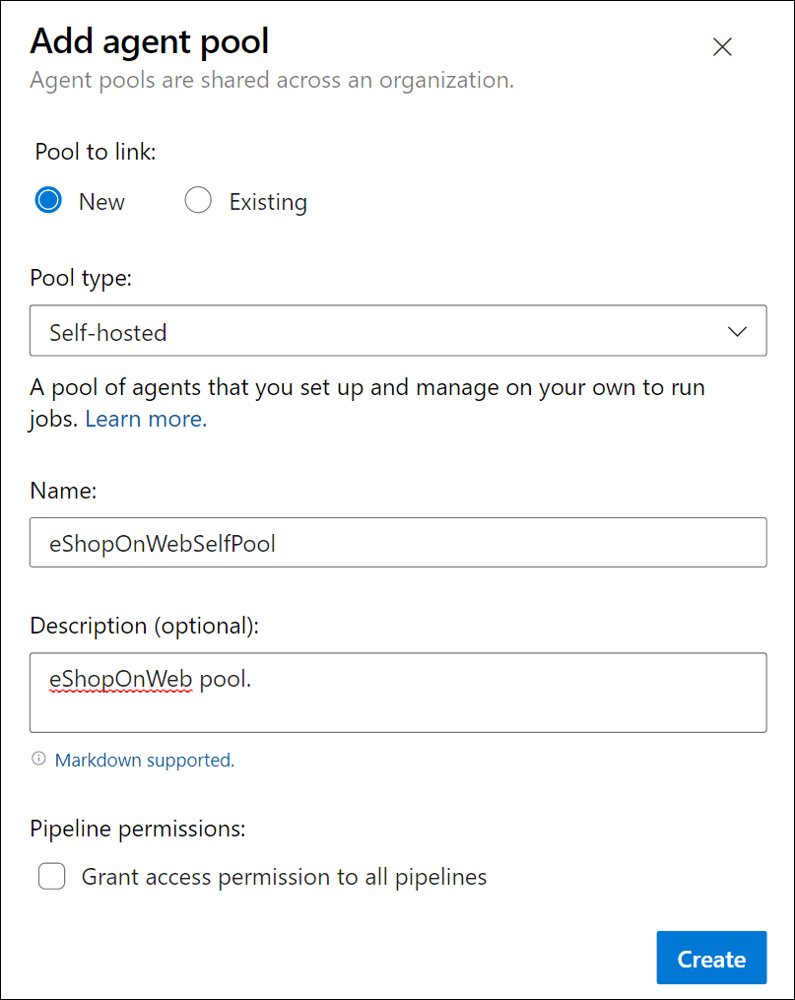
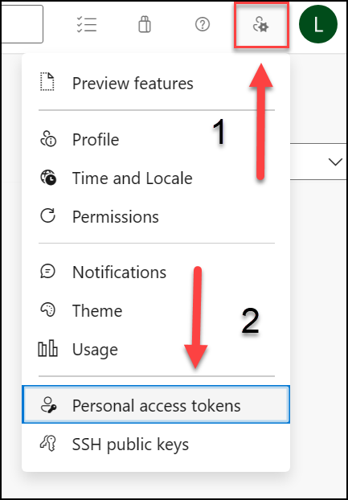
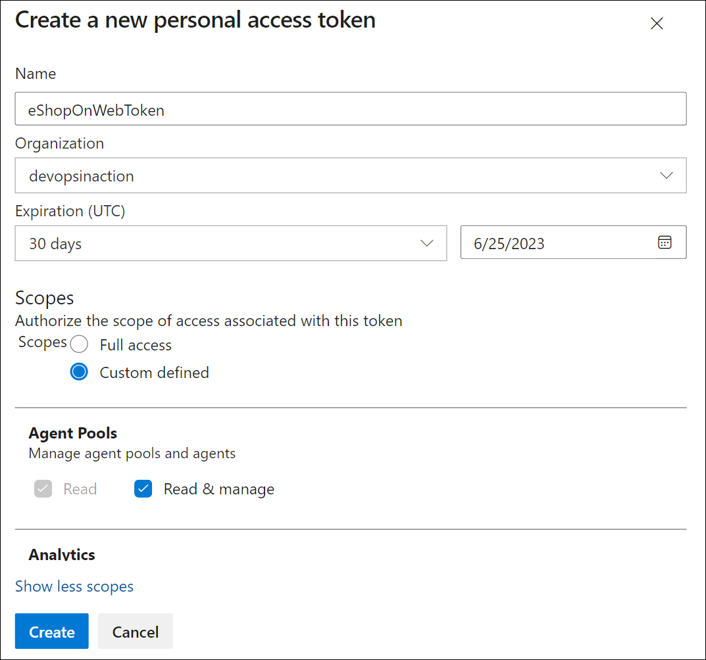
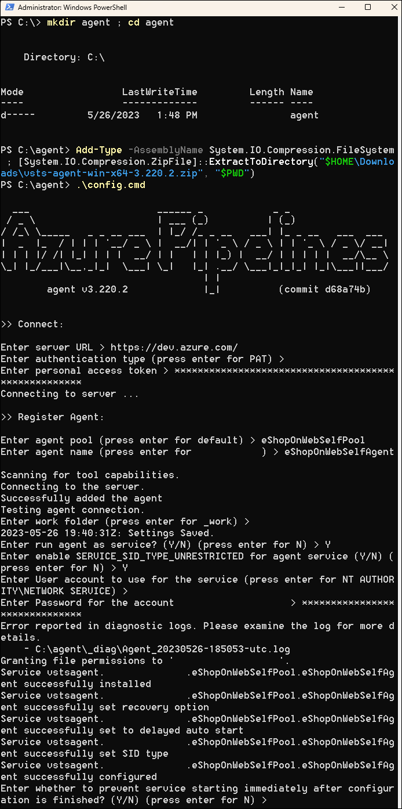
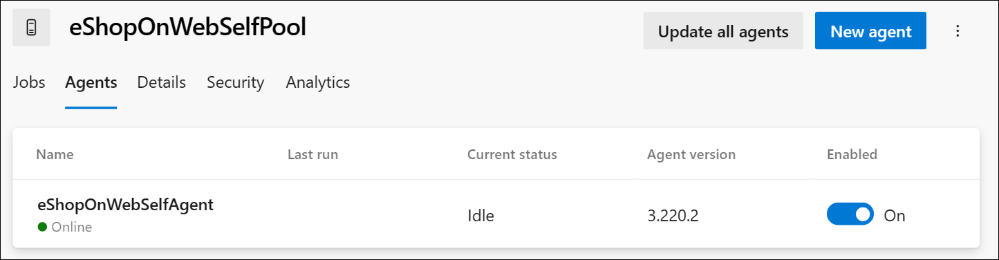
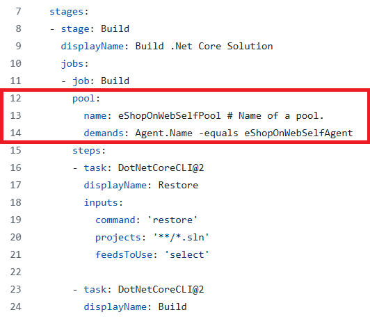

---
lab:
    title: 'Configurar agent pools y comprender los estilos de pipeline'
    module: 'Módulo 02: Implementar CI con Azure Pipelines y GitHub Actions'
---

# Configurar agent pools y comprender los estilos de pipeline

## Requisitos del laboratorio

- Este laboratorio requiere **Microsoft Edge** o un [explorador compatible con Azure DevOps.](https://docs.microsoft.com/azure/devops/server/compatibility)

- **Configurar una organización de Azure DevOps:** si aún no tiene una organización de Azure DevOps que pueda usar para este laboratorio, cree una siguiendo las instrucciones disponibles en [Crear una organización o colección de proyectos](https://docs.microsoft.com/azure/devops/organizations/accounts/create-organization).

- [Página de descarga de Git for Windows](https://gitforwindows.org/). Se instalará como parte de los requisitos previos de este laboratorio.

- [Visual Studio Code](https://code.visualstudio.com/). Se instalará como parte de los requisitos previos de este laboratorio.

## Información general del laboratorio

Los pipelines basados en YAML permiten implementar CI/CD completamente como código, donde las definiciones de pipeline residen en el mismo repositorio que el código que forma parte del proyecto de Azure DevOps. Los pipelines basados en YAML admiten una amplia variedad de características que forman parte de los pipelines clásicos, como pull requests, revisiones de código, historial, branching y templates.

Independientemente del estilo de pipeline que elija, para compilar el código o implementar la solución mediante Azure Pipelines, necesita un agente. Un agente hospeda recursos de proceso que ejecutan un job a la vez. Los jobs pueden ejecutarse directamente en la máquina host del agente o en un contenedor.

Tiene la opción de ejecutar los jobs mediante agentes hospedados por Microsoft, que se administran por usted, o implementar un agente autohospedado que usted configure y administre por su cuenta.

En este laboratorio, aprenderá a implementar y usar agentes autohospedados con pipelines YAML.

## Objetivos

Después de completar este laboratorio, podrá:

- Implementar pipelines basados en YAML.
- Implementar agentes autohospedados.

## Tiempo estimado: 30 minutos

## Instrucciones

### Ejercicio 0: (omitir si ya se realizó) Configurar los requisitos previos del laboratorio

En este ejercicio, configurará los requisitos previos del laboratorio, que consisten en un nuevo proyecto de Azure DevOps con un repositorio basado en [eShopOnWeb](https://github.com/MicrosoftLearning/eShopOnWeb).

#### Tarea 1: (omitir si ya se realizó) Crear y configurar el proyecto de equipo

En esta tarea, creará un proyecto de Azure DevOps **eShopOnWeb** que se usará en varios laboratorios.

1. En el equipo de laboratorio, abra su organización de Azure DevOps en una ventana del explorador. Haga clic en **New Project**. Asigne al proyecto el nombre **eShopOnWeb** y deje los demás campos con sus valores predeterminados. Haga clic en **Create**.

#### Tarea 2: (omitir si ya se realizó) Importar el repositorio Git de eShopOnWeb

En esta tarea, importará el repositorio Git de eShopOnWeb que se usará en varios laboratorios.

1. En el equipo de laboratorio, abra su organización de Azure DevOps y el proyecto **eShopOnWeb** creado anteriormente en una ventana del explorador. Haga clic en **Repos > Files** y en **Import a Repository**. Seleccione **Import**. En la ventana **Import a Git Repository**, pegue la siguiente URL <https://github.com/MicrosoftLearning/eShopOnWeb.git> y haga clic en **Import**:

1. El repositorio está organizado de la siguiente manera:

    - La carpeta **.ado** contiene pipelines YAML de Azure DevOps.
    - La carpeta **.devcontainer** contiene la configuración para desarrollar usando contenedores, ya sea localmente en VS Code o en GitHub Codespaces.
    - La carpeta **infra** contiene plantillas Bicep y ARM de infraestructura como código usadas en algunos escenarios de laboratorio.
    - La carpeta **.github** contiene definiciones de workflow YAML de GitHub.
    - La carpeta **src** contiene el sitio web .NET 8 usado en los escenarios de laboratorio.

#### Tarea 3: (omitir si ya se realizó) Establecer la rama main como rama predeterminada

1. Vaya a **Repos > Branches**.

1. Mantenga el puntero sobre la rama **main** y, a continuación, haga clic en los puntos suspensivos a la derecha de la columna.

1. Haga clic en **Set as default branch**.

### Ejercicio 1: Crear agentes y configurar agent pools

En este ejercicio, creará una máquina virtual (VM) de Azure y la usará para crear un agente y configurar agent pools.

#### Tarea 1: Crear y conectarse a una VM de Azure

1. En el explorador, abra Azure Portal en `https://portal.azure.com`. Si se le solicita, inicie sesión con una cuenta que tenga el rol Owner en su suscripción de Azure.

1. En el cuadro **Search resources, services and docs (G+/)**, escriba **`Virtual Machines`** y selecciónelo en la lista desplegable.

1. Seleccione el botón **Create**.

1. Seleccione **Presets**.

    

1. Seleccione **Dev/Test** como workload environment y **General purpose** como workload type.

1. Seleccione el botón **Continue to create a VM**. En la pestaña **Basics**, realice las siguientes acciones y luego seleccione **Management**:

   | Configuración | Acción |
   | -- | -- |
   | Lista desplegable **Subscription** | Seleccione su suscripción de Azure. |
   | Sección **Resource group** | Cree un nuevo resource group llamado **rg-eshoponweb-agentpool**. |
   | Cuadro de texto **Virtual machine name** | Escriba el nombre de su preferencia; por ejemplo, **`eshoponweb-vm`**. |
   | Lista desplegable **Region** | Puede elegir la región de [azure](https://azure.microsoft.com/explore/global-infrastructure/geographies) más cercana. Por ejemplo, “eastus”, “eastasia”, “westus”, etc. |
   | Lista desplegable **Availability options** | Seleccione **No infrastructure redundancy required**. |
   | Lista desplegable **Security type** | Seleccione la opción **Trusted launch virtual machines**. |
   | Lista desplegable **Image** | Seleccione la imagen **Windows Server 2022 Datacenter: Azure Edition - x64 Gen2**. |
   | Lista desplegable **Size** | Seleccione el tamaño **Standard** más económico para fines de prueba. |
   | Cuadro de texto **Username** | Escriba el nombre de usuario de su preferencia. |
   | Cuadro de texto **Password** | Escriba la contraseña de su preferencia. |
   | Sección **Public inbound ports** | Seleccione **Allow selected ports**. |
   | Lista desplegable **Select inbound ports** | Seleccione **RDP (3389)**. |

1. En la pestaña **Management**, en la sección **Identity**, seleccione la casilla **Enable system assigned managed identity** y, a continuación, seleccione **Review + create**:

1. En la pestaña **Review + create**, seleccione **Create**.

   > **Nota**: Espere a que finalice el proceso de aprovisionamiento. Esto debería tardar aproximadamente 2 minutos.

1. En Azure Portal, navegue a la página que muestra la configuración de la VM de Azure recién creada.

1. En la página de la VM de Azure, seleccione **Connect**; en el menú desplegable, seleccione **Connect** y, a continuación, seleccione **Download RDP file**.

1. Use el archivo RDP descargado para establecer una sesión de Remote Desktop con el sistema operativo que se ejecuta en la VM de Azure.

#### Tarea 2: Crear un agent pool

1. En la sesión de Remote Desktop con la VM de Azure, inicie el explorador web Microsoft Edge.

1. En el explorador web, vaya al portal de Azure DevOps en `https://aex.dev.azure.com` e inicie sesión para acceder a su organización.

   > **Nota**: Si es la primera vez que accede al portal de Azure DevOps, es posible que deba crear su perfil.

1. Abra el proyecto **eShopOnWeb** y seleccione **Project settings** en el menú inferior del lado izquierdo.

1. En **Pipelines > Agent Pools**, seleccione el botón **Add pool**.

1. Elija el tipo de pool **Self-hosted**.

1. Proporcione un nombre para el agent pool, como **eShopOnWebSelfPool**, y agregue una descripción opcional.

1. Deje sin seleccionar la opción **Grant access permission to all pipelines**.

   

   > **Nota**: Conceder permisos de acceso a todos los pipelines no se recomienda para entornos de producción. En este laboratorio se usa únicamente para simplificar la configuración del pipeline.

1. Seleccione el botón **Create** para crear el agent pool.

#### Tarea 3: Descargar y extraer los archivos de instalación del agente

1. En el portal de Azure DevOps, seleccione el agent pool recién creado y, a continuación, seleccione la pestaña **Agents**.

1. Seleccione el botón **New agent** y luego el botón **Download** desde **Download agent** en la nueva ventana emergente.

   > **Nota**: Siga las instrucciones de instalación para instalar el agente.

   > **Nota**: El nombre del archivo zip que descargó con el botón **Download** debe ser similar a `vsts-agent-win-x64-X.YYY.Z.zip` (al momento de redactar este laboratorio, el nombre del archivo es `vsts-agent-win-x64-4.255.0.zip`). El nombre del archivo se usará más adelante en uno de los comandos de instalación del agente.

1. Inicie una sesión de PowerShell y ejecute los siguientes comandos para crear una carpeta llamada **agent**.

   ```powershell
   mkdir agent ; cd agent        
   ```

   > **Nota**: Asegúrese de estar en la carpeta donde desea instalar el agente; por ejemplo, C:\agent.

1. Ejecute el siguiente comando para extraer el contenido de los archivos descargados del instalador del agente:

   ```powershell
   Add-Type -AssemblyName System.IO.Compression.FileSystem ; [System.IO.Compression.ZipFile]::ExtractToDirectory("$HOME\Downloads\vsts-agent-win-x64-4.255.0.zip", "$PWD")
   ```

   > **Nota**: Si descargó el agente en una ubicación diferente o la versión descargada difiere, ajuste el comando anterior según corresponda.

   > **Nota**: Asegúrese de que el nombre del archivo zip especificado dentro del comando `ExtractToDirectory` sea el mismo que el nombre del archivo zip que descargó anteriormente.

#### Tarea 4: Crear un token PAT

> **Nota**: Antes de configurar el agente, debe crear un token PAT, a menos que ya tenga uno existente. Para crear un token PAT, siga los pasos a continuación:

1. Dentro de la sesión de Remote Desktop con la VM de Azure, abra otra ventana del explorador, vaya al portal de Azure DevOps en `https://aex.dev.azure.com` y acceda a su organización y proyecto.

1. Seleccione **User settings** en el menú superior derecho, directamente a la izquierda del icono de avatar del usuario.

1. Seleccione el elemento de menú **Personal access tokens**.

   

1. Seleccione el botón **New Token**.

1. Proporcione un nombre para el token, como **eShopOnWebToken**.

1. Seleccione la organización de Azure DevOps para la que desea usar el token.

1. Establezca la fecha de expiración del token; solo se usará para configurar el agente.

1. Seleccione el ámbito definido de forma personalizada.

1. Seleccione mostrar todos los ámbitos.

1. Seleccione el ámbito **Agent Pools (Read & Manage)**.

1. Seleccione el botón **Create** para crear el token.

1. Copie el valor del token y guárdelo en un lugar seguro. No podrá volver a verlo; solo podrá regenerar el token.

   

   > [!IMPORTANT]
   > Use la opción de privilegios mínimos, **Agent Pools (Read & Manage)**, solo para la configuración del agente. Además, asegúrese de establecer la fecha de expiración mínima para el token si ese es su único propósito. Puede crear otro token con los mismos privilegios si necesita configurar el agente nuevamente.

#### Tarea 5: Configurar el agente

1. Dentro de la sesión de Remote Desktop con la VM de Azure, vuelva a la ventana de PowerShell. Si es necesario, cambie el directorio actual al directorio donde extrajo anteriormente los archivos de instalación del agente en este ejercicio.

1. Para configurar el agente de modo que se ejecute de forma desatendida, invoque el siguiente comando:

   ```powershell
   .\config.cmd
   ```

   > **Nota**: Si desea ejecutar el agente de forma interactiva, use `.\run.cmd` en su lugar.

1. Para configurar el agente, realice las siguientes acciones cuando se le solicite:

   - Escriba la URL de la organización de Azure DevOps (**server URL**) con el formato `https://dev.azure.com/{your organization name}`.
   - Acepte el tipo de autenticación predeterminado (**`PAT`**).
   - Escriba el valor del token PAT que creó en el paso anterior.
   - Escriba el nombre del agent pool **`eShopOnWebSelfPool`** que creó anteriormente en este ejercicio.
   - Escriba el nombre del agente **`eShopOnWebSelfAgent`**.
   - Acepte la carpeta de trabajo predeterminada del agente (_work).
   - Escriba **Y** para configurar el agente para que se ejecute como servicio.
   - Escriba **Y** para habilitar SERVICE_SID_TYPE_UNRESTRICTED para el servicio del agente.
   - Escriba **`NT AUTHORITY\SYSTEM`** para establecer el contexto de seguridad del servicio.

   > [!IMPORTANT]
   > En general, debe seguir el principio de privilegios mínimos al configurar el contexto de seguridad del servicio.

   - Acepte la opción predeterminada (**N**) para permitir que el servicio se inicie inmediatamente después de finalizar la configuración.

   

   > **Nota**: El proceso de configuración del agente tardará unos minutos en completarse. Una vez finalizado, verá un mensaje que indica que el agente se está ejecutando como servicio.

   > [!IMPORTANT] Si ve un mensaje de error que indica que el agente no se está ejecutando, es posible que deba iniciar el servicio manualmente. Para hacerlo, abra el applet **Services** en Windows Control Panel, ubique el servicio llamado **Azure DevOps Agent (eShopOnWebSelfAgent)** e inícielo.

   > [!IMPORTANT] Si el agente no se inicia, es posible que deba elegir una carpeta diferente para el directorio de trabajo del agente. Para hacerlo, vuelva a ejecutar el script de configuración del agente y elija una carpeta diferente.

1. Compruebe el estado del agente cambiando al explorador web que muestra el portal de Azure DevOps, navegando al agent pool y haciendo clic en la pestaña **Agents**. Debería ver el nuevo agente en la lista.

   

   > **Nota**: Para obtener más detalles sobre agentes de Windows, consulte: [Self-hosted Windows agents](https://learn.microsoft.com/azure/devops/pipelines/agents/windows-agent)

   > [!IMPORTANT]
   > Para que el agente pueda compilar e implementar recursos de Azure desde los pipelines de Azure DevOps, lo que recorrerá en los próximos laboratorios, debe instalar Azure CLI dentro del sistema operativo de la VM de Azure que hospeda el agente.

1. Inicie un explorador web y vaya a la página `https://learn.microsoft.com/en-us/cli/azure/install-azure-cli-windows?tabs=azure-cli&pivots=msi#install-or-update`.

1. Descargue e instale Azure CLI.

1. (Opcional) Si lo prefiere, ejecute el siguiente comando de PowerShell para instalar Azure CLI:

   ```powershell
   $ProgressPreference = 'SilentlyContinue'; Invoke-WebRequest -Uri https://aka.ms/installazurecliwindows -OutFile .\AzureCLI.msi; Start-Process msiexec.exe -Wait -ArgumentList '/I AzureCLI.msi /quiet'; Remove-Item .\AzureCLI.msi
   ```

   > **Nota**: Si usa una versión diferente de Azure CLI, es posible que deba ajustar el comando anterior según corresponda.

1. En el explorador web, vaya a la página del instalador de Microsoft .NET 8.0 SDK en `https://dotnet.microsoft.com/en-us/download/dotnet/thank-you/sdk-8.0.403-windows-x64-installer`.

   > [!IMPORTANT]
   > Debe instalar .NET 8.0 SDK o posterior en la VM de Azure que hospeda el agente. Esto es necesario para compilar la aplicación eShopOnWeb en los próximos laboratorios. Cualquier otra herramienta o SDK requerido para la compilación de la aplicación también debe instalarse en la VM de Azure.

1. Descargue e instale Microsoft .NET 8.0 SDK.

### Ejercicio 2: Crear Azure Pipelines basados en YAML

En este ejercicio, creará un pipeline de build del ciclo de vida de la aplicación mediante un template basado en YAML.

#### Tarea 1: Crear un pipeline YAML de Azure DevOps

En esta tarea, creará un pipeline basado en YAML para el proyecto **eShopOnWeb**.

1. Desde el explorador web que muestra el portal de Azure DevOps con el proyecto **eShopOnWeb** abierto, en el panel de navegación vertical del lado izquierdo, haga clic en **Pipelines**.

1. Haga clic en el botón **Create Pipeline** si aún no tiene otros pipelines creados, o haga clic en **New pipeline** para crear uno nuevo adicional.

1. En el panel **Where is your code?**, haga clic en **Azure Repos Git**.

1. En el panel **Select a repository**, haga clic en **eShopOnWeb**.

1. En el panel **Configure your pipeline**, haga clic en **Existing Azure Pipelines YAML File**.

1. En **Select an existing YAML file**, seleccione **main** para Branch y **/.ado/eshoponweb-ci-pr.yml** para Path.

1. Haga clic en **Continue**.

1. En el panel **Review your pipeline YAML**, revise el pipeline de ejemplo. Se trata de un pipeline de Build de aplicación .NET bastante directo, que hace lo siguiente:

   - Un solo Stage: Build
   - Un solo Job: Build
   - 4 tareas dentro del Build Job:
   - Dotnet Restore
   - Dotnet Build
   - Dotnet Test
   - Dotnet Publish

1. En el panel **Review your pipeline YAML**, haga clic en el símbolo de intercalación hacia abajo junto al botón **Run** y haga clic en **Save**.

    > **Nota**: Por ahora, solo estamos creando la definición del pipeline, sin ejecutarlo. Primero configurará un agent pool de Azure DevOps y ejecutará el pipeline en un ejercicio posterior.

#### Tarea 2: Actualizar el pipeline YAML con el agent pool autohospedado

1. En el portal de Azure DevOps, navegue al proyecto **eShopOnWeb** y seleccione **Pipelines** en el menú del lado izquierdo.

1. Haga clic en el botón **Edit** del pipeline que creó en la tarea anterior.

1. En el panel de edición de **eShopOnWeb**, en el pipeline existente basado en YAML, quite la línea 13 que dice **vmImage: ubuntu-latest** y designe el agent pool de destino con el siguiente contenido, que especifica el agent pool autohospedado recién creado:

    ```yaml
    pool: 
      name: eShopOnWebSelfPool
      demands: Agent.Name -equals eShopOnWebSelfAgent
    ```

    > **ADVERTENCIA**: Tenga cuidado al copiar y pegar; asegúrese de tener la misma sangría que se muestra arriba.

    

1. En el panel de edición de **eShopOnWeb**, en la esquina superior derecha del panel, haga clic en **Validate and save**. Luego haga clic en **Save**.

1. En el panel de edición de **eShopOnWeb**, en la esquina superior derecha del panel, haga clic en **Run**.

    > **Nota**: El pipeline se ejecutará en el agent pool autohospedado que creó en el ejercicio anterior.

1. Abra la ejecución del pipeline y supervise el job hasta que se complete correctamente.

    > **Nota**: Si recibe una solicitud de permisos, haga clic en **Permit** para permitir que se ejecute el pipeline.

1. Una vez que se complete la ejecución del pipeline, revise la salida y compruebe que el pipeline se ejecutó correctamente.

## Revisión

En este laboratorio, aprendió a implementar y usar agentes autohospedados con pipelines YAML.
