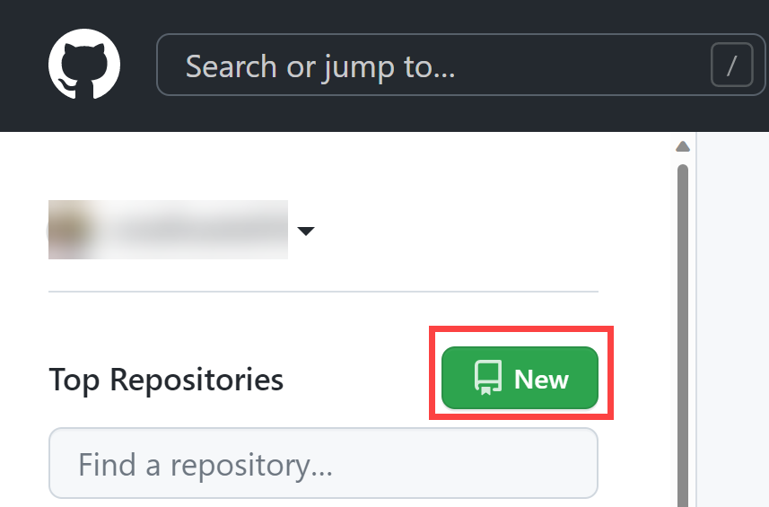
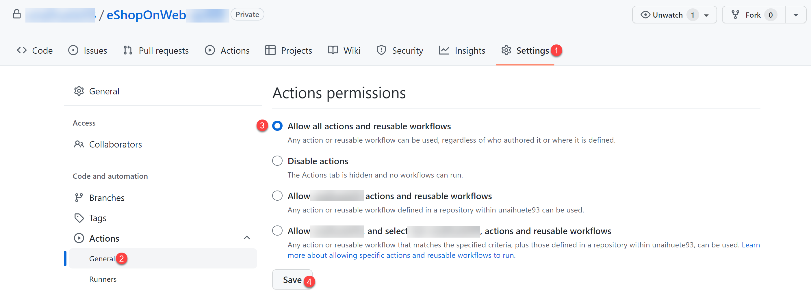
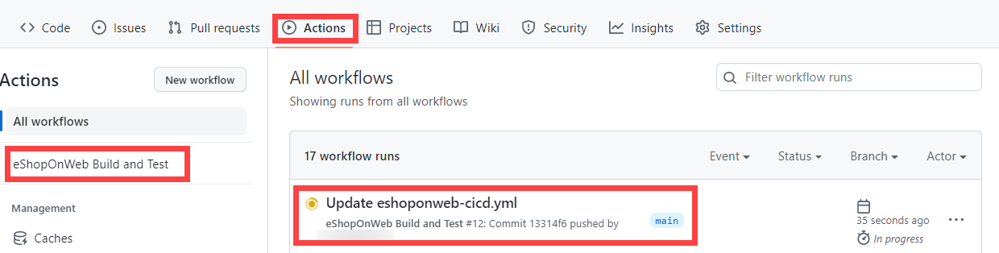
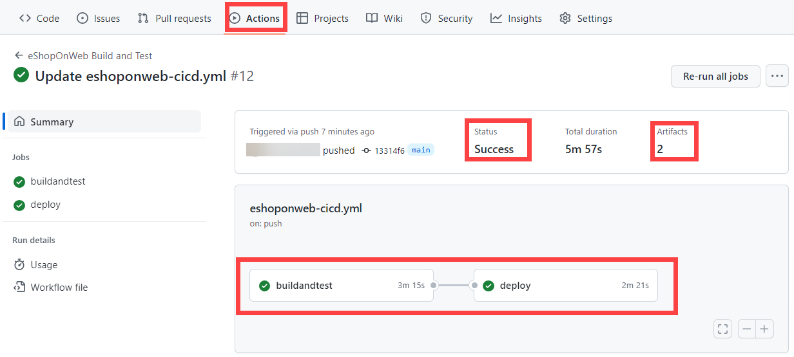
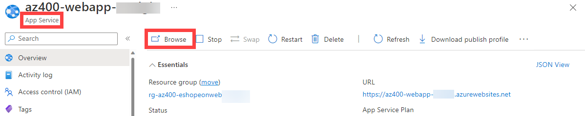
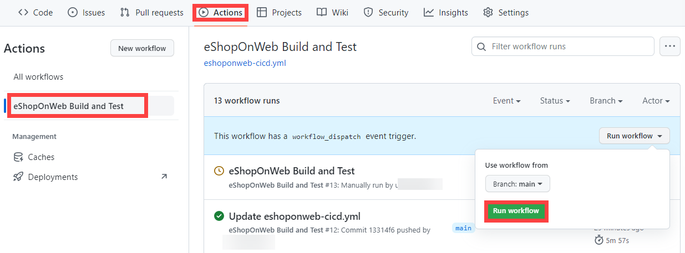
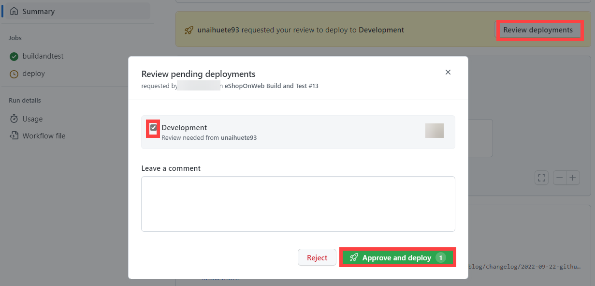

---
lab:
    title: 'Implementar GitHub Actions para CI/CD'
    module: 'Módulo 02: Implementar CI con Azure Pipelines y GitHub Actions'
---

# Implementar GitHub Actions para CI/CD

## Requisitos del laboratorio

- Este laboratorio requiere **Microsoft Edge** o un [navegador compatible con Azure DevOps](https://docs.microsoft.com/azure/devops/server/compatibility).

- Identifique una suscripción de Azure existente o cree una nueva.

- Verifique que tiene una cuenta de Microsoft o una cuenta de Microsoft Entra con el rol de Colaborador o Propietario en la suscripción de Azure. Para obtener más información, consulte [List Azure role assignments using the Azure portal](https://docs.microsoft.com/azure/role-based-access-control/role-assignments-list-portal) y [View and assign administrator roles in Azure Active Directory](https://docs.microsoft.com/azure/active-directory/roles/manage-roles-portal).

- **Si aún no tiene una cuenta de GitHub** que pueda usar para este laboratorio, siga las instrucciones disponibles en [Signing up for a new GitHub account](https://github.com/join) para crear una.

## Descripción general del laboratorio

En este laboratorio, aprenderá a implementar un flujo de trabajo de GitHub Actions que implementa una aplicación web de Azure.

## Objetivos

Después de completar este laboratorio, podrá:

- Implementar un flujo de trabajo de GitHub Actions para CI/CD.
- Explicar las características básicas de los flujos de trabajo de GitHub Actions.

## Tiempo estimado: 40 minutos

## Instrucciones

### Ejercicio 1: Importar eShopOnWeb a su repositorio de GitHub

En este ejercicio, importará el código del repositorio existente de [eShopOnWeb](https://github.com/MicrosoftLearning/eShopOnWeb) a su propio repositorio privado de GitHub.

El repositorio está organizado de la siguiente manera:
- La carpeta **.ado** contiene canalizaciones YAML de Azure DevOps.
- La carpeta **.devcontainer** contiene la configuración para desarrollar con contenedores (ya sea localmente en VS Code o en GitHub Codespaces).
- La carpeta **infra** contiene plantillas de infraestructura como código de Bicep y ARM que se usan en algunos escenarios del laboratorio.
- La carpeta **.github** contiene definiciones de flujos de trabajo YAML de GitHub.
- La carpeta **src** contiene el sitio web de .NET 8 que se usa en los escenarios del laboratorio.

#### Tarea 1: Crear un repositorio público en GitHub e importar eShopOnWeb

En esta tarea, creará un repositorio público vacío en GitHub e importará el repositorio existente de [eShopOnWeb](https://github.com/MicrosoftLearning/eShopOnWeb).

1. Desde el equipo del laboratorio, inicie un navegador web, vaya al [sitio web de GitHub](https://github.com/), inicie sesión con su cuenta y haga clic en **New** para crear un nuevo repositorio.

    

1. En la página **Create a new repository**, haga clic en el enlace **Import a repository** (debajo del título de la página).

    > **Nota**: también puede abrir el sitio de importación directamente en <https://github.com/new/import>.

1. En la página **Import your project to GitHub**:

    | Campo | Valor |
    | --- | --- |
    | The URL for your source repository | <https://github.com/MicrosoftLearning/eShopOnWeb> |
    | Owner | Su alias de cuenta |
    | Repository Name | eShopOnWeb |
    | Privacy | **Public** |

1. Haga clic en **Begin Import** y espere a que su repositorio esté listo.

1. En la página del repositorio, vaya a **Settings**, haga clic en **Actions > General** y seleccione la opción **Allow all actions and reusable workflows**. Haga clic en **Save**.

    

### Ejercicio 2: Configurar el repositorio de GitHub y el acceso a Azure

En este ejercicio, creará una entidad de servicio de Azure para autorizar que GitHub acceda a su suscripción de Azure desde GitHub Actions. También configurará el flujo de trabajo de GitHub que compilará, probará e implementará su sitio web en Azure.

#### Tarea 1: Crear una entidad de servicio de Azure y guardarla como secreto de GitHub

En esta tarea, creará la entidad de servicio de Azure que usará GitHub para implementar los recursos deseados. Como alternativa, también puede usar [OpenID Connect en Azure](https://docs.github.com/actions/deployment/security-hardening-your-deployments/configuring-openid-connect-in-azure) como mecanismo de autenticación sin secretos.

1. En el equipo del laboratorio, en una ventana del navegador, abra Azure Portal (<https://portal.azure.com/>).
1. En el portal, busque **Resource Groups** y haga clic en él.
1. Haga clic en **+ Create** para crear un nuevo grupo de recursos para el ejercicio.
1. En la pestaña **Create a resource group**, asigne el siguiente nombre a su grupo de recursos: **rg-eshoponweb-NAME** (reemplace NAME por un alias único). Haga clic en **Review + Create > Create**.
1. En Azure Portal, abra **Cloud Shell** (junto a la barra de búsqueda).

    > **Nota**: si Azure Portal le pide que cree un almacenamiento, puede elegir la opción **No storage account required**, seleccionar su suscripción y hacer clic en el botón **Apply**.

1. Asegúrese de que el terminal esté ejecutándose en modo **Bash** y ejecute el siguiente comando, reemplazando **SUBSCRIPTION-ID** y **RESOURCE-GROUP** por sus propios identificadores (ambos se pueden encontrar en la página **Overview** del grupo de recursos):

    `az ad sp create-for-rbac --name GH-Action-eshoponweb --role contributor --scopes /subscriptions/SUBSCRIPTION-ID/resourceGroups/RESOURCE-GROUP --sdk-auth`

    > **Nota**: asegúrese de escribirlo o pegarlo en una sola línea.

    > **Nota**: este comando creará una entidad de servicio con acceso de Colaborador al grupo de recursos creado anteriormente. De esta manera, aseguramos que GitHub Actions solo tenga los permisos necesarios para interactuar con este grupo de recursos y no con el resto de la suscripción.

1. El comando generará un objeto JSON que más adelante usará como secreto de GitHub para el flujo de trabajo. Copie el JSON. El JSON contiene los identificadores que se usan para autenticarse en Azure en nombre de una identidad de Microsoft Entra (entidad de servicio).

    ```JSON
        {
            "clientId": "<GUID>",
            "clientSecret": "<GUID>",
            "subscriptionId": "<GUID>",
            "tenantId": "<GUID>",
            (...)
        }
    ```

1. (Omita este paso si ya está registrado) También debe ejecutar el siguiente comando para registrar el proveedor de recursos para el **Azure App Service** que implementará más adelante:

   ```bash
   az provider register --namespace Microsoft.Web
   ```

1. En una ventana del navegador, regrese a su repositorio de GitHub **eShopOnWeb**.
1. En la página del repositorio, vaya a **Settings**, haga clic en **Secrets and variables > Actions**. Haga clic en **New repository secret**.
    - Nombre: **`AZURE_CREDENTIALS`**
    - Secreto: **pegue el objeto JSON copiado anteriormente** (GitHub puede conservar varios secretos con el mismo nombre, que se usan en la acción [azure/login](https://github.com/Azure/login)).

1. Haga clic en **Add secret**. Ahora GitHub Actions podrá hacer referencia a la entidad de servicio usando el secreto del repositorio.

#### Tarea 2: Modificar y ejecutar el flujo de trabajo de GitHub

En esta tarea, modificará el flujo de trabajo de GitHub proporcionado y lo ejecutará para implementar la solución en su propia suscripción.

1. En una ventana del navegador, regrese a su repositorio de GitHub **eShopOnWeb**.
1. En la página del repositorio, vaya a **Code** y abra el archivo **eShopOnWeb/.github/workflows/eshoponweb-cicd.yml**. Este flujo de trabajo define el proceso de CI/CD para el código del sitio web de .NET 8.
1. Descomente la sección **on** (elimine "#"). El flujo de trabajo se activa con cada inserción en la rama main y también ofrece una ejecución manual mediante "workflow_dispatch".
1. En la sección **env**, realice los siguientes cambios:
    - Reemplace **NAME** en la variable **RESOURCE-GROUP**. Debe ser el mismo grupo de recursos creado en los pasos anteriores.
    - (Opcional) Puede elegir la [región de Azure](https://azure.microsoft.com/explore/global-infrastructure/geographies) más cercana para **LOCATION**. Por ejemplo, "eastus", "eastasia", "westus", etc.
    - Reemplace **YOUR-SUBS-ID** en **SUBSCRIPTION-ID**.
    - Reemplace **NAME** en **WEBAPP-NAME** por un alias único. Se usará para crear un sitio web globalmente único con Azure App Service.
1. Lea el flujo de trabajo con atención; se proporcionan comentarios para ayudar a comprenderlo.

1. Haga clic en **Commit changes...** en la parte superior derecha y luego en **Commit changes** dejando los valores predeterminados (cambiando la rama main). El flujo de trabajo se ejecutará automáticamente.

#### Tarea 3: Revisar la ejecución del flujo de trabajo de GitHub

En esta tarea, revisará la ejecución del flujo de trabajo de GitHub:

1. En una ventana del navegador, regrese a su repositorio de GitHub **eShopOnWeb**.
1. En la página del repositorio, vaya a **Actions**; verá la configuración del flujo de trabajo antes de ejecutarse. Haga clic en él.

    

1. Espere a que termine el flujo de trabajo. En el **Summary** puede ver los dos trabajos del flujo de trabajo, el estado y los artefactos retenidos de la ejecución. Puede hacer clic en cada trabajo para revisar los registros.

    

1. En una ventana del navegador, regrese a Azure Portal (<https://portal.azure.com/>). Abra el grupo de recursos creado antes. Verá que GitHub Action, mediante una plantilla Bicep, creó un Plan de App Service de Azure y un App Service. Puede ver el sitio web publicado abriendo el App Service y haciendo clic en **Browse**.

    

#### Tarea 4 (opcional): Agregar aprobación manual previa a la implementación con GitHub Environments

En esta tarea, usará entornos de GitHub para solicitar aprobación manual antes de ejecutar las acciones definidas en el trabajo de implementación de su flujo de trabajo.

1. En la página del repositorio, vaya a **Code** y abra el archivo **eShopOnWeb/.github/workflows/eshoponweb-cicd.yml**.
1. En la sección del trabajo **deploy**, puede encontrar una referencia a un **environment** llamado **Development**. GitHub usa [environments](https://docs.github.com/en/actions/deployment/targeting-different-environments/using-environments-for-deployment) para agregar reglas de protección (y secretos) para sus destinos.

1. En la página del repositorio, vaya a **Settings**, abra **Environments** y haga clic en **New environment**.
1. Asigne el nombre **`Development`** y haga clic en **Configure Environment**.

    > **Nota**: si ya existe un entorno llamado **Development** en la lista **Environments**, abra su configuración haciendo clic en el nombre del entorno.

1. En la pestaña **Configure Development**, marque la opción **Required Reviewers** y seleccione su cuenta de GitHub como revisora. Haga clic en **Save protection rules**.
1. Ahora vamos a probar la regla de protección. En la página del repositorio, vaya a **Actions**, haga clic en el flujo de trabajo **eShopOnWeb Build and Test** y luego en **Run workflow > Run workflow** para ejecutarlo manualmente.

    

1. Haga clic en la ejecución iniciada del flujo de trabajo y espere a que termine el trabajo **buildandtest**. Verá una solicitud de revisión cuando se alcance el trabajo **deploy**.

1. Haga clic en **Review deployments**, marque **Development** y haga clic en **Approve and deploy**.

    

1. El flujo de trabajo continuará con la ejecución del trabajo **deploy** y finalizará.

> [!IMPORTANT]
> Recuerde eliminar los recursos creados en Azure Portal para evitar cargos innecesarios.

## Revisión

En este laboratorio, implementó un flujo de trabajo de GitHub Actions que implementa una aplicación web de Azure.
