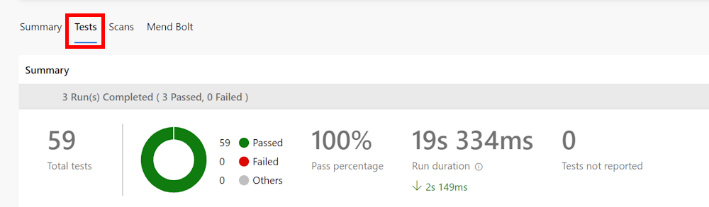
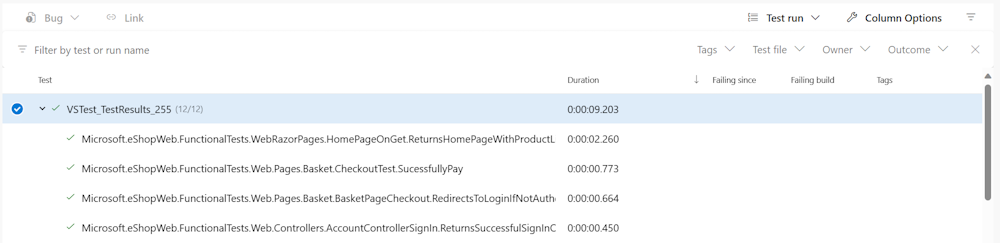

---
lab:
  title: 'Configurar y ejecutar pruebas funcionales'
  module: "Módulo 03: Diseñar e implementar una estrategia de publicación"
---

# Configurar y ejecutar pruebas funcionales

## Requisitos del laboratorio

- Este laboratorio requiere **Microsoft Edge** o un [navegador compatible con Azure DevOps](https://docs.microsoft.com/azure/devops/server/compatibility).

- **Configure una organización de Azure DevOps:** si aún no tiene una organización de Azure DevOps que pueda usar para este laboratorio, créela siguiendo las instrucciones disponibles en [Create an organization or project collection](https://learn.microsoft.com/dotnet/architecture/modern-web-apps-azure/test-asp-net-core-mvc-apps).

## Descripción general del laboratorio

El software con cualquier nivel de complejidad puede fallar de formas inesperadas como respuesta a los cambios. Por lo tanto, es necesario probar después de realizar cambios en todas las aplicaciones, salvo en las más triviales o menos críticas. Las pruebas manuales son la forma más lenta, menos confiable y más costosa de probar software.

Existen muchos tipos de pruebas automatizadas para las aplicaciones de software. La prueba más simple y de nivel más bajo es la prueba unitaria. En un nivel ligeramente superior, existen las pruebas de integración y las pruebas funcionales. Otros tipos de pruebas, como las pruebas de interfaz de usuario, de carga, de estrés y de humo, quedan fuera del alcance de este laboratorio.

*Si desea obtener más información sobre los distintos tipos de pruebas, le recomendamos leer este artículo: [Test ASP.NET Core MVC apps](https://learn.microsoft.com/dotnet/architecture/modern-web-apps-azure/test-asp-net-core-mvc-apps).* 

## Objetivos

Después de completar este laboratorio, podrá configurar una canalización de CI para una aplicación .NET que incluye:

- Unit Tests
- Integration Tests
- Functional Tests

## Tiempo estimado: 20 minutos

## Instrucciones

### Ejercicio 0: (omitir si ya se realizó) Configure los requisitos previos del laboratorio

En este ejercicio, configurará los requisitos previos del laboratorio, que consisten en un nuevo proyecto de Azure DevOps con un repositorio basado en [eShopOnWeb](https://github.com/MicrosoftLearning/eShopOnWeb).

#### Tarea 1: (omitir si ya se realizó) Crear y configurar el proyecto del equipo

En esta tarea, creará un proyecto de Azure DevOps **eShopOnWeb** que se usará en varios laboratorios.

1. En el equipo del laboratorio, en una ventana del navegador abra su organización de Azure DevOps. Haga clic en **New Project**. Asigne al proyecto el nombre **eShopOnWeb** y deje los demás campos con sus valores predeterminados. Haga clic en **Create**.

#### Tarea 2: (omitir si ya se realizó) Importar el repositorio Git de eShopOnWeb

En esta tarea, importará el repositorio Git de eShopOnWeb que se usará en varios laboratorios.

1. En el equipo del laboratorio, en una ventana del navegador abra su organización de Azure DevOps y el proyecto **eShopOnWeb** que creó previamente. Haga clic en **Repos > Files**, luego en **Import a Repository**. Seleccione **Import**. En la ventana **Import a Git Repository**, pegue la siguiente URL <https://github.com/MicrosoftLearning/eShopOnWeb.git> y haga clic en **Import**:

1. El repositorio está organizado de la siguiente manera:
    - La carpeta **.ado** contiene canalizaciones YAML de Azure DevOps.
    - La carpeta **.devcontainer** contiene la configuración para desarrollar con contenedores (ya sea localmente en VS Code o en GitHub Codespaces).
    - La carpeta **infra** contiene plantillas de infraestructura como código de Bicep y ARM que se usan en algunos escenarios del laboratorio.
    - La carpeta **.github** contiene definiciones de flujos de trabajo YAML de GitHub.
    - La carpeta **src** contiene el sitio web de .NET usado en los escenarios del laboratorio.

#### Tarea 3: (omitir si ya se realizó) Establecer la rama main como rama predeterminada

1. Vaya a **Repos > Branches**.
1. Pase el cursor sobre la rama **main** y luego haga clic en los puntos suspensivos a la derecha de la columna.
1. Haga clic en **Set as default branch**.

### Ejercicio 1: Configurar pruebas en la canalización de CI

En este ejercicio, configurará pruebas en la canalización de CI.

#### Tarea 1: (omitir si ya se realizó) Importar la definición de compilación YAML para CI

En esta tarea, agregará la definición YAML que se usará para implementar la integración continua.

Comencemos importando la canalización de CI denominada [eshoponweb-ci.yml](https://github.com/MicrosoftLearning/eShopOnWeb/blob/main/.ado/eshoponweb-ci.yml).

1. Vaya a **Pipelines > Pipelines**.
1. Haga clic en el botón **New Pipeline** (o **Create Pipeline** si no tiene ninguna canalización).
1. Seleccione **Azure Repos Git (YAML)**.
1. Seleccione el repositorio **eShopOnWeb**.
1. Seleccione **Existing Azure Pipelines YAML File**.
1. Seleccione la rama **main** y el archivo **/.ado/eshoponweb-ci.yml**, y luego haga clic en **Continue**.

    La definición de CI consta de las siguientes tareas:
    - **DotNet Restore**: con NuGet Package Restore puede instalar todas las dependencias de su proyecto sin tener que almacenarlas en el control de código fuente.
    - **DotNet Build**: compila un proyecto y todas sus dependencias.
    - **DotNet Test**: controlador de pruebas de .NET usado para ejecutar pruebas unitarias.
    - **DotNet Publish**: publica la aplicación y sus dependencias en una carpeta para su implementación en un sistema de hospedaje. En este caso, se usa **Build.ArtifactStagingDirectory**.
    - **Publish Artifact - Website**: publica el artefacto de la aplicación (creado en el paso anterior) y lo pone a disposición como artefacto de canalización.
    - **Publish Artifact - Bicep**: publica el artefacto de infraestructura (archivo Bicep) y lo pone a disposición como artefacto de canalización.
1. Haga clic en el botón **Save** (no en **Save and run**) en la parte superior derecha de la página para guardar la definición de la canalización. Puede encontrar el botón **Save** haciendo clic en la flecha a la derecha del botón **Save and Run** (o **Run**).

#### Tarea 2: Agregar pruebas a la canalización de CI

En esta tarea, agregará las pruebas de integración y funcionales a la canalización de CI.

Puede observar que la tarea de Unit Tests ya forma parte de la canalización.

- **Unit Tests** prueban una sola parte de la lógica de la aplicación. Se puede describir además enumerando algunas cosas que no prueba. Una prueba unitaria no comprueba cómo funciona el código con dependencias o infraestructura; eso es lo que hacen las pruebas de integración.

1. Edite la canalización que creó en la tarea anterior pulsando el botón **Edit**.
1. Ahora debe agregar la tarea de Integration Tests después de la tarea de Unit Tests:

    ```YAML
    - task: DotNetCoreCLI@2
      displayName: Integration Tests
      inputs:
        command: 'test'
        projects: 'tests/IntegrationTests/*.csproj'
    ```

    > **Integration Tests** verifican cómo funciona el código con dependencias o infraestructura. Aunque es buena idea encapsular el código que interactúa con infraestructura como bases de datos y sistemas de archivos, aún tendrá parte de ese código y probablemente querrá probarlo. Además, debe verificar que las capas de su código interactúan como espera cuando las dependencias de la aplicación están resueltas por completo. Esta funcionalidad es responsabilidad de las pruebas de integración.

1. A continuación, debe agregar la tarea de Functional Tests después de la de Integration Tests:

    ```YAML
    - task: DotNetCoreCLI@2
      displayName: Functional Tests
      inputs:
        command: 'test'
        projects: 'tests/FunctionalTests/*.csproj'
    ```

    > **Functional Tests** se escriben desde la perspectiva del usuario y verifican la corrección del sistema según sus requisitos. A diferencia de las pruebas de integración, que se escriben desde la perspectiva del desarrollador para verificar que algunos componentes del sistema funcionan correctamente juntos.

1. Haga clic en el botón **Validate and Save** y, si la validación es correcta, haga clic en **Save** nuevamente para confirmar los cambios directamente en la rama main.

#### Tarea 3: Revisar el resumen de pruebas

1. Haga clic en **Run** y, en la pestaña **Run pipeline**, haga clic en **Run** nuevamente.

1. Espere a que la canalización se inicie y hasta que complete la etapa de compilación correctamente.

1. Una vez finalizado, la pestaña **Test** aparecerá como parte de la ejecución de la canalización. Haga clic en ella para revisar el resumen. Se ve como se muestra a continuación:

    

1. Para obtener más detalles, en la parte inferior de la página, la tabla muestra una lista de las diferentes pruebas ejecutadas.

    > **Nota**: si la tabla está vacía, debe restablecer los filtros para tener todos los detalles sobre las pruebas ejecutadas.

    

## Revisión

En este laboratorio, aprendió cómo configurar y ejecutar distintos tipos de pruebas mediante Azure Pipelines y .NET.
