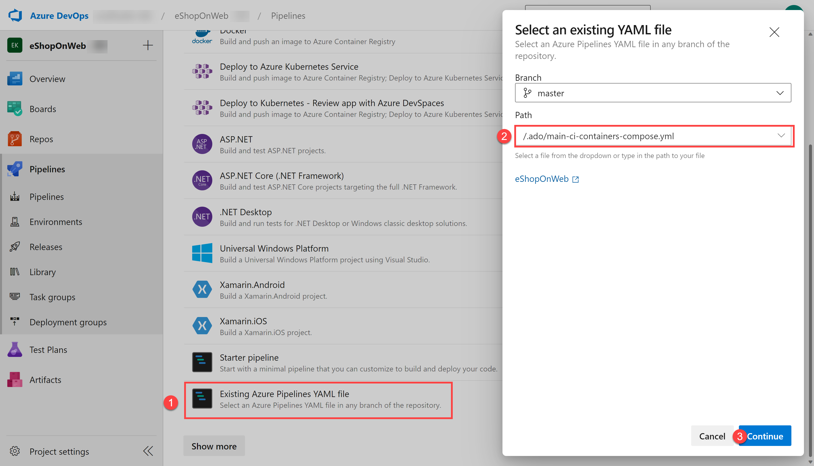
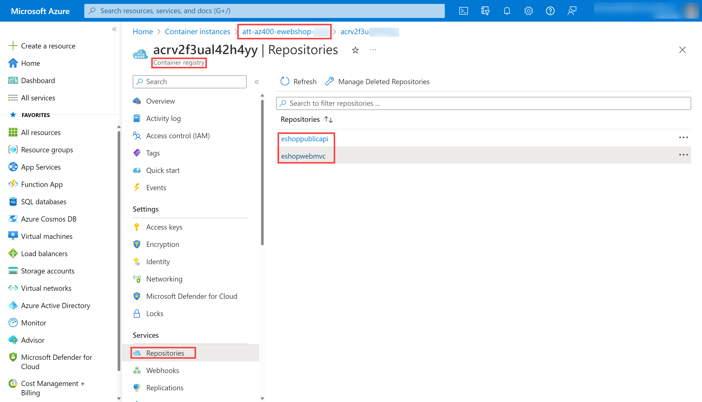
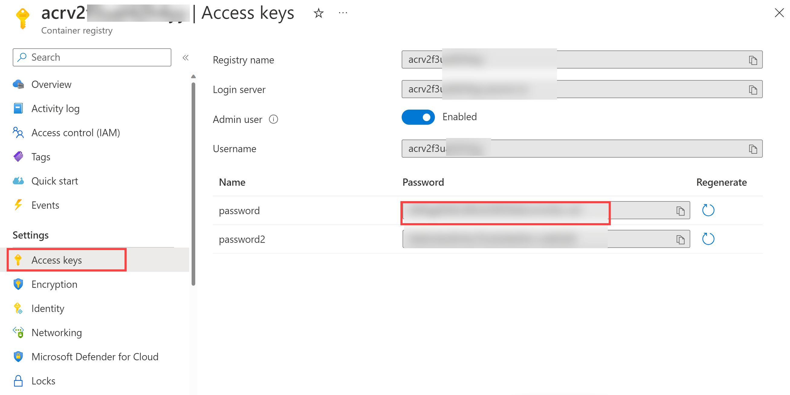
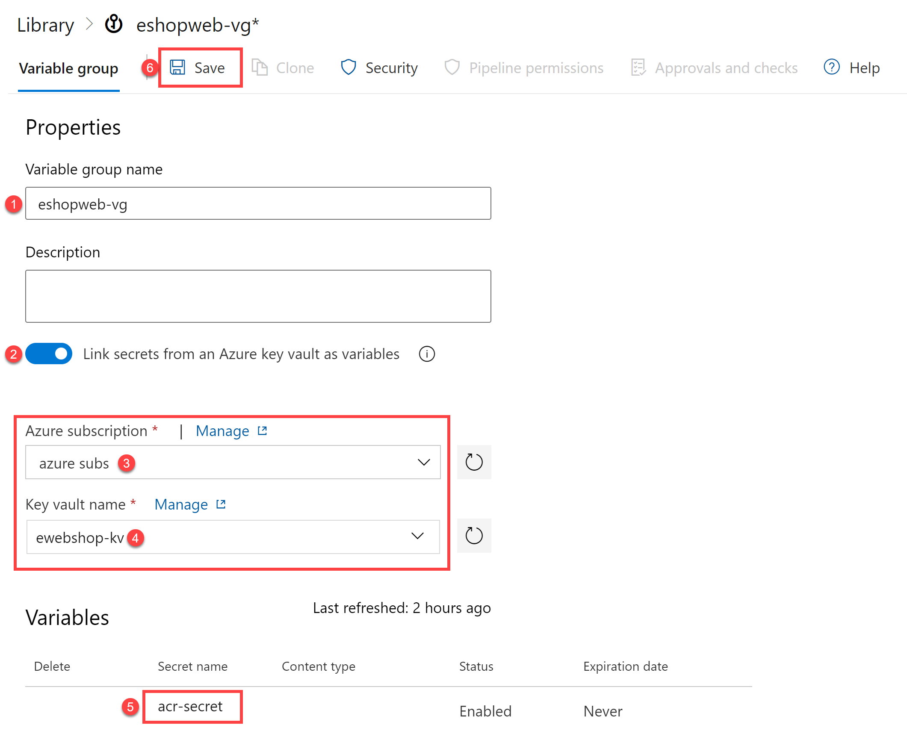

---
lab:
    title: 'Integrar Azure Key Vault con Azure DevOps'
    module: 'Módulo 04: Implementar una implementación continua segura mediante Azure Pipelines'
---

# Integrar Azure Key Vault con Azure DevOps

## Requisitos del laboratorio

- Este laboratorio requiere **Microsoft Edge** o un [navegador compatible con Azure DevOps](https://learn.microsoft.com/azure/devops/server/compatibility).

- **Complete la validación del entorno del laboratorio:** antes de iniciar este laboratorio, asegúrese de haber completado la [Validación del entorno del laboratorio](AZ400_M00_Validate_lab_environment.md), que configura la organización de Azure DevOps, el proyecto y la conexión de servicio necesarios para este laboratorio.

- **Configure una organización de Azure DevOps:** si aún no tiene una organización de Azure DevOps que pueda usar para este laboratorio, créela siguiendo las instrucciones disponibles en [Create an organization or project collection](https://learn.microsoft.com/azure/devops/organizations/accounts/create-organization).
- Identifique una suscripción de Azure existente o cree una nueva.

## Descripción general del laboratorio

Azure Key Vault proporciona almacenamiento y administración segura de datos confidenciales, como claves, contraseñas y certificados. Azure Key Vault admite módulos de seguridad de hardware, así como una variedad de algoritmos de cifrado y longitudes de clave. Al usar Azure Key Vault, puede minimizar la posibilidad de revelar datos confidenciales en el código fuente, un error común que cometen los desarrolladores. El acceso a Azure Key Vault requiere autenticación y autorización adecuadas, y admite permisos detallados sobre su contenido.

En este laboratorio, verá cómo puede integrar Azure Key Vault con Azure Pipelines mediante los siguientes pasos:

- Crear un Azure Key Vault para almacenar una contraseña de ACR como secreto.
- Proporcionar acceso a los secretos en Azure Key Vault.
- Configurar permisos para leer el secreto.
- Configurar la canalización para recuperar la contraseña de Azure Key Vault y enviarla a tareas posteriores.

## Objetivos

Después de completar este laboratorio, podrá:

- Crear un Azure Key Vault.
- Recuperar un secreto de Azure Key Vault en una canalización de Azure DevOps.
- Usar el secreto en una tarea posterior de la canalización.
- Implementar una imagen de contenedor en Azure Container Instance (ACI) usando el secreto.

## Tiempo estimado: 40 minutos

## Instrucciones

### Ejercicio 0: (omitir si ya se realizó) Configure los requisitos previos del laboratorio

En este ejercicio, configurará los requisitos previos del laboratorio, que consisten en un nuevo proyecto de Azure DevOps con un repositorio basado en [eShopOnWeb](https://github.com/MicrosoftLearning/eShopOnWeb).

#### Tarea 1: (omitir si ya se realizó) Crear y configurar el proyecto del equipo

En esta tarea, creará un proyecto de Azure DevOps **eShopOnWeb** que se usará en varios laboratorios.

1. En el equipo del laboratorio, en una ventana del navegador abra su organización de Azure DevOps. Haga clic en **New Project**. Asigne al proyecto el nombre **eShopOnWeb** y deje los demás campos con sus valores predeterminados. Haga clic en **Create**.

    

#### Tarea 2: (omitir si ya se realizó) Importar el repositorio Git de eShopOnWeb

En esta tarea, importará el repositorio Git de eShopOnWeb que se usará en varios laboratorios.

1. En el equipo del laboratorio, en una ventana del navegador abra su organización de Azure DevOps y el proyecto **eShopOnWeb** que creó previamente. Haga clic en **Repos > Files** y luego en **Import**. En la ventana **Import a Git Repository**, pegue la siguiente URL <https://github.com/MicrosoftLearning/eShopOnWeb.git> y haga clic en **Import**:

    

1. El repositorio está organizado de la siguiente manera:
    - La carpeta **.ado** contiene canalizaciones YAML de Azure DevOps.
    - La carpeta **.devcontainer** contiene la configuración para desarrollar con contenedores (ya sea localmente en VS Code o en GitHub Codespaces).
    - La carpeta **infra** contiene plantillas de infraestructura como código de Bicep y ARM que se usan en algunos escenarios del laboratorio.
    - La carpeta **.github** contiene definiciones de flujos de trabajo YAML de GitHub.
    - La carpeta **src** contiene el sitio web de .NET 8 usado en los escenarios del laboratorio.

#### Tarea 3: (omitir si ya se realizó) Establecer la rama main como rama predeterminada

1. Vaya a **Repos > Branches**.
1. Pase el cursor sobre la rama **main** y luego haga clic en los puntos suspensivos a la derecha de la columna.
1. Haga clic en **Set as default branch**.

### Ejercicio 1: Configurar la canalización de CI para compilar el contenedor de eShopOnWeb

En este ejercicio, creará una canalización de CI que compila y carga las imágenes de contenedor de eShopOnWeb en un Azure Container Registry (ACR). La canalización usará Docker Compose para compilar las imágenes y cargarlas en el ACR.

#### Tarea 1: Configurar y ejecutar la canalización de CI

En esta tarea, importará una definición de canalización YAML existente de CI, la modificará y la ejecutará. Creará un Azure Container Registry (ACR) nuevo y compilará/publicará las imágenes de contenedor de eShopOnWeb.

1. Desde el equipo del laboratorio, inicie un navegador web y navegue al proyecto **eShopOnWeb** en Azure DevOps. Vaya a **Pipelines > Pipelines** y haga clic en **Create Pipeline** (o **New pipeline**).

1. En la ventana **Where is your code?**, seleccione **Azure Repos Git (YAML)** y el repositorio **eShopOnWeb**.

1. En la sección **Configure**, elija **Existing Azure Pipelines YAML file**. Seleccione la rama **main**, proporcione la siguiente ruta **/.ado/eshoponweb-ci-dockercompose.yml** y haga clic en **Continue**.

    

1. En la definición YAML de la canalización, personalice el nombre del grupo de recursos reemplazando **NAME** en **AZ400-EWebShop-NAME** por un valor único y reemplace **YOUR-SUBSCRIPTION-ID** por el identificador de su propia suscripción de Azure.

1. Haga clic en **Save and Run** y espere a que la canalización se ejecute correctamente. Es posible que deba hacer clic en **Save and Run** una segunda vez para completar el proceso de creación y ejecución de la canalización.

    > **Importante**: si ve el mensaje "This pipeline needs permission to access resources before this run can continue to Docker Compose to ACI", haga clic en **View**, **Permit** y **Permit** nuevamente. Esto es necesario para permitir que la canalización cree el recurso. Debe hacer clic en el trabajo de compilación para ver el mensaje de permiso.

    > **Nota**: la compilación puede tardar unos minutos en finalizar. La definición de compilación consta de las siguientes tareas:
    - **AzureResourceManagerTemplateDeployment** usa **bicep** para implementar un Azure Container Registry.
    - La tarea **PowerShell** toma la salida de bicep (servidor de inicio de sesión del ACR) y crea una variable de canalización.
    - La tarea **DockerCompose** compila y carga las imágenes de contenedor de eShopOnWeb en el Azure Container Registry.

1. La canalización tomará un nombre basado en el nombre del proyecto. Vamos a **renombrarla** para identificarla mejor. Vaya a **Pipelines > Pipelines** y haga clic en la canalización creada recientemente. Haga clic en los puntos suspensivos y seleccione la opción **Rename/Remove**. Asigne el nombre **`eshoponweb-ci-dockercompose`** y haga clic en **Save**.

1. Cuando finalice la ejecución, en Azure Portal abra el grupo de recursos definido previamente y debería encontrar un Azure Container Registry (ACR) con las imágenes de contenedor creadas **eshoppublicapi** y **eshopwebmvc**. Solo usará **eshopwebmvc** en la fase de implementación.

    

1. Haga clic en **Access Keys**, active **Admin user** si aún no lo está y copie el valor de la **password**. Se usará en la siguiente tarea, ya que la conservaremos como secreto en Azure Key Vault.

    

#### Tarea 2: Crear un Azure Key Vault

En esta tarea, creará un Azure Key Vault con el portal de Azure.

Para este escenario del laboratorio, tendremos una Azure Container Instance (ACI) que extrae y ejecuta una imagen de contenedor almacenada en Azure Container Registry (ACR). Pretendemos guardar la contraseña del ACR como secreto en el key vault.

1. En Azure Portal, en el cuadro de texto **Search resources, services, and docs**, escriba **`Key vault`** y presione la tecla **Enter**.
1. Seleccione el panel **Key vault** y haga clic en **Create > Key Vault**.
1. En la pestaña **Basics** del panel **Create a key vault**, especifique la siguiente configuración y haga clic en **Next**:

    | Configuración | Valor |
    | --- | --- |
    | Subscription | nombre de la suscripción de Azure que usa en este laboratorio |
    | Resource group | nombre de un nuevo grupo de recursos **AZ400-EWebShop-NAME** |
    | Key vault name | cualquier nombre válido y único, como **ewebshop-kv-NAME** (reemplace NAME) |
    | Region | una región de Azure cercana a la ubicación de su entorno de laboratorio |
    | Pricing tier | **Standard** |
    | Days to retain deleted vaults | **7** |
    | Purge protection | **Disable purge protection** |

1. En la pestaña **Access configuration** del panel **Create a key vault**, seleccione **Vault access policy** y, luego, en la sección **Access policies**, haga clic en **+ Create** para configurar una nueva política.

    > **Nota**: debe proteger el acceso a sus key vaults permitiendo solo aplicaciones y usuarios autorizados. Para acceder a los datos del almacén, deberá proporcionar permisos de lectura (Get/List) a la conexión de servicio que creó durante la validación del entorno del laboratorio para la autenticación en la canalización.

    1. En el panel **Permission**, debajo de **Secret permissions**, marque los permisos **Get** y **List**. Haga clic en **Next**.
    2. En el panel **Principal**, busque la **Azure subscription service connection** (la creada durante la validación del entorno del laboratorio, normalmente llamada "azure subs") y selecciónela de la lista. Puede encontrar el nombre de la entidad de servicio en Azure DevOps en **Project Settings > Service connections > azure subs > Manage service principal**. Si encuentra un error de permisos al seleccionar la suscripción de Azure, haga clic en el botón **Authorize**, que creará automáticamente la política de acceso en el key vault. Haga clic en **Next**, **Next**, **Create** (política de acceso).
    3. En el panel **Review + create**, haga clic en **Create**.

1. En el panel **Create a key vault**, haga clic en **Review + Create > Create**.

    > **Nota**: espere a que Azure Key Vault se aprovisione. Esto debería tardar menos de 1 minuto.

1. En el panel **Your deployment is complete**, haga clic en **Go to resource**.
1. En el panel de Azure Key Vault (ewebshop-kv-NAME), en el menú vertical de la izquierda, dentro de la sección **Objects**, haga clic en **Secrets**.
1. En el panel **Secrets**, haga clic en **Generate/Import**.
1. En el panel **Create a secret**, especifique la siguiente configuración y haga clic en **Create** (deje el resto con los valores predeterminados):

    | Configuración | Valor |
    | --- | --- |
    | Upload options | **Manual** |
    | Name | **acr-secret** |
    | Secret value | contraseña de acceso al ACR copiada en la tarea anterior |

#### Tarea 3: Crear un grupo de variables conectado a Azure Key Vault

En esta tarea, creará un Variable Group en Azure DevOps que recuperará el secreto de la contraseña del ACR desde Key Vault mediante la conexión de servicio creada anteriormente.

1. En el equipo del laboratorio, inicie un navegador web y navegue al proyecto **eShopOnWeb** en Azure DevOps.

1. En el panel de navegación vertical del portal de Azure DevOps, seleccione **Pipelines > Library**. Haga clic en **+ Variable Group**.

1. En el panel **New variable group**, especifique la siguiente configuración:

    | Configuración | Valor |
    | --- | --- |
    | Variable Group Name | **eshopweb-vg** |
    | Link secrets from an Azure Key Vault | **enable** |
    | Azure subscription | **Available Azure service connection > Azure subs** |
    | Key vault name | nombre de su key vault |

1. En **Variables**, haga clic en **+ Add** y seleccione el secreto **acr-secret**. Haga clic en **OK**.
1. Haga clic en **Save**.

    

#### Tarea 4: Configurar la canalización CD para implementar el contenedor en Azure Container Instance (ACI)

En esta tarea, importará una canalización de CD, la personalizará y la ejecutará para implementar la imagen del contenedor creada antes en una Azure Container Instance.

1. Desde el equipo del laboratorio, inicie un navegador web y navegue al proyecto **eShopOnWeb** en Azure DevOps. Vaya a **Pipelines > Pipelines** y haga clic en **New Pipeline**.

1. En la ventana **Where is your code?**, seleccione **Azure Repos Git (YAML)** y el repositorio **eShopOnWeb**.

1. En la sección **Configure**, elija **Existing Azure Pipelines YAML file**. Seleccione la rama **main**, proporcione la siguiente ruta **/.ado/eshoponweb-cd-aci.yml** y haga clic en **Continue**.

1. En la definición YAML de la canalización, personalice:

    - **YOUR-SUBSCRIPTION-ID** con el identificador de su suscripción de Azure.
    - **az400eshop-NAME** reemplace NAME para hacerlo globalmente único.
    - **YOUR-ACR.azurecr.io** y **ACR-USERNAME** con el servidor de inicio de sesión de su ACR (ambos requieren el nombre del ACR y se pueden revisar en **ACR > Access Keys**).
    - **AZ400-EWebShop-NAME** con el nombre del grupo de recursos definido antes en el laboratorio.

1. Haga clic en **Save and Run**. Es posible que deba hacer clic en **Save and Run** una segunda vez para completar la creación y ejecución de la canalización. Debe hacer clic en el trabajo de compilación para ver cualquier mensaje de permiso.
1. Abra la canalización y espere a que se ejecute correctamente.

    > **Importante**: si ve el mensaje "This pipeline needs permission to access resources before this run can continue to Docker Compose to ACI", haga clic en **View**, **Permit** y **Permit** nuevamente. Esto es necesario para permitir que la canalización cree el recurso.

    > **Nota**: la implementación puede tardar unos minutos en completarse. La definición de CD consta de las siguientes tareas:
    - **Resources**: está preparada para desencadenarse automáticamente al finalizar la canalización de CI. También descarga el repositorio del archivo Bicep.
    - **Variables (for Deploy stage)** conecta el grupo de variables para consumir el secreto de Azure Key Vault **acr-secret**.
    - **AzureResourceManagerTemplateDeployment** implementa Azure Container Instance (ACI) usando una plantilla Bicep y proporciona los parámetros de inicio de sesión del ACR para permitir que ACI descargue la imagen del contenedor creada previamente desde Azure Container Registry (ACR).

1. Para verificar el resultado de la implementación de la canalización, en Azure Portal busque y seleccione el grupo de recursos **AZ400-EWebShop-NAME**. En la lista de recursos, verifique que se haya creado la instancia del contenedor **az400eshop** por la canalización.

1. La canalización tomará un nombre basado en el nombre del proyecto. Vamos a **renombrarla** para identificarla mejor. Vaya a **Pipelines > Pipelines** y haga clic en la canalización creada recientemente. Haga clic en los puntos suspensivos y seleccione la opción **Rename/Remove**. Asigne el nombre **eshoponweb-cd-aci** y haga clic en **Save**.

   > [!IMPORTANT]
   > Recuerde eliminar los recursos creados en Azure Portal para evitar cargos innecesarios.

## Revisión

En este laboratorio, integró Azure Key Vault con una canalización de Azure DevOps mediante los siguientes pasos:

- Creó un Azure Key Vault para almacenar una contraseña del ACR como secreto.
- Proporcionó acceso a los secretos en Azure Key Vault.
- Configuró permisos para leer el secreto.
- Configuró una canalización para recuperar la contraseña de Azure Key Vault y enviarla a tareas posteriores.
- Implementó una imagen de contenedor en Azure Container Instance (ACI) usando el secreto.
- Creó un Variable Group conectado a Azure Key Vault.
