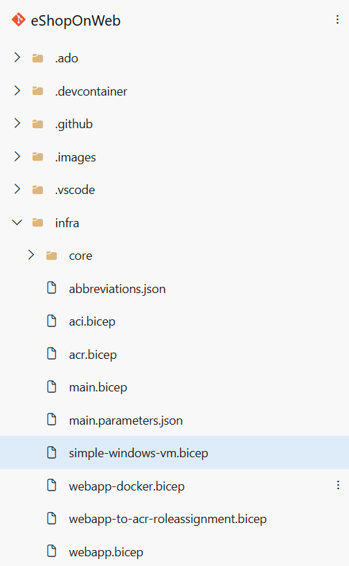
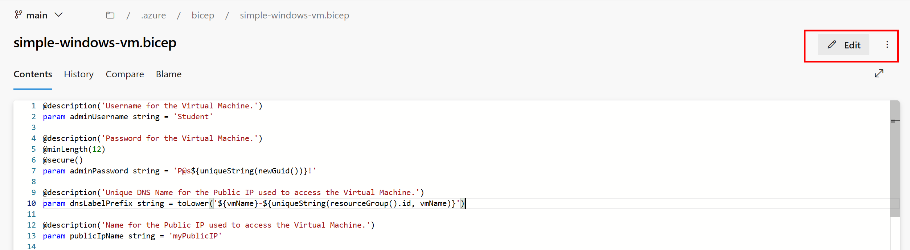
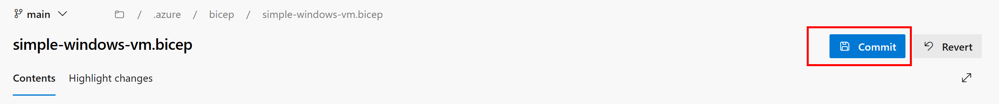
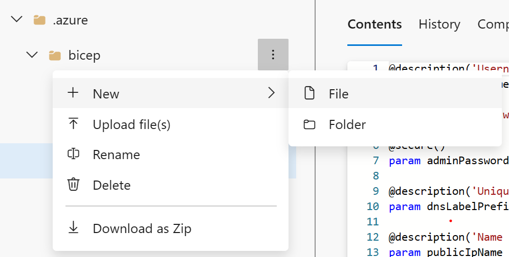
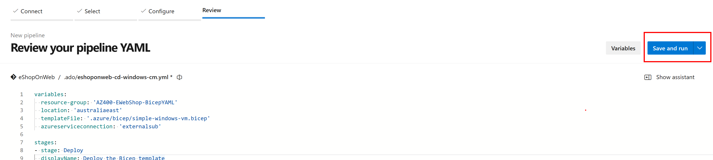
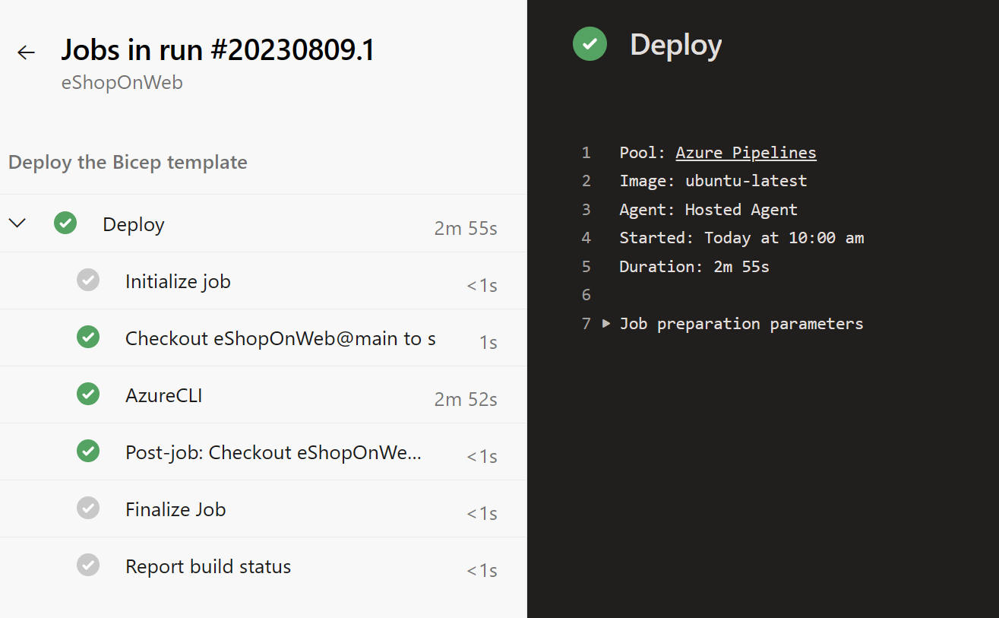

---
lab:
  title: "Implementaciones mediante plantillas de Azure Bicep"
  module: "Módulo 05: Administrar la infraestructura como código mediante Azure y DSC"
---

# Implementaciones mediante plantillas de Azure Bicep

## Requisitos del laboratorio

- Este laboratorio requiere **Microsoft Edge** o un [navegador compatible con Azure DevOps](https://docs.microsoft.com/azure/devops/server/compatibility).

- **Configure una organización de Azure DevOps:** si aún no tiene una organización de Azure DevOps que pueda usar para este laboratorio, créela siguiendo las instrucciones disponibles en [Create an organization or project collection](https://docs.microsoft.com/azure/devops/organizations/accounts/create-organization).

- Identifique una suscripción de Azure existente o cree una nueva.

- Verifique que tiene una cuenta de Microsoft o una cuenta de Microsoft Entra con el rol de Propietario en la suscripción de Azure y el rol de Administrador global en el inquilino de Microsoft Entra asociado a la suscripción de Azure. Para obtener más información, consulte [List Azure role assignments using the Azure portal](https://docs.microsoft.com/azure/role-based-access-control/role-assignments-list-portal) y [View and assign administrator roles in Azure Active Directory](https://docs.microsoft.com/azure/active-directory/roles/manage-roles-portal).

## Descripción general del laboratorio

En este laboratorio, creará una plantilla de Azure Bicep y la modularizará mediante el concepto de módulos de Azure Bicep. A continuación, modificará la plantilla principal de implementación para que use el módulo y, finalmente, implementará todos los recursos en Azure.

## Objetivos

Después de completar este laboratorio, podrá:

- Comprender la estructura de una plantilla de Azure Bicep.
- Crear un módulo reutilizable de Bicep.
- Modificar la plantilla principal para usar el módulo.
- Implementar todos los recursos en Azure mediante canalizaciones YAML de Azure.

## Tiempo estimado: 45 minutos

## Instrucciones

### Ejercicio 0: (omitir si ya se realizó) Configure los requisitos previos del laboratorio

En este ejercicio, configurará los requisitos previos del laboratorio, que consisten en un nuevo proyecto de Azure DevOps con un repositorio basado en [eShopOnWeb](https://github.com/MicrosoftLearning/eShopOnWeb).

#### Tarea 1: (omitir si ya se realizó) Crear y configurar el proyecto del equipo

En esta tarea, creará un proyecto de Azure DevOps **eShopOnWeb** que se usará en varios laboratorios.

1. En el equipo del laboratorio, en una ventana del navegador abra su organización de Azure DevOps. Haga clic en **New Project**. Asigne al proyecto el nombre **eShopOnWeb** y deje los demás campos con sus valores predeterminados. Haga clic en **Create**.

    

#### Tarea 2: (omitir si ya se realizó) Importar el repositorio Git de eShopOnWeb

En esta tarea, importará el repositorio Git de eShopOnWeb que se usará en varios laboratorios.

1. En el equipo del laboratorio, en una ventana del navegador abra su organización de Azure DevOps y el proyecto **eShopOnWeb** que creó previamente. Haga clic en **Repos > Files**, luego en **Import a Repository**. Seleccione **Import**. En la ventana **Import a Git Repository**, pegue la siguiente URL <https://github.com/MicrosoftLearning/eShopOnWeb.git> y haga clic en **Import**:

    

1. El repositorio está organizado de la siguiente manera:
    - La carpeta **.ado** contiene canalizaciones YAML de Azure DevOps.
    - La carpeta **.devcontainer** contiene la configuración para desarrollar con contenedores (ya sea localmente en VS Code o en GitHub Codespaces).
    - La carpeta **infra** contiene plantillas de infraestructura como código de Bicep y ARM que se usan en algunos escenarios del laboratorio.
    - La carpeta **.github** contiene definiciones de flujos de trabajo YAML de GitHub.
    - La carpeta **src** contiene el sitio web de .NET 8 usado en los escenarios del laboratorio.

#### Tarea 3: (omitir si ya se realizó) Establecer la rama main como rama predeterminada

1. Vaya a **Repos > Branches**.
1. Pase el cursor sobre la rama **main** y luego haga clic en los puntos suspensivos a la derecha de la columna.
1. Haga clic en **Set as default branch**.

### Ejercicio 1: Comprender una plantilla de Azure Bicep y simplificarla mediante un módulo reutilizable

En este laboratorio, revisará una plantilla de Azure Bicep y la simplificará mediante un módulo reutilizable.

#### Tarea 1: Crear la plantilla de Azure Bicep

En esta tarea, usará Visual Studio Code para crear una plantilla de Azure Bicep.

1. En la pestaña del navegador donde tiene abierto su proyecto de Azure DevOps, navegue a **Repos** y **Files**. Abra la carpeta `infra` y busque el archivo `simple-windows-vm.bicep`.

   

1. Revise la plantilla para comprender mejor su estructura. Hay algunos parámetros con tipos, valores predeterminados y validación, algunas variables y varios recursos con estos tipos:

   - Microsoft.Storage/storageAccounts
   - Microsoft.Network/publicIPAddresses
   - Microsoft.Network/virtualNetworks
   - Microsoft.Network/networkInterfaces
   - Microsoft.Compute/virtualMachines

1. Preste atención a lo simple que son las definiciones de recursos y a la capacidad de hacer referencias simbólicas implícitas en lugar de usar `dependsOn` de forma explícita en toda la plantilla.

#### Tarea 2: Crear un módulo Bicep para los recursos de almacenamiento

En esta tarea, creará un módulo de plantilla de almacenamiento **storage.bicep**, que solo creará una cuenta de almacenamiento y será importado por la plantilla principal. El módulo de plantilla de almacenamiento debe devolver un valor a la plantilla principal, **main.bicep**, y este valor se definirá en el elemento outputs del módulo de la plantilla de almacenamiento.

1. Primero debemos quitar el recurso de almacenamiento de nuestra plantilla principal. En la esquina superior derecha de la ventana del navegador, haga clic en el botón **Edit**:

   

1. Ahora elimine el recurso de almacenamiento:

   ```bicep
   resource storageAccount 'Microsoft.Storage/storageAccounts@2022-05-01' = {
     name: storageAccountName
     location: location
     sku: {
       name: 'Standard_LRS'
     }
     kind: 'Storage'
   }
   ```

1. Cambie el valor predeterminado del parámetro `publicIPAllocationMethod` de `Dynamic` a `Static` en la línea 20.

1. Cambie el valor predeterminado del parámetro `publicIpSku` de `Basic` a `Standard` en la línea 27.

1. Confirme el archivo; sin embargo, aún no hemos terminado con él.

   

1. A continuación, pase el mouse sobre la carpeta `Infra`, haga clic en el icono de los puntos suspensivos y seleccione **New** y **File**. Escriba **`storage.bicep`** como nombre y haga clic en **Create**.

   

1. Ahora copie el siguiente fragmento de código en el archivo y confirme sus cambios:

   ```bicep
   @description('Location for all resources.')
   param location string = resourceGroup().location

   @description('Name for the storage account.')
   param storageAccountName string

   resource storageAccount 'Microsoft.Storage/storageAccounts@2022-05-01' = {
     name: storageAccountName
     location: location
     sku: {
       name: 'Standard_LRS'
     }
     kind: 'Storage'
   }

   output storageURI string = storageAccount.properties.primaryEndpoints.blob
   ```

#### Tarea 3: Modificar la plantilla simple-windows-vm para que use el módulo de plantilla

En esta tarea, modificará la plantilla `simple-windows-vm.bicep` para que haga referencia al módulo de plantilla que creó en la tarea anterior.

1. Vuelva a la plantilla `simple-windows-vm.bicep` y haga clic en el botón **Edit** otra vez.

1. A continuación, agregue el siguiente código después de las variables:

   ```bicep
   module storageModule './storage.bicep' = {
     name: 'linkedTemplate'
     params: {
       location: location
       storageAccountName: storageAccountName
     }
   }
   ```

1. También debemos modificar la referencia a la URI del blob de la cuenta de almacenamiento en nuestro recurso de máquina virtual para que use la salida del módulo en lugar de la directa. Busque el recurso de la máquina virtual y reemplace la sección `diagnosticsProfile` con lo siguiente:

   ```bicep
   diagnosticsProfile: {
     bootDiagnostics: {
       enabled: true
       storageUri: storageModule.outputs.storageURI
     }
   }
   ```

1. Revise los siguientes detalles de la plantilla principal:

   - En la plantilla principal se usa un módulo para enlazar otra plantilla.
   - El módulo tiene un nombre simbólico llamado `storageModule`. Este nombre se usa para configurar cualquier dependencia.
   - Solo se puede usar el modo de implementación **Incremental** cuando se usan módulos de plantilla.
   - Se usa una ruta relativa para el módulo de la plantilla.
   - Use parámetros para pasar valores de la plantilla principal a los módulos de plantilla.

1. Confirme la plantilla.

### Ejercicio 2: Implementación de las plantillas en Azure mediante canalizaciones YAML

En este laboratorio, usará una canalización YAML de Azure DevOps para implementar su plantilla en su entorno de Azure.

#### Tarea 1: Implementar recursos en Azure mediante canalizaciones YAML

1. Vuelva al panel **Pipelines** del centro **Pipelines**.
1. En la ventana **Create your first Pipeline**, haga clic en **Create pipeline**.

    > **Nota**: usaremos el asistente para crear una nueva definición de canalización YAML basada en nuestro proyecto.

1. En el panel **Where is your code?**, haga clic en la opción **Azure Repos Git (YAML)**.
1. En el panel **Select a repository**, haga clic en **eShopOnWeb**.
1. En el panel **Configure your pipeline**, desplácese hacia abajo y seleccione **Existing Azure Pipelines YAML File**.
1. En el panel **Selecting an existing YAML File**, especifique los siguientes parámetros:
   - Branch: **main**
   - Path: **.ado/eshoponweb-cd-windows-cm.yml**
1. Haga clic en **Continue** para guardar estos ajustes.
1. En la sección de variables, elija un nombre para el grupo de recursos, establezca la ubicación deseada y reemplace el valor de la conexión de servicio con una de las conexiones de servicio existentes que creó antes.
1. Haga clic en el botón **Save and run** en la parte superior derecha y, cuando aparezca el cuadro de diálogo de confirmación, haga clic de nuevo en **Save and run**.

   

1. Espere a que finalice la implementación y revise los resultados.
   

   > **Nota**: recuerde conceder a la canalización el permiso para usar la conexión de servicio creada previamente.

   > [!IMPORTANT]
   > Recuerde eliminar los recursos creados en Azure Portal para evitar cargos innecesarios.

## Revisión

En este laboratorio, aprendió a crear una plantilla de Azure Bicep, modularizarla mediante un módulo de plantilla, modificar la plantilla principal de implementación para que use el módulo y sus dependencias actualizadas, y finalmente implementar las plantillas en Azure mediante canalizaciones YAML.
