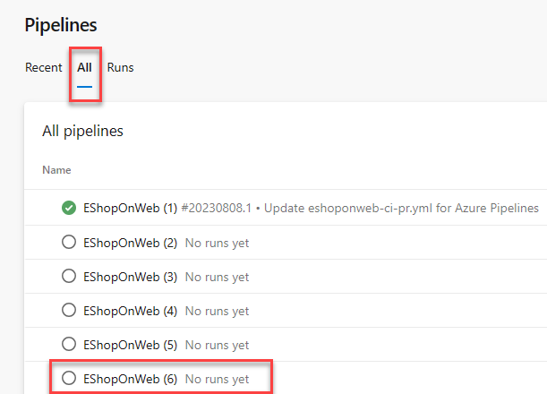
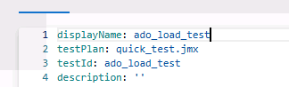

---
lab:
  title: "Supervisar el rendimiento de aplicaciones con Azure Load Testing"
  module: "Módulo 08: Implementar retroalimentación continua"
---

# Supervisar el rendimiento de aplicaciones con Azure Load Testing

## Requisitos del laboratorio

- Este laboratorio requiere **Microsoft Edge** o un [explorador compatible con Azure DevOps.](https://docs.microsoft.com/azure/devops/server/compatibility)

- **Configurar una organización de Azure DevOps:** si aún no tiene una organización de Azure DevOps que pueda usar para este laboratorio, cree una siguiendo las instrucciones disponibles en [Crear una organización o colección de proyectos](https://docs.microsoft.com/azure/devops/organizations/accounts/create-organization).

- Identifique una suscripción de Azure existente o cree una nueva.

- Compruebe que tiene una cuenta Microsoft o una cuenta de Microsoft Entra con el rol Owner en la suscripción de Azure y el rol Global Administrator en el tenant de Microsoft Entra asociado con la suscripción de Azure. Para obtener más detalles, consulte [List Azure role assignments using the Azure portal](https://docs.microsoft.com/azure/role-based-access-control/role-assignments-list-portal) y [View and assign administrator roles in Azure Active Directory](https://docs.microsoft.com/azure/active-directory/roles/manage-roles-portal#view-my-roles).

## Información general del laboratorio

**Azure Load Testing** es un servicio de pruebas de carga totalmente administrado que permite generar carga a gran escala. El servicio simula tráfico para las aplicaciones, independientemente de dónde estén hospedadas. Los desarrolladores, testers e ingenieros de control de calidad (QA) pueden usarlo para optimizar el rendimiento, la escalabilidad o la capacidad de las aplicaciones.

Puede crear rápidamente una prueba de carga para la aplicación web mediante una URL y sin conocimiento previo de herramientas de pruebas. Azure Load Testing abstrae la complejidad y la infraestructura necesarias para ejecutar la prueba de carga a escala.

Para escenarios de pruebas de carga más avanzados, puede crear una prueba de carga reutilizando un script de prueba Apache JMeter existente, una herramienta popular de código abierto para carga y rendimiento. Por ejemplo, el plan de prueba podría constar de varias solicitudes de aplicación, podría necesitar llamar a endpoints que no son HTTP o podría usar datos de entrada y parámetros para hacer que la prueba sea más dinámica.

En este laboratorio, aprenderá cómo usar Azure Load Testing para simular pruebas de rendimiento contra una aplicación web en ejecución con diferentes escenarios de carga. Por último, aprenderá a integrar Azure Load Testing en sus pipelines de CI/CD.

## Objetivos

Después de completar este laboratorio, podrá:

- Implementar aplicaciones web de Azure App Service.
- Componer y ejecutar un pipeline de CI/CD basado en YAML.
- Implementar Azure Load Testing.
- Investigar el rendimiento de aplicaciones web de Azure mediante Azure Load Testing.
- Integrar Azure Load Testing en sus pipelines de CI/CD.

## Tiempo estimado: 60 minutos

## Instrucciones

### Ejercicio 0: Configurar los requisitos previos del laboratorio

En este ejercicio, configurará los requisitos previos del laboratorio.

#### Tarea 1: (omitir si ya se realizó) Crear y configurar el proyecto de equipo

En esta tarea, creará un proyecto de Azure DevOps **eShopOnWeb** que se usará en varios laboratorios.

1. En el equipo de laboratorio, abra su organización de Azure DevOps en una ventana del explorador. Haga clic en **New Project**. Asigne al proyecto el nombre **eShopOnWeb** y elija **Scrum** en la lista desplegable **Work Item process**. Haga clic en **Create**.

   

#### Tarea 2: (omitir si ya se realizó) Importar el repositorio Git de eShopOnWeb

En esta tarea, importará el repositorio Git de eShopOnWeb que se usará en varios laboratorios.

1. En el equipo de laboratorio, abra su organización de Azure DevOps y el proyecto **eShopOnWeb** creado anteriormente en una ventana del explorador. Haga clic en **Repos > Files** y en **Import**. En la ventana **Import a Git Repository**, pegue la siguiente URL <https://github.com/MicrosoftLearning/eShopOnWeb.git> y haga clic en **Import**:

   

1. El repositorio está organizado de la siguiente manera:

   - La carpeta **.ado** contiene pipelines YAML de Azure DevOps.
   - La carpeta **.devcontainer** contiene la configuración para desarrollar usando contenedores, ya sea localmente en VS Code o en GitHub Codespaces.
   - La carpeta **infra** contiene plantillas Bicep y ARM de infraestructura como código usadas en algunos escenarios de laboratorio.
   - La carpeta **.github** contiene definiciones de workflow YAML de GitHub.
   - La carpeta **src** contiene el sitio web .NET 8 usado en los escenarios de laboratorio.

#### Tarea 3: (omitir si ya se realizó) Establecer la rama main como rama predeterminada

1. Vaya a **Repos > Branches**.

1. Mantenga el puntero sobre la rama **main** y, a continuación, haga clic en los puntos suspensivos a la derecha de la columna.

1. Haga clic en **Set as default branch**.

#### Tarea 4: Crear recursos de Azure

En esta tarea, creará una aplicación web de Azure mediante Cloud Shell en Azure Portal.

1. Desde el equipo de laboratorio, inicie un explorador web, navegue a [**Azure Portal**](https://portal.azure.com) e inicie sesión.

1. En Azure Portal, en la barra de herramientas, haga clic en el icono **Cloud Shell**, ubicado directamente a la derecha del cuadro de texto de búsqueda.

1. Si se le solicita seleccionar **Bash** o **PowerShell**, seleccione **Bash**.

   > **Nota**: Si esta es la primera vez que inicia **Cloud Shell** y se le presenta el mensaje **You have no storage mounted**, seleccione la suscripción que está usando en este laboratorio y seleccione **Create storage**.

1. Desde el prompt de **Bash**, en el panel **Cloud Shell**, ejecute el siguiente comando para crear un resource group. Reemplace el marcador de posición `<region>` por el nombre de la región de Azure más cercana a usted, como 'eastus'.

   ```bash
   RESOURCEGROUPNAME='az400m08l14-RG'
   LOCATION='<region>'
   az group create --name $RESOURCEGROUPNAME --location $LOCATION
   ```

1. Para crear un Windows App Service plan, ejecute el siguiente comando:

   ```bash
   SERVICEPLANNAME='az400l14-sp'
   az appservice plan create --resource-group $RESOURCEGROUPNAME \
       --name $SERVICEPLANNAME --sku B3
   ```

1. Cree una aplicación web con un nombre único.

   ```bash
   WEBAPPNAME=az400eshoponweb$RANDOM$RANDOM
   az webapp create --resource-group $RESOURCEGROUPNAME --plan $SERVICEPLANNAME --name $WEBAPPNAME
   ```

   > **Nota**: Registre el nombre de la aplicación web. Lo necesitará más adelante en este laboratorio.

### Ejercicio 1: Configurar pipelines de CI/CD como código con YAML en Azure DevOps

En este ejercicio, configurará pipelines de CI/CD como código con YAML en Azure DevOps.

#### Tarea 1: Agregar una definición YAML de build e implementación

En esta tarea, agregará una definición YAML de build al proyecto existente.

1. Vuelva al panel **Pipelines** del hub **Pipelines**.

1. Haga clic en **New pipeline**, o en Create Pipeline si este es el primero que crea.

   > **Nota**: Usaremos el asistente para crear una nueva definición de YAML Pipeline basada en nuestro proyecto.

1. En el panel **Where is your code?**, haga clic en la opción **Azure Repos Git (YAML)**.

1. En el panel **Select a repository**, haga clic en **eShopOnWeb**.

1. En el panel **Configure your pipeline**, desplácese hacia abajo y seleccione **Starter Pipeline**.

1. **Seleccione** todas las líneas de Starter Pipeline y elimínelas.

1. **Copie** el template completo de pipeline que aparece a continuación, teniendo en cuenta que deberá realizar modificaciones en los parámetros **antes de guardar** los cambios:

   ```yml
   #Template Pipeline for CI/CD
   # trigger:
   # - main

   resources:
     repositories:
       - repository: self
         trigger: none

   stages:
     - stage: Build
       displayName: Build .Net Core Solution
       jobs:
         - job: Build
           pool:
             vmImage: ubuntu-latest
           steps:
             - task: DotNetCoreCLI@2
               displayName: Restore
               inputs:
                 command: "restore"
                 projects: "**/*.sln"
                 feedsToUse: "select"

             - task: DotNetCoreCLI@2
               displayName: Build
               inputs:
                 command: "build"
                 projects: "**/*.sln"

             - task: DotNetCoreCLI@2
               displayName: Publish
               inputs:
                 command: "publish"
                 publishWebProjects: true
                 arguments: "-o $(Build.ArtifactStagingDirectory)"

             - task: PublishBuildArtifacts@1
               displayName: Publish Artifacts ADO - Website
               inputs:
                 pathToPublish: "$(Build.ArtifactStagingDirectory)"
                 artifactName: Website

     - stage: Deploy
       displayName: Deploy to an Azure Web App
       jobs:
         - job: Deploy
           pool:
             vmImage: "windows-2019"
           steps:
             - task: DownloadBuildArtifacts@1
               inputs:
                 buildType: "current"
                 downloadType: "single"
                 artifactName: "Website"
                 downloadPath: "$(Build.ArtifactStagingDirectory)"
   ```

1. Coloque el cursor en una nueva línea al final de la definición YAML. **Asegúrese de colocar el cursor en la sangría del nivel de tarea anterior**.

   > **Nota**: Esta será la ubicación donde se agregarán las nuevas tareas.

1. Haga clic en **Show Assistant** en el lado derecho del portal. En la lista de tareas, busque y seleccione la tarea **Azure App Service Deploy**.

1. En el panel **Azure App Service deploy**, especifique la siguiente configuración y haga clic en **Add**:

   - En la lista desplegable **Azure subscription**, seleccione la service connection que acaba de crear.
   - Valide que **App Service Type** apunte a Web App on Windows.
   - En la lista desplegable **App Service name**, seleccione el nombre de la aplicación web que implementó anteriormente en el laboratorio (\*\*az400eshoponweb...).
   - En el cuadro de texto **Package or folder**, **actualice** el valor predeterminado a `$(Build.ArtifactStagingDirectory)/**/Web.zip`.
   - Expanda **Application and Configuration Settings** y, en el cuadro de texto App settings, agregue los siguientes pares clave-valor: `-UseOnlyInMemoryDatabase true -ASPNETCORE_ENVIRONMENT Development`.

1. Confirme la configuración desde el panel Assistant haciendo clic en el botón **Add**.

   > **Nota**: Esto agregará automáticamente la tarea de implementación a la definición YAML del pipeline.

1. El fragmento de código agregado al editor debe ser similar al siguiente, reflejando su nombre para los parámetros azureSubscription y WebappName:

   ```yml
   - task: AzureRmWebAppDeployment@5
     inputs:
       ConnectionType: "AzureRM"
       azureSubscription: "SERVICE CONNECTION NAME"
       appType: "webApp"
       WebAppName: "az400eshoponWeb369825031"
       packageForLinux: "$(Build.ArtifactStagingDirectory)/**/Web.zip"
       AppSettings: "-UseOnlyInMemoryDatabase true -ASPNETCORE_ENVIRONMENT Development"
   ```

   > **Nota**: El parámetro **packageForLinux** puede resultar confuso en el contexto de este laboratorio, pero es válido para Windows o Linux.

1. Antes de guardar las actualizaciones del archivo yml, asígnele un nombre más claro. En la parte superior de la ventana del editor YAML, se muestra **EShopOnweb/azure-pipelines-#.yml**, donde # es un número, normalmente 1, aunque podría ser diferente en su entorno. Seleccione **ese nombre de archivo** y cámbielo a **m08l14-pipeline.yml**.

1. Haga clic en **Save** y, en el panel **Save**, vuelva a hacer clic en **Save** para confirmar el cambio directamente en la rama main.

   > **Nota**: Como nuestro CI-YAML original no estaba configurado para desencadenar automáticamente un nuevo build, debemos iniciar este manualmente.

1. Desde el menú izquierdo de Azure DevOps, navegue a **Pipelines** y seleccione **Pipelines** de nuevo. A continuación, seleccione **All** para abrir todas las definiciones de pipeline, no solo las recientes.

   > **Nota**: Si conservó todos los pipelines anteriores de ejercicios de laboratorio previos, este nuevo pipeline podría haber reutilizado un nombre de secuencia predeterminado **eShopOnWeb (#)** para el pipeline, como se muestra en la siguiente captura de pantalla. Seleccione un pipeline, probablemente el que tenga el número de secuencia más alto; seleccione Edit y valide que apunta al archivo de código m08l14-pipeline.yml.

   

1. Confirme la ejecución de este pipeline haciendo clic en **Run pipeline** en el panel que aparece y confirme haciendo clic en **Run** una vez más.

1. Observe que aparecen 2 stages diferentes: **Build .Net Core Solution** y **Deploy to Azure Web App**.

1. Espere a que se inicie el pipeline.

1. **Ignore** cualquier advertencia que aparezca durante Build Stage. Espere hasta que complete correctamente Build Stage. Puede seleccionar el Build stage real para ver más detalles en los logs.

1. Cuando Deploy Stage intente iniciar, se le solicitará **Permissions Needed**, así como una barra naranja que indica:

   ```text
   This pipeline needs permission to access a resource before this run can continue to Deploy to an Azure Web App
   ```

1. Haga clic en **View**.

1. Desde el panel **Waiting for Review**, haga clic en **Permit**.

1. Valide el mensaje en la ventana **Permit popup** y confirme haciendo clic en **Permit**.

1. Esto inicia Deploy Stage. Espere a que se complete correctamente.

#### Tarea 2: Revisar el sitio implementado

1. Vuelva a la ventana del explorador web que muestra Azure Portal y navegue al blade que muestra las propiedades de la aplicación web de Azure.

1. En el blade de la aplicación web de Azure, haga clic en **Overview** y, en el blade de información general, haga clic en **Browse** para abrir el sitio en una nueva pestaña del explorador web.

1. Compruebe que el sitio implementado se carga según lo esperado en la nueva pestaña del explorador, mostrando el sitio web de E-commerce eShopOnWeb.

### Ejercicio 2: Implementar y configurar Azure Load Testing

En este ejercicio, implementará un recurso de Azure Load Testing en Azure y configurará diferentes escenarios de Load Testing para su Azure App Service en ejecución.

> **Importante**: Azure Load Testing es un **servicio de pago**. Incurrirá en costos al ejecutar pruebas de carga. Asegúrese de limpiar los recursos después de completar el laboratorio para evitar cargos adicionales. Por cada 'Load Testing Resource' que esté activo durante cualquier parte de un mes, se le cobrará la tarifa mensual y tendrá acceso a los 50 VUH incluidos. Consulte la [página de precios de Azure Load Testing](https://azure.microsoft.com/pricing/details/load-testing) para obtener más información.

#### Tarea 1: Implementar Azure Load Testing

En esta tarea, implementará un recurso de Azure Load Testing en su suscripción de Azure.

1. Desde Azure Portal (<https://portal.azure.com>), navegue a **Create Azure Resource**.

1. En el campo de búsqueda 'Search Services and marketplace', escriba **`Azure Load Testing`**.

1. Seleccione **Azure Load Testing** (publicado por Microsoft) en los resultados de búsqueda.

1. En la página de Azure Load Testing, haga clic en **Create** para iniciar el proceso de implementación.

1. En la página 'Create a Load Testing Resource', proporcione los detalles necesarios para la implementación del recurso:

   - **Subscription**: seleccione su Azure Subscription.
   - **Resource Group**: seleccione el Resource Group que usó para implementar Web App Service en el ejercicio anterior.
   - **Name**: `eShopOnWebLoadTesting`
   - **Region**: seleccione una región cercana a su región.

   > **Nota**: El servicio Azure Load Testing no está disponible en todas las regiones de Azure.

1. Haga clic en **Review and Create** para validar la configuración.

1. Haga clic en **Create** para confirmar e implementar el recurso de Azure Load Testing.

1. Se le cambiará a la página 'Deployment is in progress'. Espere unos minutos hasta que la implementación se complete correctamente.

1. Haga clic en **Go to Resource** desde la página de progreso de implementación para navegar al recurso de Azure Load Testing **eShopOnWebLoadTesting**.

   > **Nota**: Si cerró el blade o cerró Azure Portal durante la implementación del recurso de Azure Load Testing, puede encontrarlo nuevamente desde el campo de búsqueda de Azure Portal o desde la lista Resources / Recent de recursos.

#### Tarea 2: Crear pruebas de Azure Load Testing

En esta tarea, creará diferentes pruebas de Azure Load Testing usando distintas opciones de configuración de carga.

1. Desde el blade del recurso de Azure Load Testing **eShopOnWebLoadTesting**, navegue a **Tests** en **Tests**. Haga clic en la opción de menú **+ Create** y seleccione **Create a URL-based test**.

1. Desactive la casilla **Enable advanced settings** para mostrar la configuración avanzada.

1. Complete los siguientes parámetros y opciones para crear una prueba de carga:

   - **Test URL**: escriba la URL de Azure App Service que implementó en el ejercicio anterior (az400eshoponweb...azurewebsites.net), **incluido https://**.
   - **Specify Load**: Virtual Users
   - **Number of Virtual Users**: 50
   - **Test Duration (minutes)**: 5
   - **Ramp-up time (minutes)**: 1

1. Confirme la configuración de la prueba haciendo clic en **Review and Create**. No realice cambios en las demás pestañas. Haga clic en **Create** una vez más.

1. Esto inicia las pruebas de Load Testing. La prueba se ejecutará durante 5 minutos.

1. Con la prueba en ejecución, vuelva a la página del recurso de Azure Load Testing **eShopOnWebLoadTesting**, navegue a **Tests**, seleccione **Tests** y vea una prueba **Get_eshoponweb...**.

1. En el menú superior, haga clic en **Create** y en **Create a URL-based test** para crear una segunda prueba de carga.

1. Complete los siguientes parámetros y opciones para crear otra prueba de carga:

   - **Test URL**: escriba la URL de Azure App Service que implementó en el ejercicio anterior (eShopOnWeb...azurewebsites.net), **incluido https://**.
   - **Specify Load**: Requests per Second (RPS)
   - **Requests per second (RPS)**: 100
   - **Response time (milliseconds)**: 500
   - **Test Duration (minutes)**: 5
   - **Ramp-up time (minutes)**: 1

1. Confirme la configuración de la prueba haciendo clic en **Review + create** y en **Create** una vez más.

1. La prueba se ejecutará durante aproximadamente 5 minutos.

#### Tarea 3: Validar resultados de Azure Load Testing

En esta tarea, validará el resultado de un TestRun de Azure Load Testing.

Con ambas pruebas rápidas completas, realicemos algunos cambios en ellas y validemos los resultados.

1. Desde **Azure Load Testing**, navegue a **Tests**. Seleccione cualquiera de las definiciones de prueba para abrir una vista más detallada haciendo **clic** en una de las pruebas. Esto lo redirige a la página de prueba más detallada. Desde aquí, puede validar los detalles de las ejecuciones reales seleccionando **TestRun_mm/dd/yy-hh:hh** en la lista resultante.

1. Desde la página detallada de **TestRun**, identifique el resultado real de la simulación de Azure Load Testing. Algunos de los valores son:

   - Load / Total Requests
   - Duration
   - Response Time (muestra el resultado en segundos, reflejando el tiempo de respuesta del percentil 90; esto significa que, para el 90 % de las solicitudes, el tiempo de respuesta estará dentro de los resultados proporcionados)
   - Throughput en solicitudes por segundo

1. Más abajo, varios de estos valores se representan mediante líneas de gráfico de dashboard y vistas de gráfico.

1. Dedique unos minutos a **comparar los resultados** de ambas pruebas simuladas entre sí e **identificar el impacto** de tener más usuarios en el rendimiento de App Service.

### Ejercicio 3: Automatizar una prueba de carga con CI/CD en Azure Pipelines

Comience a automatizar pruebas de carga en Azure Load Testing agregándolo a un pipeline de CI/CD. Después de ejecutar una prueba de carga en Azure Portal, exportará los archivos de configuración y configurará un pipeline de CI/CD en Azure Pipelines. Existe una capacidad similar para GitHub Actions.

Después de completar este ejercicio, tendrá un workflow de CI/CD configurado para ejecutar una prueba de carga con Azure Load Testing.

#### Tarea 1: Identificar los detalles de Azure DevOps Service Connection

En esta tarea, concederá los permisos necesarios a Azure DevOps Service Connection.

1. Desde **Azure DevOps Portal** (<https://aex.dev.azure.com>), navegue al proyecto **eShopOnWeb**.

1. Desde la esquina inferior izquierda, seleccione **Project Settings**.

1. En la sección **Pipelines**, seleccione **Service Connections**.

1. Observe la Service Connection, que tiene el nombre de la Azure Subscription que usó para implementar recursos de Azure al inicio del ejercicio de laboratorio.

1. **Seleccione la Service Connection**. Desde la pestaña **Overview**, navegue a **Details** y seleccione **Manage service connection roles**.

1. Esto lo redirige a Azure Portal, desde donde se abre la información del resource group en el blade de access control (IAM).

#### Tarea 2: Conceder permisos al recurso de Azure Load Testing

Azure Load Testing usa Azure RBAC para conceder permisos para realizar actividades específicas en el recurso de pruebas de carga. Para ejecutar una prueba de carga desde el pipeline de CI/CD, conceda el rol **Load Test Contributor** a la service connection de Azure DevOps.

1. Seleccione **+ Add** y **Add role assignment**.

1. En la pestaña **Role**, seleccione **Load Test Contributor** en la lista de roles de función de trabajo.

1. En la pestaña **Members**, seleccione **Select members** y, a continuación, busque y seleccione su cuenta de usuario y haga clic en **Select**.

1. En la pestaña **Review + assign**, seleccione **Review + assign** para agregar la asignación de rol.

Ahora puede usar la service connection en la definición de workflow de Azure Pipelines para acceder al recurso de Azure Load Testing.

#### Tarea 3: Exportar archivos de entrada de la prueba de carga e importarlos a Azure Repos

Para ejecutar una prueba de carga con Azure Load Testing en un workflow de CI/CD, debe agregar la configuración de la prueba de carga y cualquier archivo de entrada al repositorio de control de código fuente. Si tiene una prueba de carga existente, puede descargar la configuración y todos los archivos de entrada desde Azure Portal.

Realice los siguientes pasos para descargar los archivos de entrada de una prueba de carga existente en Azure Portal:

1. En **Azure portal**, vaya a su recurso de **Azure Load Testing**.

1. En el panel izquierdo, seleccione **Tests** para ver la lista de pruebas de carga y, a continuación, seleccione **your test**.

1. Seleccione los **puntos suspensivos (...)** junto a la ejecución de prueba con la que está trabajando y, a continuación, seleccione **Download input file**.

1. El explorador descarga una carpeta comprimida que contiene los archivos de entrada de la prueba de carga.

1. Use cualquier herramienta zip para extraer los archivos de entrada. La carpeta contiene los siguientes archivos:

   - _config.yaml_: el archivo de configuración YAML de la prueba de carga. Hará referencia a este archivo en la definición de workflow de CI/CD.
   - _quick_test.jmx_: el script de prueba de JMeter.

1. Confirme todos los archivos de entrada extraídos en su repositorio de control de código fuente. Para hacerlo, navegue a **Azure DevOps Portal** (<https://aex.dev.azure.com/>) y vaya al proyecto DevOps **eShopOnWeb**.

1. Seleccione **Repos**. En la estructura de carpetas del código fuente, observe la subcarpeta **tests**. Observe los puntos suspensivos (...) y seleccione **New > Folder**.

1. Especifique **jmeter** como nombre de carpeta y **placeholder.txt** como nombre de archivo. Nota: una carpeta no se puede crear vacía.

1. Haga clic en **Commit** para confirmar la creación del archivo placeholder y la carpeta jmeter.

1. Desde **Folder structure**, navegue a la subcarpeta **jmeter** recién creada. Haga clic en los **puntos suspensivos(...)** y seleccione **Upload File(s)**.

1. Con la opción **Browse**, navegue a la ubicación del archivo zip extraído y seleccione **config.yaml** y **quick_test.jmx**.

1. Haga clic en **Commit** para confirmar la carga de archivos en el control de código fuente.

1. Dentro de Repos, navegue a la subcarpeta **/tests/jmeter** recién creada.

1. Abra el archivo de Load Testing **config.yaml**. Haga clic en **Edit** para permitir la edición del archivo.

1. Reemplace los atributos **displayName** y **testId** con el valor **ado_load_test**.

  

#### Tarea 4: Actualizar el archivo de definición YAML del workflow de CI/CD

1. Para crear y ejecutar una prueba de carga, la definición de workflow de Azure Pipelines usa la **Azure Load Testing task extension** de Azure DevOps Marketplace. Abra la [Azure Load Testing task extension](https://marketplace.visualstudio.com/items?itemName=AzloadTest.AzloadTesting) en Azure DevOps Marketplace y seleccione **Get it free**.

1. Seleccione su organización de Azure DevOps y, a continuación, seleccione **Install** para instalar la extensión.

1. Desde Azure DevOps Portal y el proyecto, navegue a **Pipelines** y seleccione el pipeline creado al inicio de este ejercicio. Haga clic en **Edit**.

1. En el script YAML, navegue a **line 64** y presione ENTER/RETURN para agregar una nueva línea vacía. Esto está justo antes del Deploy Stage del archivo YAML.

1. En la línea 65, seleccione Tasks Assistant en el lado derecho y busque **Azure Load Testing**. Asegúrese de colocar el cursor en la sangría del nivel de tarea anterior.

1. Complete el panel gráfico con la configuración correcta para su escenario:

   - Azure Subscription: seleccione la suscripción que ejecuta sus recursos de Azure.
   - Load Test File: '$(Build.SourcesDirectory)/tests/jmeter/config.yaml'
   - Load Test Resource Group: el Resource Group que contiene sus recursos de Azure Load Testing.
   - Load Test Resource Name: `eShopOnWebLoadTesting`
   - Load Test Run Name: ado_run
   - Load Test Run Description: load testing from ADO

1. Confirme la inserción de los parámetros como un fragmento YAML haciendo clic en **Add**.

1. Si la sangría del fragmento YAML genera errores (líneas onduladas rojas), corríjalos agregando 2 espacios o tab para posicionar el fragmento correctamente.

1. El siguiente fragmento de ejemplo muestra cómo debe verse el código YAML:

   ```yml
        - task: AzureLoadTest@1
         inputs:
           azureSubscription: 'AZURE DEMO SUBSCRIPTION'
           loadTestConfigFile: '$(Build.SourcesDirectory)/tests/jmeter/config.yaml'
           resourceGroup: 'az400m08l14-RG'
           loadTestResource: 'eShopOnWebLoadTesting'
           loadTestRunName: 'ado_run'
           loadTestRunDescription: 'load testing from ADO'
   ```

1. Debajo del fragmento YAML insertado, agregue una nueva línea vacía presionando ENTER/RETURN.

1. Debajo de esta línea vacía, agregue un fragmento para la tarea Publish, que muestra los resultados de la tarea de Azure Load Testing durante la ejecución del pipeline:

   ```yml
   - publish: $(System.DefaultWorkingDirectory)/loadTest
     artifact: loadTestResults
   ```

1. Si la sangría del fragmento YAML genera errores (líneas onduladas rojas), corríjalos agregando 2 espacios o tab para posicionar el fragmento correctamente.

1. Con ambos fragmentos agregados al pipeline de CI/CD, haga clic en **Validate and save** y, luego, en **Save** para guardar los cambios.

1. Una vez guardado, haga clic en **Run** para desencadenar el pipeline.

1. Confirme la rama (main) y haga clic en el botón **Run** para iniciar la ejecución del pipeline.

1. Desde la página de estado del pipeline, haga clic en el stage **Deploy** para abrir los detalles de logging detallado de las diferentes tareas del pipeline.

1. Espere a que el pipeline inicie Deploy Stage y llegue a la tarea **AzureLoadTest** en el flujo del pipeline.

1. Mientras la tarea se ejecuta, vaya a **Azure Load Testing** en Azure Portal y observe cómo el pipeline crea un nuevo RunTest llamado **ado_load_test**. Puede seleccionarlo para mostrar los valores resultantes del job TestRun.

1. Vuelva a la vista de ejecución del pipeline de CI/CD de Azure DevOps, donde la **AzureLoadTest task** se completó correctamente. En la salida de logging detallado, también estarán visibles los valores resultantes de la prueba de carga:

   ```text
   Task         : Azure Load Testing
   Description  : Automate performance regression testing with Azure Load Testing
   Version      : 1.2.30
   Author       : Microsoft Corporation
   Help         : https://docs.microsoft.com/azure/load-testing/tutorial-cicd-azure-pipelines#azure-load-testing-task
   ==============================================================================
   Test '0d295119-12d0-482d-94be-a7b84787c004' already exists
   Uploaded test plan for the test
   Creating and running a testRun for the test
   View the load test run in progress at: https://portal.azure.com/#blade/Microsoft_Azure_CloudNativeTesting/NewReport//resourceId/%2fsubscriptions%4b75-a1e0-27fb2ea7f9f4%2fresourcegroups%2faz400m08l14-RG%2fproviders%2fmicrosoft.loadtestservice%2floadtests%2feshoponwebloadtesting/testId/0d295119-12d0-787c004/testRunId/161046f1-d2d3-46f7-9d2b-c8a09478ce4c
   TestRun completed

   -------------------Summary ---------------
   TestRun start time: Mon Jul 24 2023 21:46:26 GMT+0000 (Coordinated Universal Time)
   TestRun end time: Mon Jul 24 2023 21:51:50 GMT+0000 (Coordinated Universal Time)
   Virtual Users: 50
   TestStatus: DONE

   ------------------Client-side metrics------------

   Homepage
   response time 		 : avg=1359ms min=59ms med=539ms max=16629ms p(90)=3127ms p(95)=5478ms p(99)=13878ms
   requests per sec 	 : avg=37
   total requests 		 : 4500
   total errors 		 : 0
   total error rate 	 : 0
   Finishing: AzureLoadTest

   ```

1. Ahora ha realizado una prueba de carga automatizada como parte de una ejecución de pipeline. En la última tarea, especificará condiciones de error, lo que significa que no permitiremos que Deploy Stage se inicie si el rendimiento de la aplicación web está por debajo de un umbral determinado.

#### Tarea 5: Agregar criterios de error/correcto al pipeline de Load Testing

En esta tarea, usará criterios de error de pruebas de carga para recibir alertas, es decir, tener como resultado una ejecución de pipeline con error, cuando la aplicación no cumpla sus requisitos de calidad.

1. Desde Azure DevOps, navegue al proyecto eShopOnWeb y abra **Repos**.

1. Dentro de Repos, navegue a la subcarpeta **/tests/jmeter** creada y usada anteriormente.

1. Abra el archivo de Load Testing \*config.yaml**. Haga clic en **Edit\*\* para permitir la edición del archivo.

1. Reemplace `failureCriteria: []` si está presente; de lo contrario, anexe el siguiente fragmento de código:

   ```text
   failureCriteria:
     - avg(response_time_ms) > 300
     - percentage(error) > 50
   ```

1. Guarde los cambios en config.yaml haciendo clic en **Commit** y luego en Commit una vez más.

1. Vuelva a **Pipelines** y ejecute nuevamente el pipeline **eShopOnWeb**. Después de unos minutos, completará la ejecución con un estado **failed** para la tarea **AzureLoadTest**.

1. Abra la vista de logging detallado del pipeline y valide los detalles de **AzureLoadtest**. A continuación se muestra una salida de ejemplo similar:

   ```text
   Creating and running a testRun for the test
   View the load test run in progress at: https://portal.azure.com/#blade/Microsoft_Azure_CloudNativeTesting/NewReport//resourceId/%2fsubscriptions%2fb86d9ae1-7552-47fb2ea7f9f4%2fresourcegroups%2faz400m08l14-RG%2fproviders%2fmicrosoft.loadtestservice%2floadtests%2feshoponwebloadtesting/testId/0d295119-12d0-a7b84787c004/testRunId/f4bec76a-8b49-44ee-a388-12af34f0d4ec
   TestRun completed

   -------------------Summary ---------------
   TestRun start time: Mon Jul 24 2023 23:00:31 GMT+0000 (Coordinated Universal Time)
   TestRun end time: Mon Jul 24 2023 23:06:02 GMT+0000 (Coordinated Universal Time)
   Virtual Users: 50
   TestStatus: DONE

   -------------------Test Criteria ---------------
   Results			 :1 Pass 1 Fail

   Criteria					 :Actual Value	      Result
   avg(response_time_ms) > 300                       1355.29               FAILED
   percentage(error) > 50                                                  PASSED


   ------------------Client-side metrics------------

   Homepage
   response time 		 : avg=1355ms min=58ms med=666ms max=16524ms p(90)=2472ms p(95)=5819ms p(99)=13657ms
   requests per sec 	 : avg=37
   total requests 		 : 4531
   total errors 		 : 0
   total error rate 	 : 0
   ##[error]TestResult: FAILED
   Finishing: AzureLoadTest

   ```

1. Observe cómo la última línea de la salida de Load Testing dice **##[error]TestResult: FAILED**. Como definimos un **FailCriteria** con un tiempo de respuesta promedio > 300 o un porcentaje de errores > 20, al ver ahora un tiempo de respuesta promedio superior a 300, la tarea se marcará como con error.

   > **Nota**: Imagine que, en un escenario real, validaría el rendimiento de App Service y, si el rendimiento estuviera por debajo de un umbral determinado, lo que normalmente significa que hay más carga en la Web App, podría desencadenar una nueva implementación en un Azure App Service adicional. Como no podemos controlar el tiempo de respuesta en los entornos de laboratorio de Azure, decidimos invertir la lógica para garantizar el error.

1. El estado FAILED de la tarea del pipeline refleja en realidad un SUCCESS de la validación de criterios de requisitos de Azure Load Testing.

   > [!IMPORTANT]
   > Recuerde eliminar los recursos creados en Azure Portal para evitar cargos innecesarios.

## Revisión

En este ejercicio, implementó una aplicación web en Azure App Service mediante Azure Pipelines, además de implementar un recurso de Azure Load Testing con TestRuns. Luego, integró el archivo config.yaml de pruebas de carga de JMeter en el control de código fuente de Azure Repos y extendió el pipeline de CI/CD con Azure Load Testing. En el último ejercicio, aprendió a definir los criterios de éxito de LoadTest.
